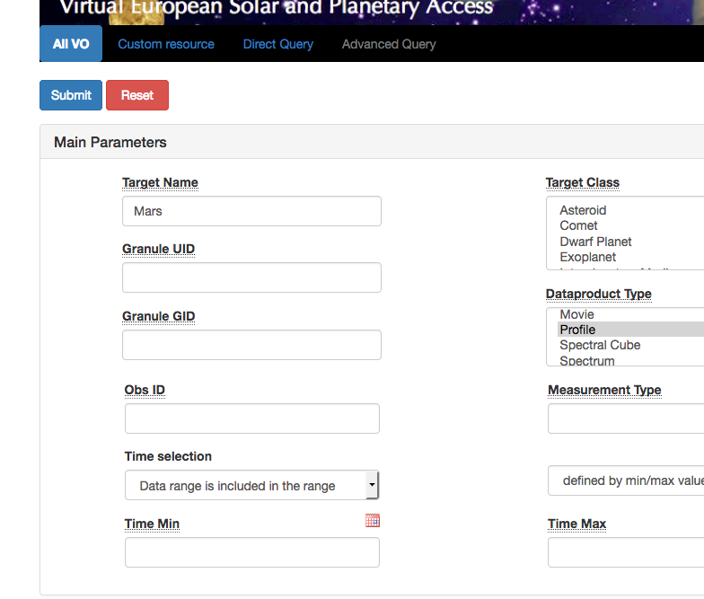

## Comparing vertical profiles in the atmosphere of Mars

* [Authors](#authors)
* [Change log](#change-log)
* [Requirements](#requirements-and-dependencies)
* [Use case](#use-case)
* [Keywords](#keywords)
* [Summary](#summary)
* [Introduction](#introduction)
* [Steps](#steps)
* [References](#references)
* [Links](#links)

## Authors:

S. Erard

## Change log

| Version       | Author        | Notes  |
| ------------- |:-------------:| -----: |
| 1             | S. Erard      |  29/9/2018      |

* * *

## Requirements and dependencies
 Not applicable

* * *

## Use case
Comparing vertical profiles in the atmosphere of Mars (Mars-Express/SPICAM and Mars Climate Database simulations)

## Keywords
* Atmospheres 
* Observations
* Simulations

## Summary
This short tutorial shows how to compare related profiles in some services

## Introduction

## Steps

### Go to VESPA portal
* Look for target = Mars, dataproduct_type = profiles

[http://vespa.obspm.fr]

### Open service SPICAM in results page
* Click button "Show All" to see all parameters
* Browse service
* Launch TOPCAT (e.g. by clicking on TOPCAT button in VESPA portal page)
* Select line  granule_uid = temp2888A1
* On bottom left menu "Data selection", click "Send Tables" and validate security dialogues in pop-up windows. 

This sends the profile in VOTable format to TOPCAT

### In TOPCAT
* Click icon "Plane Plot"
* (in the Position tab) Select x= CO2_Temp_T100k, and Y = AAMZD 
* Click Form tab, then the +Form button, select "Add Line" in local menu

### Back to VESPA portal
* Go to the right end of the table
* Click value in Datalink_url of the selected line. A new page opens.

### Back to VESPA portal
* This page first provides a link which opens the profile in ascii format
* In the yellow dialogue MCD_scenario, enter "28" (ID of the Martian year used in the simulation) and click "Retrieve data"
* This opens an xml file in your browser (this is a simulated profile in the same conditions as the observation)
* Copy the url from your browser and paste it to TOPCAT (click on "Open new Table" icon and paste it in the first field)

### Back to TOPCAT PlanePlot window
* Click icon "Add new positonal plot"
* Select the last table in the local menu
* Select X = temperature and y = AAMZD

### To go further
* From the yellow datalink dialogue, you can try other Martian year scenarios and check if they fit better
* In TOPCAT you can try other temperature profiles from the same SPICAM file (retrieved assumming other T at the top of the atmosphere)

## References

## Links
