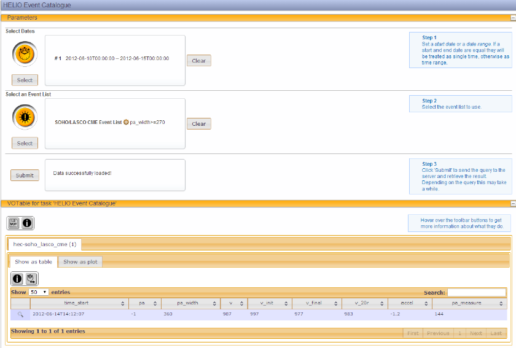
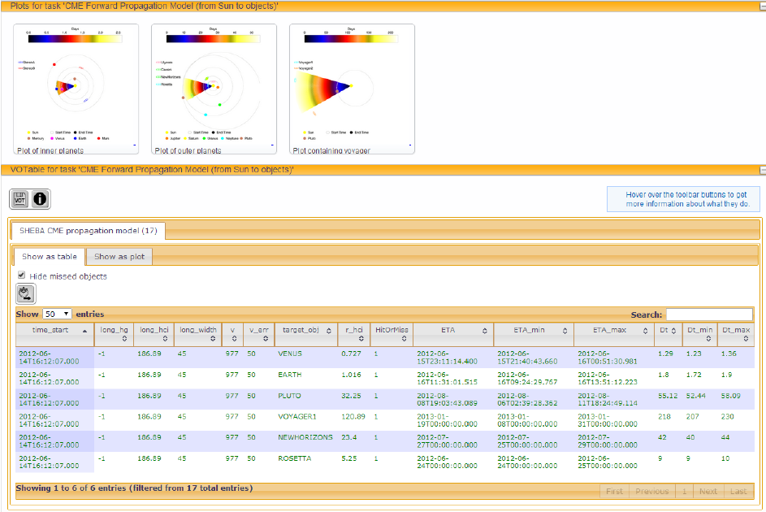
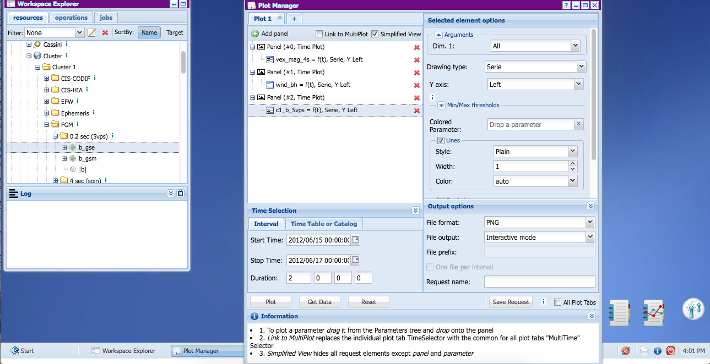
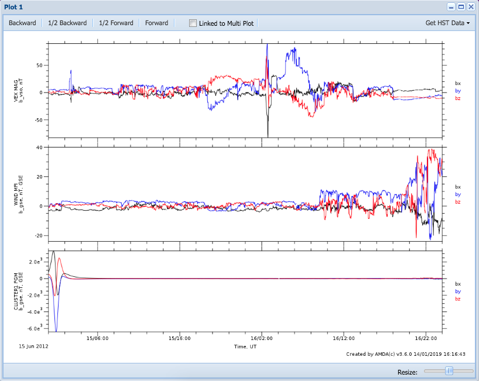
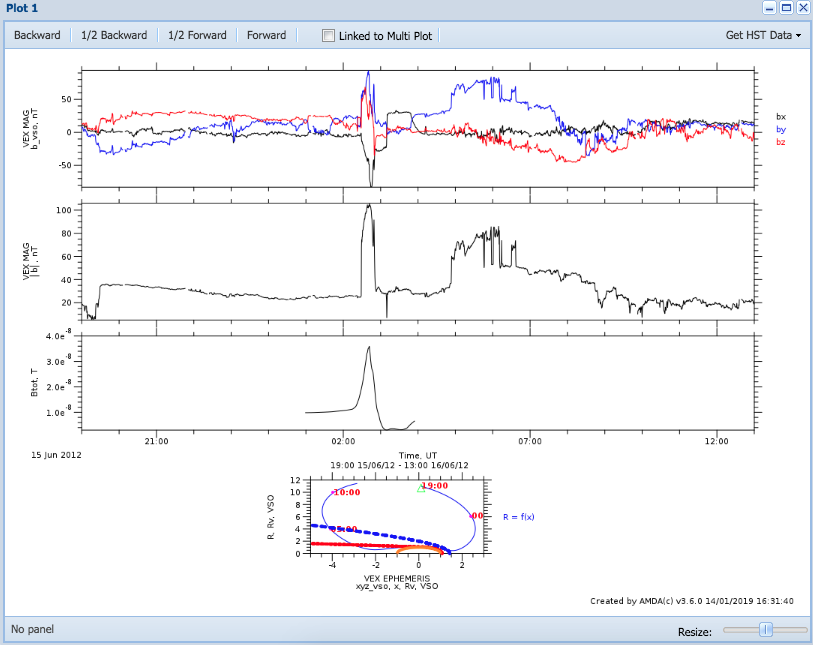
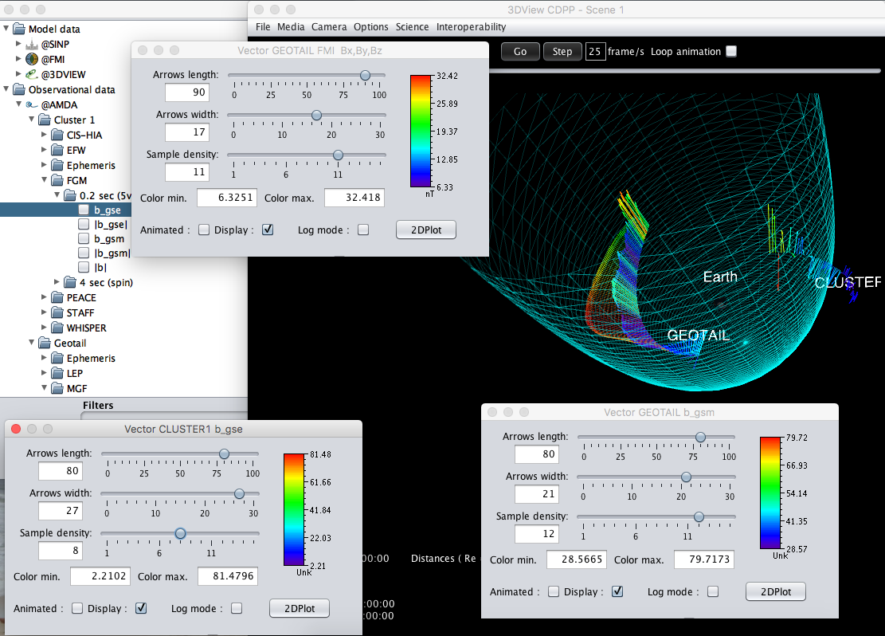
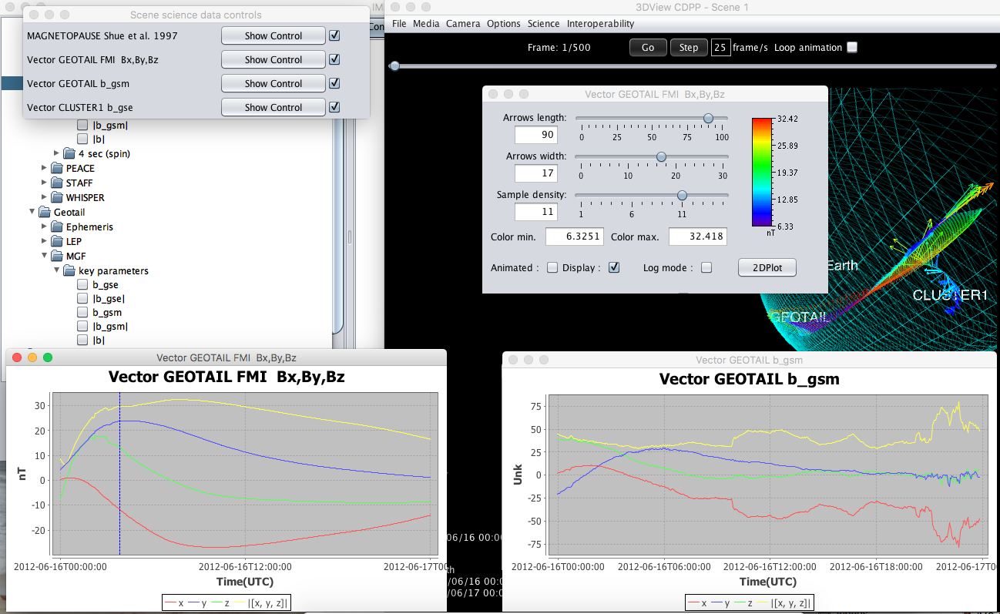

## Connection of Helio Tools, AMDA & 3DView: CME impact on Venus and Earth

[Authors](#Authors)

[ChangeLog](#ChangeLog)

[Introduction](#Introduction)

[Steps](#Steps)

## Authors
Michel Gangloff, Vincent Génot, Baptiste Cecconi

## ChangeLog

|Version|Name|Note|
|---|---|---|
|1|[Keyuan Yin](https://github.com/megadiesel705)|[Original site](http://typhon.obspm.fr/VESPA-tutorials/docs/Tuto-HELIO-IMPEx.pdf)|
|2|Michel Gangloff|Updates to become compliant with new versions of AMDA and 3DView|

## Introduction
This tutorial gives an example of the interconnected use of HELIO Tools, AMDA/IMPEx functionality and 3DView/IMPEx functionality. The AMDA, as well as the 3DView part show new features in AMDA, which were implemented within the IMPEx FP7 project, i.e. the possibility of plotting simulation runs for given spacecraft side by side with observational data.  

## Steps
### First Step

Searching for events in [Helio](http://hfe.helio-vo.eu/Helio/). Using *Search Events* button to open new search.   

Example(with picture attached):  
*Time Range*:  
20120610Z00:00:00 - 2012-06-15Z00:00:00    
*Event Catalogue*:  
SOHO/LASCO CME Event List / pa_width>=270 : 1 CME  

  

## Second Step 

Extraction of time range, used as input for the Helio CME Forward PM  
**Longitude: 1  
Width: 45  
Speed:  977  
SpeedError: +/50**  
CME hits Earth, Venus, Pluto, Voyager1, New Horizons, Rosetta (see screenshot)  

## Third Step 

Plotting data in AMDA Comparison of model data with insitu data on [this site](http://amda.cdpp.eu/).  

<h4 id="3a">a)  Verification of CME impacts on Venus and Earth</h4>  

* Open the Plot Manager in AMDA:
Use the time range as received via HELIO and extend it properly, i.e. the CME
impacts at Venus and Earth should be visible (e.g. 2012/06/15 15:00:00 2012/
06/17 05:00:00)  

* The following parameters may be selected (see screenshot below):  
  * VEX MAG data: Local Data/VEX/MAG/4 sec/b_vso 
  * WIND MFI data: Local Data/Wind/MFI/3 sec(wi_ho_mfi)/b_gse  
  * CLUSTER1 FGM data: Local Data/Cluster/Cluster 1/FGM/0.2 sec(5vps)/b_gse  

* Plot the data (see screenshot below). One can zoom into different time intervals
to get a more detailed view on the data at Venus and Earth.  

Selected Parameters Illustration:  

Output Plot:  

### The Venus Impact

* Prepare another plot via the Plot Manager for the time interval of the CME impact
at Venus (e.g. 2012/06/15 19:00:00 2012/06/16/ 13:00:00).  

* Compare observational data by VEX MAG with FMI HYB simulation run data (please be aware that the FMI HYB simulation runs are by now only for quiet solar wind conditions. The runs are within a range around Venus of x=[3,3],y=[4,4],z=[4,4]  
Venus radii). Use the following data:  
  * VEX MAG data: Local Data/VEX/MAG/4 sec/b_vso
  * absolute value of the observed magnetic field  Local Data/VEX/MAG/4 sec/|b|
  * runs for Venus under (Remote Data (Simulations)  
  * VEX ephemeris data: Local Data/VEX/Ephemeris/orbit venus/xyz_vso  

* Plot the data. 

#### The Earth Case  

* The same can be performed for the Earth case within AMDA. One can use e.g. WIND data to obtain the CME outside the magnetoshpere and **e.g. CLUSTER1 within the magnetosphere**. CLUSTER1 data can then be compared with SINP paraboloid model for Earth. The SINP model performs the simulation on the fly **i.e. the input parameters are parameters measured by the chosen spacecraft at the chosen time**.    
* Besides AMDA, one can also go to the 3D visualization tool 3DView and test the
interconnectivity of AMDA & 3DView (see example in fourth step).  

## Fourth Step - Visualization within 3DView: IMPEx functionality within 3DView 
### The CME impact at Earth (Cluster1 & Geotail)

1. Download and open [3DView](http://3dview.cdpp.eu/)  
2. File : New. Open File : Manage Scene within the new scene window and choose
a. Time range: Start = 2012/06/16 00:00:00 & Stop = 2012/06/17 00:00:00
b. Choose Cluster1 and Geotail and start scene
3. Load
a. Science : Models : Magnetopause models / Shue et al.
b. Science : Remote Data(Impex)Impex 
4. Within the Impex tree choose
a. Model data : @FMI/GUMICS_Earth_run_000001 -> Time series / Magnetic field components / Bx,By,Bz
 *Add selected data to 3DScene* (make sure that Geotail is the selected spacecraft)
b. Observational data @AMDA : Geotail : MGF : key_parameters : b_gsm
and *Add selected data to 3DScene*
c. One may additionally add Cluster1 data in the same way as described above
5. The different parameters can be manipulated via Scientific Control Panels (see screenshot below). One can get to the control panels via Science -> Science data controls. Additionally further spacecraft can be added via File -> Manage Scene. Further data can also be added in the same way as described above.

6. Within the science control one can also add a 2DPlot by clicking on *2Dplot* on the
respective Science Control Panel (see below screenshot)   

## References

PDF File exported from VESPA tutorial site and updated. 
[This site](http://typhon.obspm.fr/VESPA-tutorials/docs/Tuto-HELIO-IMPEx.pdf)
