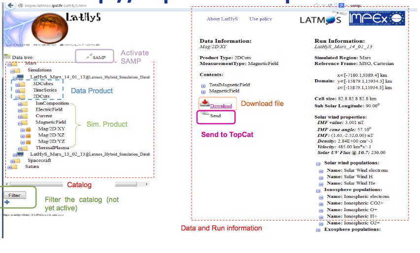
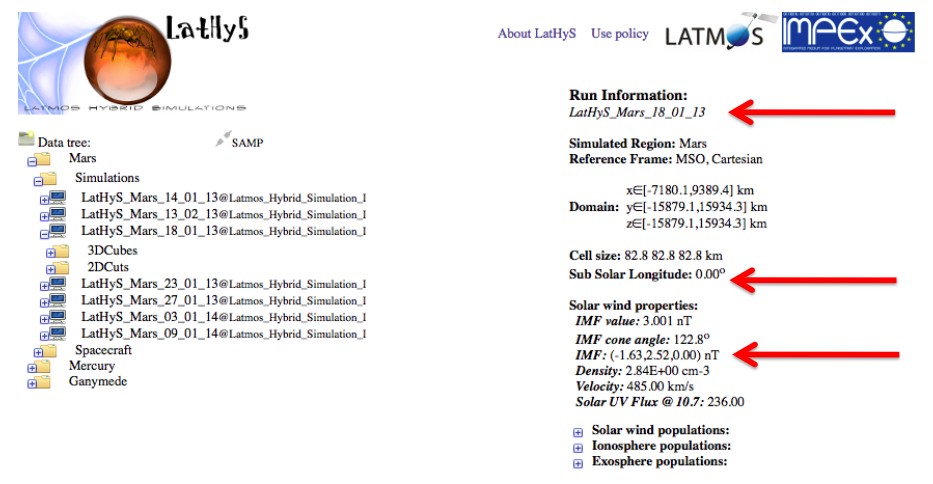
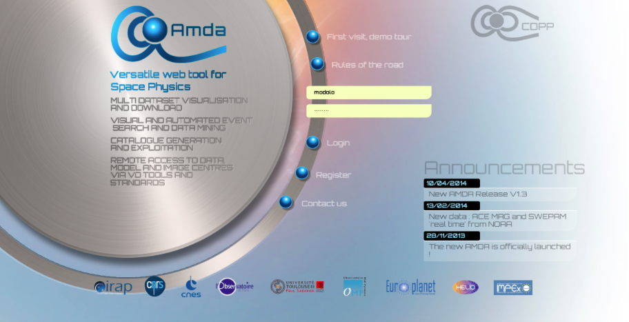
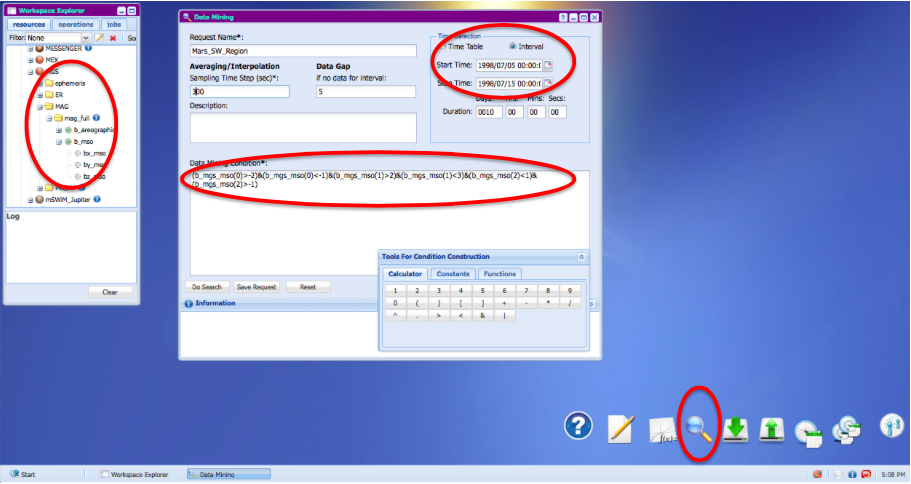
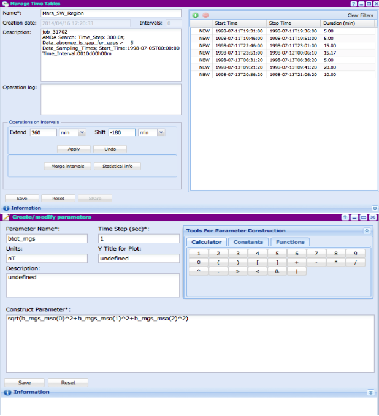
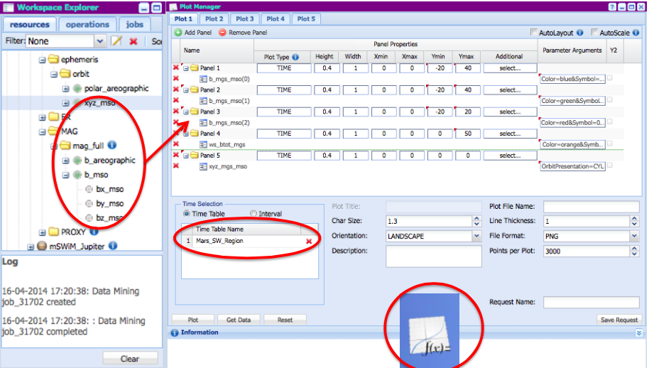
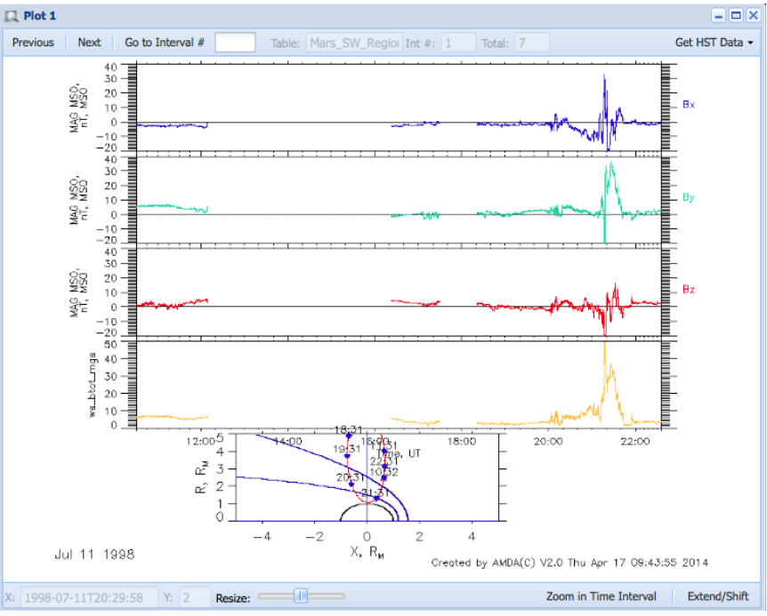
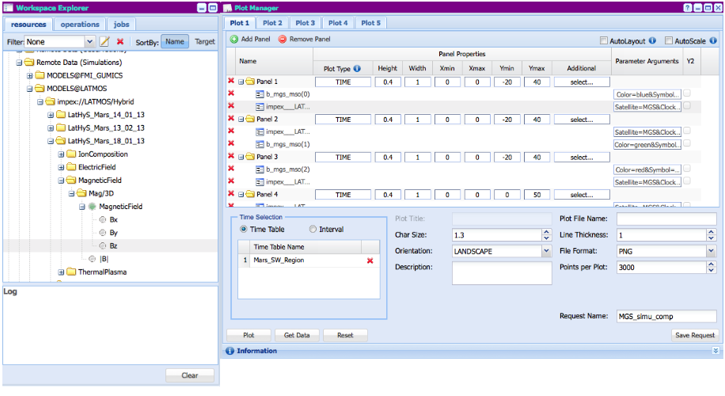
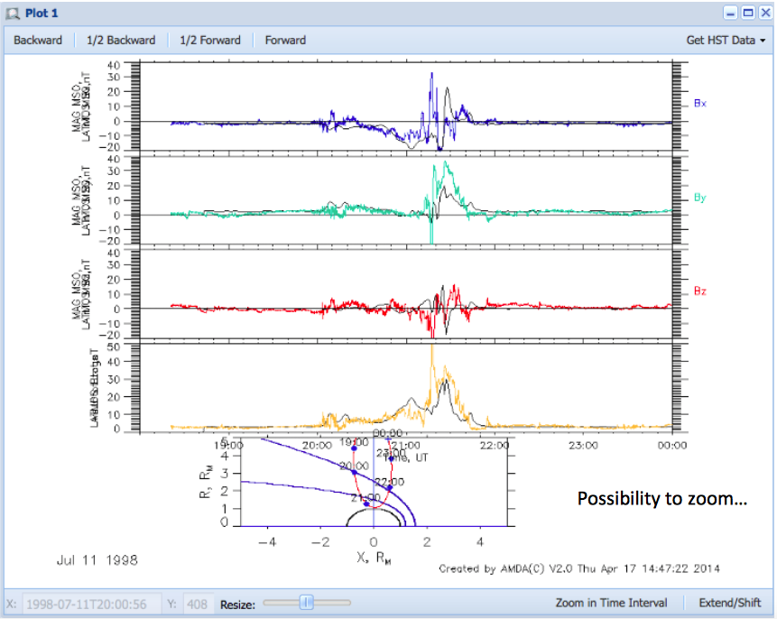

## Mars Global Surveyor plasma data compared with models

[Authors](#Authors)
[Change Log](#Log)
[Goals](#Goals)
[Steps](#Steps)
[References](#References)

## Authors

R. Modolo , LATMOS, Paris, France

S. Hess , ONERA, Toulouse, France

B. Cecconi , LESIA,Meudon,France

V. Génot, IRAP-CDPP,Toulouse,France 

M. Gangloff, IRAP-CDPP,Toulouse,France 

IMPEx team  http://impex-fp7.oeaw.ac.at  

Version : 1

Name : [Keyuan Yin](https://github.com/megadiesel705)

Note : First converted from [original site](http://typhon.obspm.fr/VESPA-tutorials/docs/Tuto-MGS-LATHYS.pdf)

Version : 2

Name : Michel Gangloff

Updated 2019 January 15 

Correction of several typos and update of AMDA windows

## Goals

* Hands on LATMOS simulation database and Visualization tools (AMDA, 3Dview, TopCat)
* Comparison between MGS observations and Hybrid simulation results

## Steps

[Presentation of LatHyS](hbp://impex.latmos.ipsl.fr)  

Choosing one Martian simulation :  
LatHyS catalog propose the main characteristic of the simulation - The ResourceID (Name) :  

LatHyS_Mars-18_01_13@...  

- IMF values : (-1.63, 2.52, 0.0) nT  
- Sub Solar Longitude : 0 degree (main crustal field on the nightside)   

Searching if MGS data have similar IMF values ....   

Comparison between MGS observations and Hybrid simulation results using [AMDA](http://amda.cdpp.eu)  

Use Data Mining tool (Magnifying glass)  
Construct a data Mining condition by dragging and dropping resources of the workspace explorer (MGS bx_mso => data mining conditions)  
The condition mark out the simula1on IMF value : -2<Bx<-1 , 2<By<3, -1<Bz<1  
Specify a sampling time (averaging over 300s), the name of the request and the Time interval Start Time : 1998/07/05 => Stop Time : 1998/07/15  
Then perform the search...  

Visualize the Time Table created from the search and manipulate it in order to have about one orbit per event  

* Extend all time periods by 360 min (6h) and shift them by -180 min (3h) to have new periods of about 6h centered on your searched time results  
* Name your Time Table (Mars\_SW\_Region)  

Create a new parameter corresponding to the Total B field (MGS) Idem by drag and drop  

Visualize your data with the *plotting data* function. Select each component of the MGS magnetic field (MSO) with some color code (bx : blue, by:green, bz : red, btot from *derived parameter* : orange) + MGS ephemeris (xyz_mso in *CYL* coordinate system)  
For Time Selection : select *Time Table* and drag and drop the *Mars\_SW\_Region* from *My\_Time\_Table*  

Add simulation result datasets:  
Remote data(Simulations)/MODELS@LATMOS/LatHyS_Mars_18_01_13/Magnetic_field Drag and drop each B components and select MGS S/C  

Possibly to zoom  

## References

Original Powerpoint PDF version 1 on [this site](http://typhon.obspm.fr/VESPA-tutorials/docs/Tuto-MGS-LATHYS.pdf)
  

