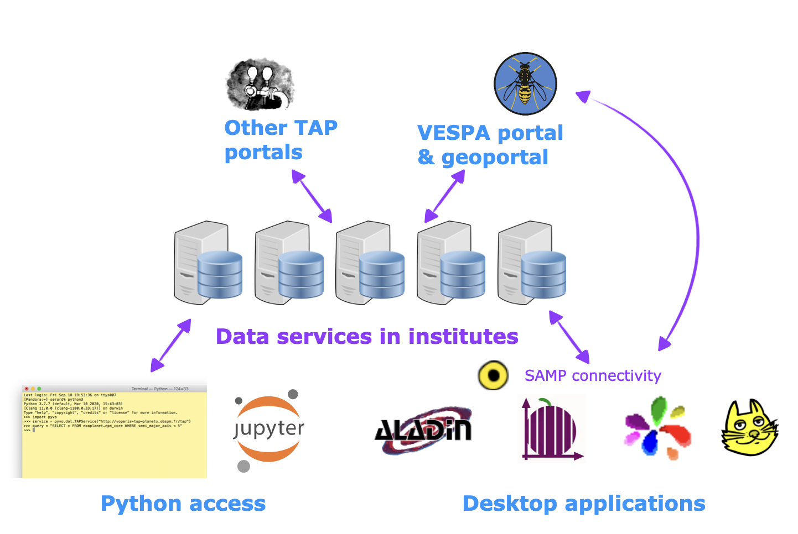
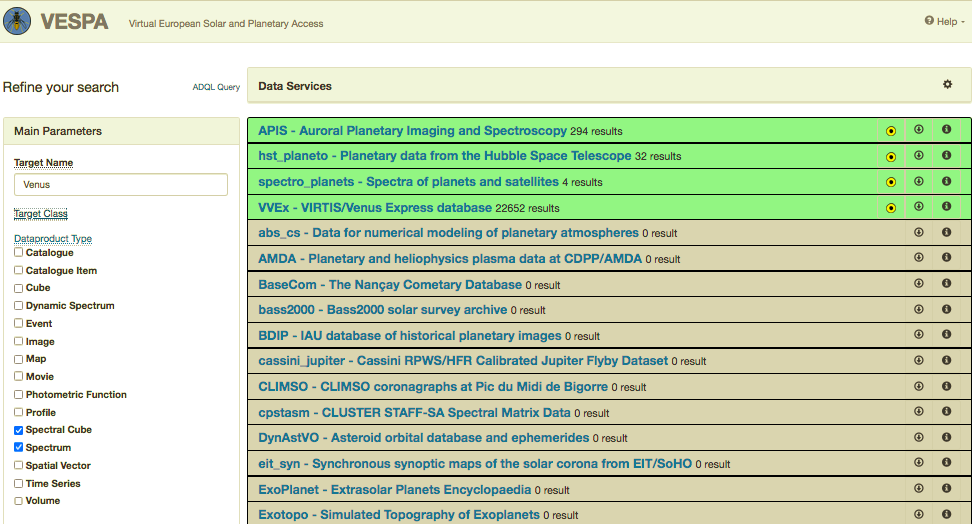
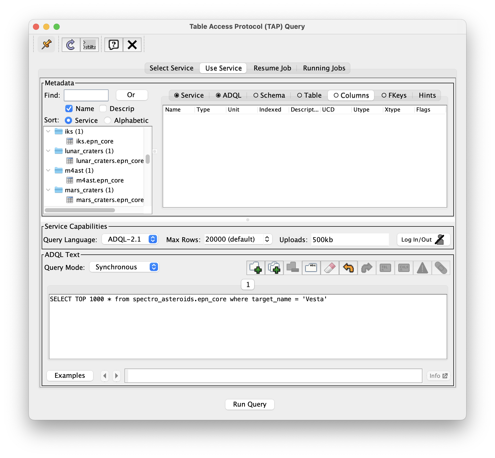
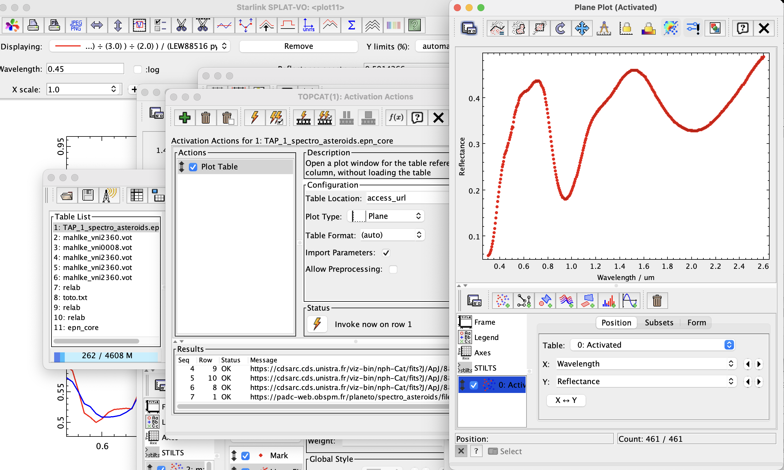
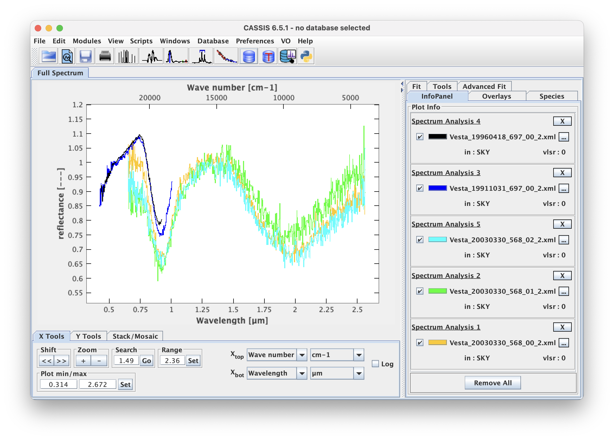
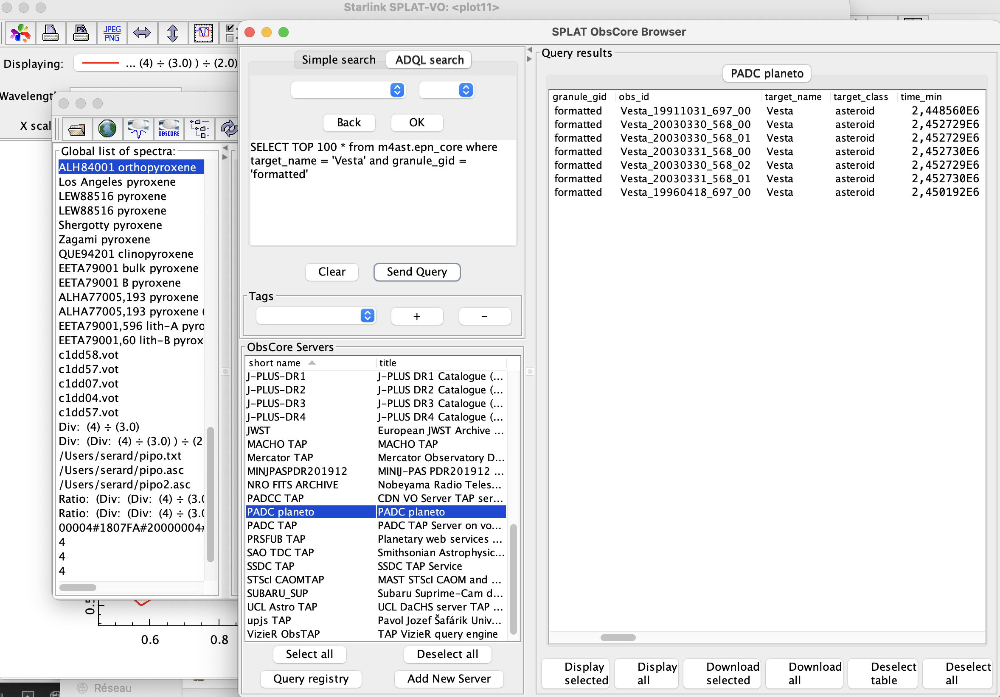
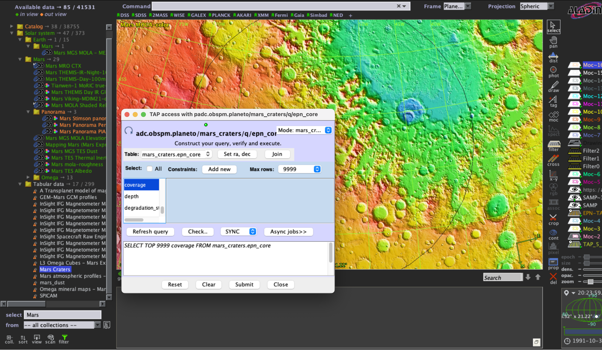
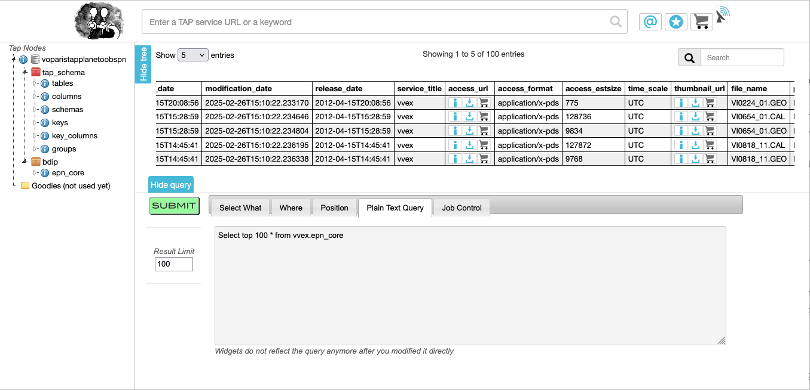

## Accessing EPN-TAP services from different tools

Searching for spectra in EPN-TAP data services

## Summary

We're showing how to search for data in EPN-TAP data services from various environments, and display the results. This tutorial uses spectral data as an example.

[Introduction](#Introduction)  
[VESPA portal](#1--VESPA-portal)  
[TOPCAT](#2--TOPCAT)  
[CASSIS](#3--CASSIS)  
[SPLAT-VO](#4--SPLAT-VO)  
[Aladin](#5--Aladin)  
[TAPhandle](#6--TAPhandle)  
[python](#7--python-/-pyvo)  
[To go further](#To-go-further)  

### Change log

| Version | Author   | Notes     |
| ------- | -------- | --------- |
| 1.0     | S. Erard | 25/9/2026 |
|         |          |           |

### Requirements and dependencies

Download the last version of VO tools: 

TOPCAT: [TOPCAT](https://www.star.bristol.ac.uk/mbt/topcat/)

SPLAT-VO: [GAVO SPLAT](https://www.g-vo.org/pmwiki/About/SPLAT)     (use 4-beta at time of writing)

CASSIS: [https://cassis.irap.omp.eu/](https://cassis.irap.omp.eu/)

Aladin: [https://aladin.cds.unistra.fr/AladinDesktop/](https://aladin.cds.unistra.fr/AladinDesktop/)

• VESPA portal: [https://vespa.obspm.fr](https://vespa.obspm.fr)

• TAPhandle: [https://saada.unistra.fr/taphandle/](https://saada.unistra.fr/taphandle/)

• Astropy / pyvo: [https://www.astropy.org/](https://www.astropy.org/)

### Keywords

Spectra
VO Tools

## Introduction

Most Solar System data are shared in the VO as data services compliant with the EPN-TAP standard. Those can be searched in many ways: 

• The **VESPA portal** is a user-friendly interface for quick search and data discovery, hiding the complexity of the query system (ADQL and EPN-TAP)

• **VO tools** provide a lower-level but more detailed access, explicitly using the power of the query system, as well as advanced display and processing features

• More **generic VO portals** such as TAPhandle can access these services

• **python libraries** allow flexible access to the data and the construction of complex workflows.

All these environments access the same EPN-TAP services. They differ mainly in the way queries are submitted, data are displayed, and further processing is performed. We're showing here how to send similar queries from various environments, and plot the results. We search for spectra of asteroid 4 Vesta as a simple example because several spectral services provide data for this target.

VO tools are specialized in a type of data product, although they tend to support many situations. 

• TOPCAT mostly handles tables

• CASSIS and SPLAT-VO handle spectra

• Aladin handles images and maps, plus georeferenced objects

They all have direct access to VO data services, with particularities detailed below.

### 1- VESPA portal

The entry page is divided in a main area listing the available EPN-TAP services and a query form on the left side. This form is a set of parameter fields which can be completed to compose a query. The query will be sent to all data services.

In the parameter fields, enter:

• target_name = Vesta

• dataproduct_type = spectrum

• Click the Submit button (or type Enter)

The list of services is then updated and reordered: 

• Services answering the query are displayed in green at the top of the list 

• Services displayed in gray do not match the query

• Services displayed in red do not respond correctly (this may happen if your query contains non-standard parameters, or because of internal issues)

• The complete query is displayed below the table for reuse.

(click the ADQL Query field on top of the form to enter a more formal/powerful query)

Select one service in green (M4ast or spectro_asteroids) to open the results from this service. In most cases, thumbnails are displayed when hovering the mouse over the table. With VO tools open, select All metadata / send table or select All data / send spectra to pass the data to tools which can handle it.

Alternative: in the global result page, click the SAMP button on the row EPN-TAP compilation results, this will send a table of all results to open tools.

### 2- TOPCAT

In the icon bar of the main window, click the icon: Open… SQL (or VO / TAP query from the menu)

In the Select service pane, type keyword = PADC

Select http://voparis-tap-planeto.obspm.fr/tap and click Use service - this changes pane

In the ADQL text field, type:

`SELECT TOP 100 * from spectro_asteroids.epn_core where target_name = 'Vesta'` 

Click Run query (Fig. 1)

*Alternative*: select one of the *.epn_core items in the list (= data tables) and play with the Examples button at the bottom.

After a few seconds, the result table should add in the table list (main window)

• Click the Display Table cells icon to open it — this is the same table you would see in the VESPA portal, except that units are not converted (time is in JD, spectral range in Hz…).

• In the main window select this table and go to the Menu: Views / Activate actions

• Click and select Plot table with Resource URL = access_url & Plot Type = Plane 

• Click on Invoke now…  the current spectrum should display in a plot window and load in the table list

Go to the table window, select another row. It should display upon selection (wait a second if the interface does not react, or try another row)

Superpose other spectra in the same window by clicking Add new positional plot control, then defining the spectrum of interest. This is a bit tedious - sending the table to SPLAT may be easier in such cases (it will open the files under access_url and plot them at once).

### 3- CASSIS

In the main panel, Click VO / EPN-TAP Query

- The left panel displays a list of EPN-TAP services/tables

- If the service of interest is not in the list you can add it (provide server url + table name)

- Send a TAP query to the service of interest (here with service m4ast):

`SELECT TOP 100 * FROM #tablename# WHERE target_name LIKE 'Vesta' AND dataproduct_type LIKE '%sp%' and granule_gid = 'formatted'`

- Select spectra of interest and click Display all

- In the plot window / Plot min/max field, click Set. Adjust the Y axis similarly (do it again in both X and Y panels if you lose the correct scaling later).

CASSIS is very efficient to handle scales, units, and spectral quantities, and to analyse spectral lines. It is also connected to atomic and molecular databases.

### 4- SPLAT-VO

Launch TOPCAT in addition to SPLAT-VO. This is required for SPLAT-VO to exchange data with other applications via SAMP. Launching SPLAT may open a terminal window in some configurations (MacOS) — keep it open.

Click the ObsCore icon in the main page

- Look for the server of interest in the left side list
  
   Only TAP servers with an ivoa.obscore table are listed by default 

- If it is not there, click on Add New server, provide at least a short name and URL, e.g.: 
  
   PADC planeto
  
   http://voparis-tap-planeto.obspm.fr/tap

- Select this server, click ADQL search in the dialogue above the server list and type a complete EPN-TAP query, e.g.: 

`SELECT TOP 100 * from m4ast.epn_core where target_name = 'Vesta' and granule_gid = 'formatted'`

The table for the selected results will pop up in the right side dialogue.

Click Display all will plot all spectra at once in a single window.

Adjust settings of the plot window by clicking Configure Plot attributes.

You can dispatch spectra between plotting windows from the main window, or click the spectra in a plotting window to highlight it in the list.

SPLAT-VO is particularly efficient to display many spectra with minimum manipulations. It is also connected to experimental spectroscopy services in the VO.

### 5- Aladin

EPN-TAP services can be queried from the data tree on the left side. 

• Collection / Solar System / <target_name> contains planetary HiPS (multiresolution maps)

• Collection / Solar System / Tabular data lists the individual data services

• Click Load in the pop-up window to open a query dialogue where you can type an EPN-TAP query

Tables may appear below the display area in Aladin. Some fields display as buttons which can overplot on the display.

Aladin is mostly a celestial image / map environment. It handles planetary coordinates, footprints (s_region ou MOC) and georeferenced data products (associated with spatial coordinates) but other data types may not display properly.

### 6- TAPhandle

Select PADC planeto (http://voparis-tap-planeto.obspm.fr/tap) as a server, either from the entry list or by entering the URL in the top field

• Select the spectro_asteroids service from the list of services available on this server

Type your query, either with the graphic query builder (Select What / Where / Position) or by typing it in the Plain Text Query panel at the bottom

• Click Submit — this will display the result table with all columns

• You can send this table via SAMP to other tools from the Job Control panel, Action menu

• URL columns in the table may contain a SAMP icon for individual sends, depending on format

### 7- python / pyvo

In your environment, type:

`import pyvo as vo`

`service = vo.dal.TAPService("http://voparis-tap-planeto.obspm.fr/tap")`

`resultset = service.search("SELECT TOP 100 * from m4ast.epn_core where target_name = 'Vesta' and granule_gid = 'formatted' ")`

`resultset`

The last command will print the result table.

• Parameters can be retrieved like this:

`t0 = 0`

`timemin = resultset['time_min'][t0]`

• To download a file: 

`import requests`

`url = resultset['access_url'][0]`

`file_name = resultset['file_name'][0]`

`response = requests.get(url)`

`response.raise_for_status()`

`with open(file_name, "wb") as f: `

`    f.write(response.content)`

## To go further

You have seen how to query VESPA data services from the most common VO clients, and display simple data products.

Data analysis is possible in VO tools and of course in python. Jupyter notebooks can mix python (for VO access) and other languages (for existing algorithms or even data readers).

VO tools may require special setup to adapt to Solar System data standards, see

https://github.com/epn-vespa/tutorials/blob/master/misc/setting_up_tools/setting_up_tools.md

Other more specialized tools are available to support Solar System data, as well as non-VO tools using VO plugins, and VO-compliant web services.
