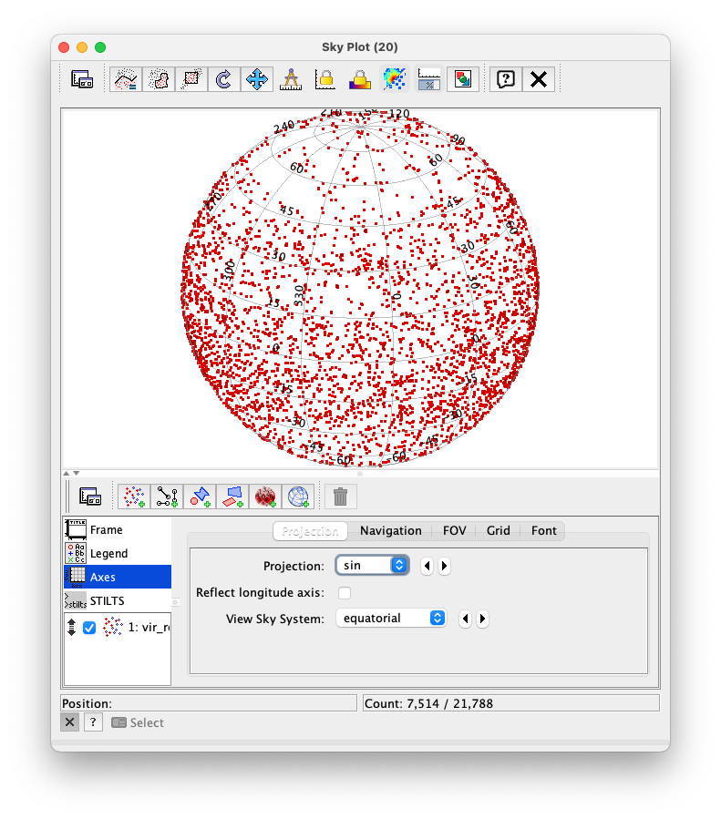
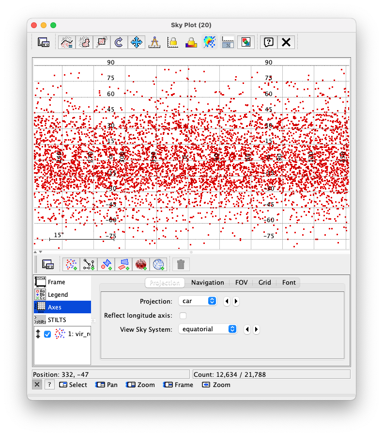
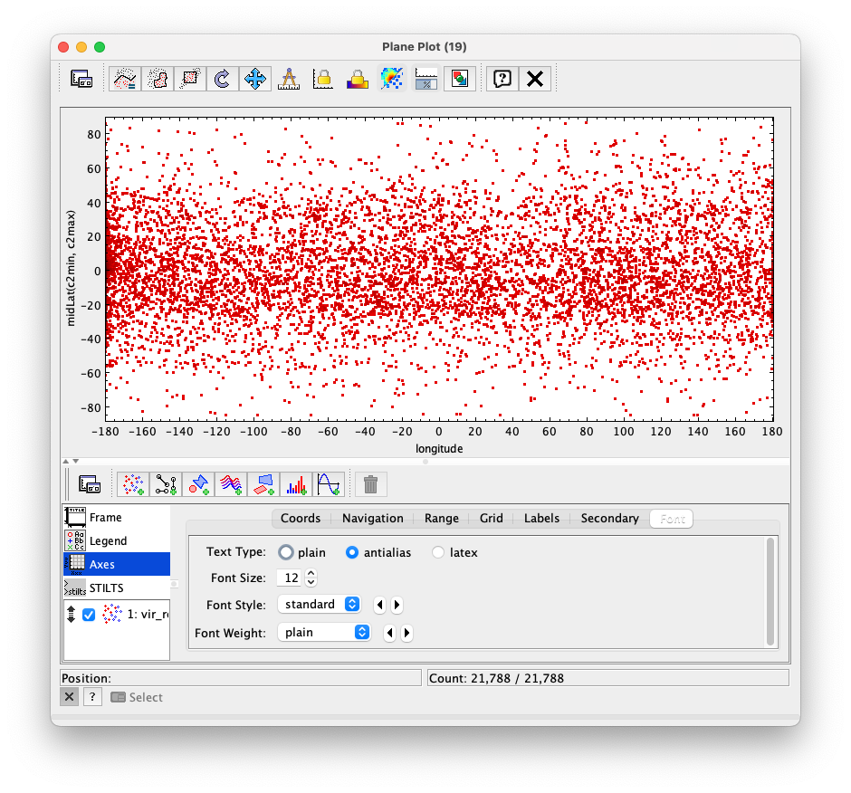
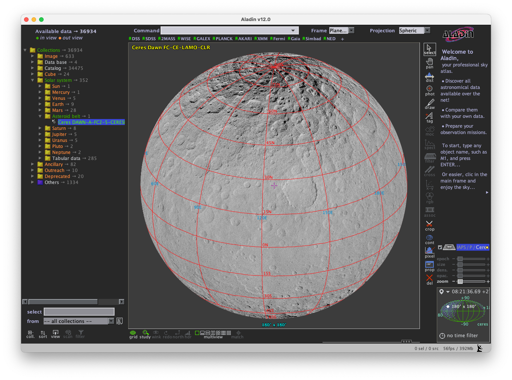

## Setting up VO tools for planetary context

[Tutorial](#use-case)  
[Authors](#author)  
[Summary](#summary)  
[Introduction](#introduction)  
[Tutorial](#tutorial)  
[Links](#links)  

## Tutorial
Basic set up of VO tools for planetary science

## Author:

S. Erard

### Change log

| Version       | Author        | Notes  |
| ------------- |:-------------:| -----: |
| 1.0           | S. Erard      | 6/9/2017  |
| 1.1           | S. Erard      | 2/11/2024  |

### Requirements and dependencies

### Keywords
Data
Tools

## Summary
This tutorial describes convenient settings of VO tools for use with Solar System data.

## Introduction

The VESPA data infrastructure heavily relies on the Virtual Observatory (VO) framework, and enlarges it to support Solar System data. In particular, classic VO tools are used to provide easy display functionalities to the users. However, those are mainly aimed at plotting objects in a celestial reference frame. Although this is adapted to celestial images of planetary interest (e.g., telescopic images of asteroids or planets), this is not optimal for planetary maps or orbital measurements.

This tutorial summarizes the basic settings for adapting the display to standard planetary use. 

## Planetary mapping

 
### 1- TOPCAT

TOPCAT includes several mapping tools (windows) usable to display planetary maps.

#### Standard settings for planetary maps in  TOPCAT SkyPlot

The SkyPlot window is adapted to planetary mapping in 3D (on a rotating sphere, similar to Aladin) but also to 2D mapping. This is the defaut mode to map EPNCore tables, since coordinates are predefined as average (min,max) values. 

In 3D the difference with the celestial sphere is that the planet is observed from outside, and several conventions are different. 3D mapping may be adapted to ellipsoids, as long as the body shape is reasonably regular.

**• For 3D mapping on a sphere:**

(in Axes / Projection)

- Projection =  sin (i.e. sphere, for orthographic projection)
- Uncheck "Reflect longitude axis" in general: EPNCore coordinates C1/C2 are always provided as E-handed. Keep it checked only if coordinates are provided with W longitudes.
- View Sky System: Equatorial

(in Axis / Grid)

- Uncheck "Sexagesimal"
- Increase "Grid Crowding" cursor value to 30 or 60° tick

  

**• For 2D maps:**

Two options are available for 2D/flat mapping: car (plate carrée / cylindrical) or Aitoff. The latter is similar to the sinusoidal projection used by NASA in the 90s: all the surface is visible, and it minimizes deformations near the poles. Sinusoidal maps were always  centered on (0°,0°).

(in Axes / Projection)

- Projection = car or Aitoff (for 0° at center, range = 0-360°) — you want to use this option for Aitoff
- Projection = car0 or Aitoff0 (for 0° on left border)
- In both cases, keep View Sky system = Equatorial

  

####  Standard settings for planetary maps in TOPCAT PlanePlot (cylindrical)

The older PlanePlot window is still available to produce 2D cylindrical maps, and may provide additional flexibility in some cases. This looks more like a simple plot than the SkyPlot window, but it may be more convenient in particular for atmospheric "maps" (e.g., latitude vs time).

**• For cylindrical maps with central meridian on the left border**

(in Axes / Range)

- Set Max X value to 360°

**• To put the central meridian at the center (range = -180 to 180):**

(in Axes / Range)

- Min / Max X = -180 / 180

(in Mark / Position)

- X: c1min > 180 ? c1min - 360 : c1min

(in Axes / Labels)

- X Label = Longitude

  

 
### 2- Aladin

#### Standard settings for planetary maps and HiPS in Aladin:

Aladin is initially a sky atlas with VO capacities. Aladin has a special mode to handle Planetary data, which needs to be validated — go to Edit > User preferences and check the Planetary data box, then restart. Planetary data collections will become available from the left menu of Aladin.

Aladin uses HiPS as basemaps - they are multiresolution maps which can be zoomed in very efficiently. Planetary HiPS are available from the left menu, under Collection / Solar System, providing global image coverage of many bodies.

**• To display a HiPS:**

- In the fields on top of the window, set Frame to "Planet" or "Planet deg" - this will use a grid in degrees (counted E and W from 0 - this is not the IAU convention, but this is OK).
- Set Projection to Spheric (which is actually: orthographic), Cartesian (actually: cylindrical), or Mercator for most applications.
- Aitoff and Mollweide projections are similar to sinusoidal, with all the surface visible simultaneously; keep them centered on (0°,0°).
- In properties, ".longitude" should be set to "ascending" for correct orientation.
- The grid button is on the bottom left of the display

  

#### Superposing images on HiPS

Although Aladin will overplot images in the current coordinate frame, the positioning may be approximative. A secure way to overplot images is to first turn them into HiPS in Aladin.
Contours (s\_region) and MOC will display correctly in Aladin.

#### Building HiPS

New HiPS can also be computed from complete image maps. This is best done in a terminal:

``
java -Xmx16g -jar Hipsgen.jar -hhhcar in=Phobos_Viking_Mosaic_40ppd_DLRcontrol.jpg out=Phobos/PhobosHips color=jpg id=yourInstitute/P/Phobos-Viking order=4 INDEX TILES
``

You need to identify the optimal HiPS order that preserves the map resolution, and also to check that the HiPS is correctly oriented in Aladin. If longitudes are reversed, set ".longitude" to "descending" in properties (it may be more convenient to invert the map before conversion to HiPS).

To use the new HiPS, just drop the PhobosHips directory on Aladin window.

On this particular example (Phobos): Aladin assumes targets are spherical, therefore large departures from a spherical shape result in mapping errors and unusual representation in 3D. Although you probably don't want to plot Phobos as a 3D sphere, 2D maps (projections other than spheric) are acceptable and commonly used for non-spherical objects. Real problems arise when the lon/lat system is degenerated and does not identify unique locations at the surface (e.g., Eros, 67P, etc).

### 3- AladinLite

AladinLite has functionalities similar to Aladin but is a different software:

- AladinLite is typically integrated in a web page, where it provides display capacities.
- It has a different Planetary data mode - options need to be implemented when AladinLite is installed in the web page, see developer doc: [https://aladin.cds.unistra.fr/AladinLite/doc/](https://aladin.cds.unistra.fr/AladinLite/doc/).
- A very handy feature is to replace the Simbad resolver of celestial objects by a similar functionality connected to the USGC Gazetteer of Planetary Nomenclature —&nbsp;see here: [https://aladin.cds.unistra.fr/AladinLite/planets-explorer/](https://aladin.cds.unistra.fr/AladinLite/planets-explorer/)

### 4- Further topics

Please contact the VESPA team for support: support.vespa @ obspm.fr

## Links

More information on VESPA: [http://www.europlanet-vespa.eu/](http://www.europlanet-vespa.eu/)

VESPA data portal: [https://vespa.obspm.fr](https://vespa.obspm.fr)
