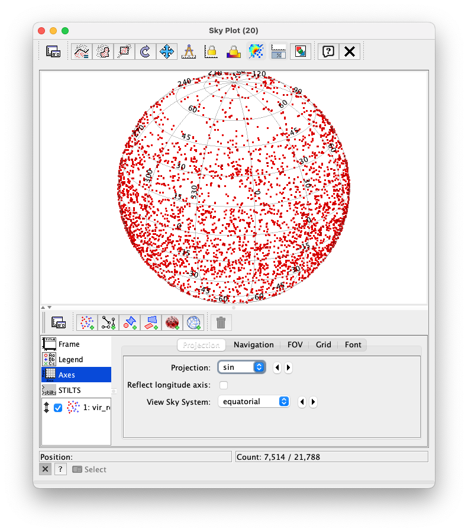
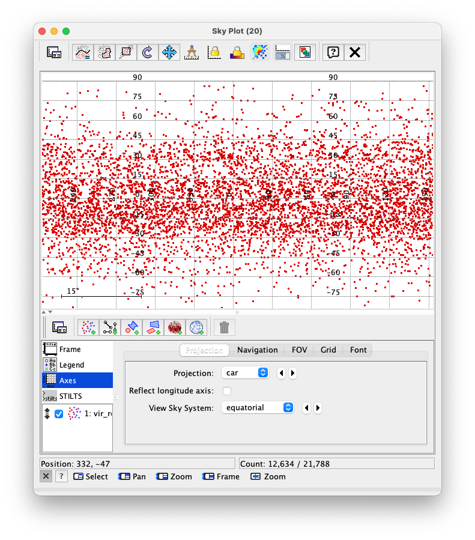
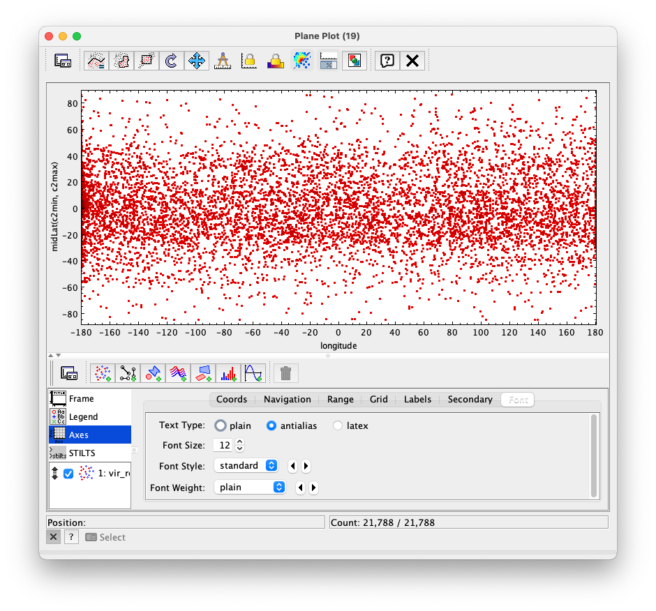
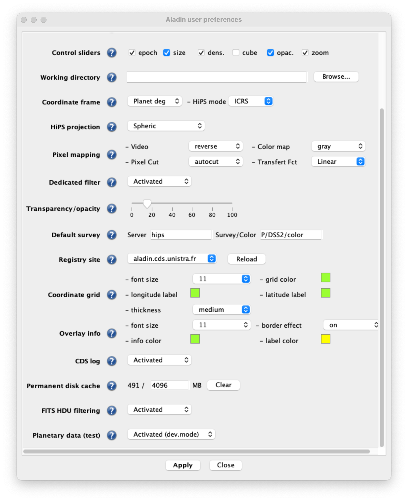
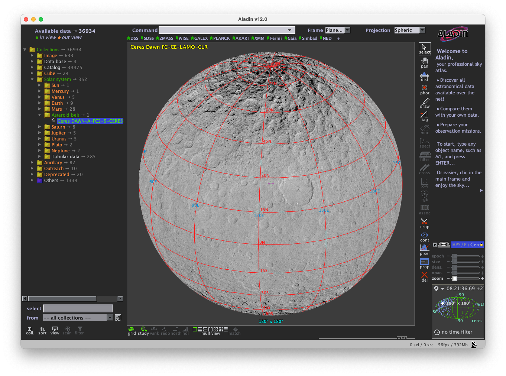

## Configuring VO tools for planetary data

[Summary](#summary)  
[Introduction](#introduction)  
[Planetary mapping](#1--planetary-mapping)  
[3D shape models](#2--3d-shape-models)  
[SAMP connectivity](#3--samp-connectivity-check)  
[Links](#links)  

### Change log

| Version | Author   | Notes     |
| ------- |:--------:| ---------:|
| 1.0     | S. Erard | 6/9/2017  |
| 1.1     | S. Erard | 2/11/2024 |
| 1.2     | S. Erard | 28/3/2025 |
| 1.3     | S. Erard | 8/10/2026 |

### Requirements and dependencies

Download the latest versions of VO tools: 

TOPCAT: [TOPCAT](https://www.star.bristol.ac.uk/mbt/topcat/)

Aladin: [https://aladin.cds.unistra.fr/AladinDesktop/](https://aladin.cds.unistra.fr/AladinDesktop/)

SPLAT-VO: [GAVO SPLAT](https://www.g-vo.org/pmwiki/About/SPLAT)

CASSIS: [https://cassis.irap.omp.eu/](https://cassis.irap.omp.eu/)

### Keywords

Data
Tools
Mapping
Plotting

## Summary

This tutorial describes the settings required to display planetary maps, orbital measurements, and Solar System data using standard planetary conventions.

## Introduction

The VESPA data infrastructure heavily relies on the Virtual Observatory (VO) framework, and enlarges it to support Solar System data. In particular, classic VO tools are used to provide easy display functionalities to the users. However, those are mainly aimed at plotting objects in a celestial reference frame. Although this is adapted to celestial images of planetary interest (e.g., telescopic images of asteroids or planets), this is not optimal for planetary maps or orbital measurements.

This tutorial summarizes the settings required to adapt common VO tools to planetary data.

## 1- Planetary mapping

### 1.1- TOPCAT

TOPCAT includes several mapping tools (windows) that can be used to display planetary maps.

#### Standard settings for planetary maps in  TOPCAT SkyPlot

The SkyPlot window is adapted to planetary mapping in 3D (on a rotating sphere, similar to Aladin) but also to 2D mapping. This is the default mode to map EPNCore tables, since TOPCAT uses average values:

- midLon(c1min, c1max)
- midLat(c2min, c2max)

In 3D the difference with the celestial sphere is that the planet is observed from outside, and several conventions are different. Spherical mapping may be adapted to ellipsoids, as long as the body shape is reasonably regular.

**• For 3D mapping on a sphere:**

(in Axes / Projection)

- Projection =  sin (i.e. sphere, for orthographic projection)
- Uncheck "Reflect longitude axis" in general: EPNCore coordinates C1/C2 are always provided as E-handed. Keep it checked only if coordinates are provided with W longitudes in a data product
- View Sky System: Equatorial (other options are for the sky only)

(in Axis / Grid)

- Uncheck "Sexagesimal"
- Increase "Grid Crowding" cursor value to 30 or 60° tick

  

*Fig. 1: Spherical plot in TOPCAT with standard planetary orientation*

**• For 2D maps:**

Two options are available for 2D/flat mapping: car (plate carrée / cylindrical) or Aitoff. The latter is similar to the sinusoidal projection used by NASA in the 90s: all the surface is visible, and it minimizes deformations near the poles. Sinusoidal maps were usually centered on (0°,0°).

(in Axes / Projection)

- Projection = car or Aitoff (for 0° at center, range = 0-360°) — you want to use this option for Aitoff
- Projection = car0 or Aitoff0 (for 0° on left border)
- In both cases, keep View Sky system = Equatorial

  

*Fig. 2: Cylindrical map in TOPCAT in a SkyPlot window*

#### Standard settings for planetary maps in TOPCAT PlanePlot (cylindrical)

The older PlanePlot window is still available to produce 2D cylindrical maps, and may provide additional flexibility in some cases. This looks more like a simple plot than the SkyPlot window, but it may be more convenient in particular for atmospheric "maps" (e.g., latitude vs time).

**• For cylindrical maps with central meridian on the left border**

(in Axes / Range)

- Set Max X value to 360°

**• To put the central meridian at the center (range = -180 to 180):**

(in Axes / Range)

- Min / Max X = -180 / 180

(in Mark / Position)

- X: c1min > 180 ? c1min - 360 : c1min

(in Axes / Labels)

- X Label = Longitude

 

*Fig. 3: Cylindrical map in TOPCAT in a PlanePlot window*
 

### 1.2- Aladin

#### Standard settings for planetary maps and HiPS in Aladin:

Aladin is initially a sky atlas with VO capacities. Aladin has a special mode to handle Planetary data, which needs to be activated — go to Edit > User preferences and check the Planetary data box, then restart. Planetary data collections will become available from the left menu of Aladin.

  

*Fig. 4: Aladin preferences window: check the last item*

Aladin uses HiPS as basemaps - they are multiresolution maps which can be zoomed in very efficiently. Planetary HiPS are available from the data tree on the left, under Collection / Solar System, providing global image coverage of many bodies (satellites are in the planet directory).

**• To display a HiPS:**

- In the fields on top of the window, set Frame to "Planet" or "Planet deg" - this will use a grid in degrees (counted E and W from 0 - this is not the IAU convention, but this is OK).
- In properties, ".longitude" should be set to "ascending" for correct orientation.
- The grid button is on the bottom left of the display.

Concerning projections:

- Set Projection to Spheric (which is actually: orthographic), Cartesian (actually: cylindrical), or Mercator for most planetary applications.
- Mollweide and Aitoff both provide a complete view of the surface similar to the historical NASA sinusoidal maps. They produce less deformation at high latitudes than cylindrical or Mercator. In addition Mollweide preserves areas while Aitoff does not. It is therefore preferred for surface studies. 
- Unlike in TOPCAT, the coordinate frame can be moved and rotated (except in Cartesian projection) – but maintaining the view centered on (0°,0°) with the poles at top and bottom conforms to the planetary standard.
- Other projections are available in Aladin, including Tangential (gnomonic), Zenital (zenithal equidistant family), or Stereographic. These may be relevant for solar disk observations or narrow fields of view. 

  

*Fig. 5: Spherical plot in Aladin with standard planetary orientation. The data tree is on the left, the stack on the right.*

#### Superposing images on HiPS

Another tutorial is dedicated to overlay HiPS, images, and contours in Aladin. See [Planetary maps and images in Aladin](https://github.com/epn-vespa/tutorials/blob/master/surfaces/Aladin_Hips_MOC/Images_Aladin.md)

#### Building HiPS

New HiPS can also be computed from complete image maps. This is best done in a terminal:

``
java -Xmx16g -jar Hipsgen.jar -hhhcar in=Phobos_Viking_Mosaic_40ppd_DLRcontrol.jpg out=Phobos/PhobosHips color=jpg id=yourInstitute/P/Phobos-Viking order=4 INDEX TILES
``

You first need to identify the optimal HiPS order that preserves the map resolution —&nbsp;see [https://ivoa.net/documents/HiPS/index.html](https://ivoa.net/documents/HiPS/index.html)

Also check that the HiPS is correctly oriented in Aladin. If longitudes are reversed, set ".longitude" to "descending" in properties (it may be more convenient to invert the map before conversion to HiPS).

To use the new HiPS, just drop the PhobosHips directory itself on the Aladin window.

On this particular example (Phobos): Aladin assumes targets are spherical, therefore large departures from a spherical shape result in mapping errors and unusual representation in 3D. Although you probably don't want to plot Phobos as a 3D sphere, 2D maps (projections other than spheric) are acceptable and commonly used for non-spherical objects. Real problems arise when the lon/lat system is degenerated and does not identify unique locations at the surface (e.g., Eros, 67P, etc). In such cases you want to plot your data on 3D shape models - see section 2.

### 1.3- AladinLite

AladinLite has functionalities similar to Aladin but is a different software, with a different Planetary data mode than Aladin Desktop:

- AladinLite is typically integrated in a web page, where it provides display capacities and SAMP connectivity. 
- Options are activated when AladinLite is installed in the web page, see the developer doc if you're concerned: [https://aladin.cds.unistra.fr/AladinLite/doc/](https://aladin.cds.unistra.fr/AladinLite/doc/)

For the planetary context (e.g., in the VESPA geoportal):
 
- The coordinate system defaults to ICRS. Although no specific planetary system is currently implemented in AladinLite, you want to set the grid to ICRSd. This will display longitudes as d:m:s (E-handed) instead of h:m:s - similar to the EPNCore standard.
- The Simbad resolver of celestial objects is replaced by a similar functionality connected to the USGS Gazetteer of Planetary Nomenclature —&nbsp;see it here in action: [https://aladin.cds.unistra.fr/AladinLite/planets-explorer/](https://aladin.cds.unistra.fr/AladinLite/planets-explorer/)
- The Stack menu allows the user to both display new HiPS layers or to save overlays on disk (in particular MOC footprints)

Most planetary options are available in the [VESPA geoportal](https://github.com/epn-vespa/tutorials/blob/master/surfaces/geoportal_demo/Geoportal_demo.md)

## 2- 3D shape models

### 2.1- TOPCAT configuration

From v4.10-3, TOPCAT supports 3D formats in a limited and exploratory form. On some TOPCAT versions, the "ver" option is not available by default when reading a file. If not, you need to enable this option by setting a system property. The simplest way is to add a line:

``
startable.readers=uk.ac.starlink.table.formats.VerTableBuilder
``

to a file ~/.starjava.properties located in your home directory (add this file if it doesn't already exist).

The "ver" option will become available in the Format field of the Load new table dialogue, which allows reading several flavors of vertex files. 

Check [this tutorial](https://github.com/epn-vespa/tutorials/blob/master/surfaces/shape_models/shape_models.md) to optimise the display of 3D shape models.

## 3- SAMP connectivity check

SAMP is a VO protocol to share information between applications on your machine, including web pages. It relies on the SAMP hub to exchange messages - these can point to a file or convey information such as feature coordinates. Non-VO applications may also benefit from SAMP connectivity through plugins. Beware that applications do not accept all SAMP messages, in particular not all data types (e.g., TOPCAT will only receive tables).

SAMP is commonly used to send data from the VESPA portal to VO tools, and between VO tools. It also maintains windows synchronized among VO applications. Upon the first call, the application must be registered manually with the hub —&nbsp;a dialogue will open to authorize this.

Although all VO applications include a SAMP hub, these are not equivalent: some only implement a subset of the protocol. Standard VO applications display the icons of applications connected to the hub. If an expected application is not visible here, check that your application is actually connected to the SAMP hub (e.g., in Aladin, SPLAT-VO or TOPCAT, this is under the Interop menu). Starting TOPCAT usually helps minimize such issues. 

### 3.1- SAMP in SPLAT-VO

SPLAT-VO has a particularity regarding the SAMP setup. By default SPLAT expects to receive VOTables similar to ObsCore or EPN-TAP tables, i.e. tables describing many spectra with links to the spectral data. Such messages will open a window to browse the table and select data of interest, then extract the spectra linked under access_url —&nbsp;this is what happens when you `Send metadata as table` from the VESPA portal.

If you want to send spectra directly in VOTable from other applications, you first need to check the option `Handle table.load.votable as spectra` in the Interop menu. This is sensitive, e.g., with TOPCAT. From the VESPA portal, `Send data as spectra` usually works.

This doesn't affect VOTable directly opened, which are interpreted on the fly.

<!-- ## 4- Further topics? -->

## Links

More information on VESPA: [http://www.europlanet-vespa.eu/](http://www.europlanet-vespa.eu/)

VESPA data portal: [https://vespa.obspm.fr](https://vespa.obspm.fr)

VESPA team for support: support.vespa @ obspm.fr
