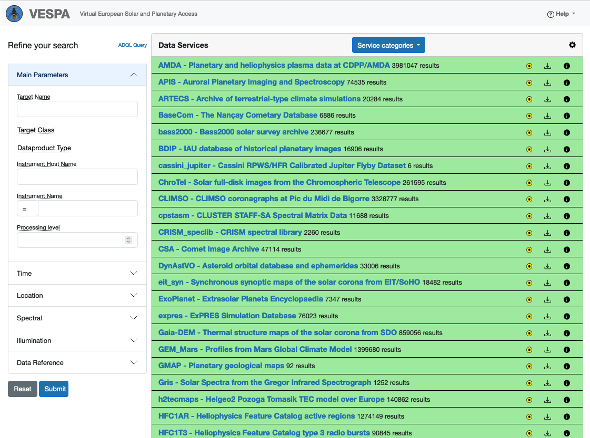
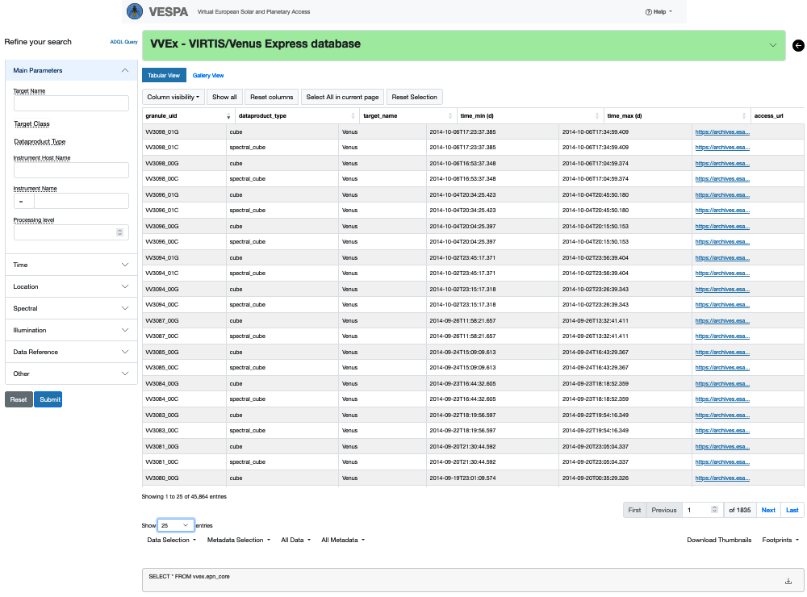

## Overview of the VESPA portal

* [Authors](#authors)
* [Change log](#change-log)
* [Summary](#Summary)
* [Introduction](#Introduction)


## Authors:

S. Erard, C. Chauvin

## Change log

| Version       | Author        | Notes  |
| ------------- |:-------------:| -----: |
| 0.x           | S. Erard      | on line help ~2020  |
| 1.0           | S. Erard      | 14/11/2024  |


  


# Summary

VESPA (Virtual European Solar and Planetary Access) is an integrated system connecting many data services related to Planetary Science and solar Physics  —&nbsp;see the [main VESPA site](http://www.europlanet-vespa.eu/).

This tutorial provides an overview of the [VESPA data portal](https://vespa.obspm.fr). A shorter documentation is available in the portal from the upper right menu (*Help*> How to use)

# Introduction

VESPA is a facility for Solar System data which is intended to: 

* help users find data of interest for their research
* help research teams make their data available directly at limited cost

VESPA relies on the Virtual Observatory framework, and enlarges it to support Solar System data. It is therefore a distributed infrastructure of data servers connected through a registry. The VESPA portal is a dedicated client that allows the user to query all such data services simultaneously, to identify data of interest from science-oriented parameters, and to plot and analyze data on-line using standard techniques. 


# Entry page

The entry page is divided in 2 columns. The leftmost one is the query area, the large one is the result display area. A menu under *Help* in the upper right corner provides links to external tools and quickstart help.


 
## Query Form

The left area displays a form that allows the user to build his query. This consists in providing values to standard query fields. Each one acts as a filter which reduces the number of results; none is mandatory (no requested value = no filtering). Fields are grouped in thematic panels, with the "*Main parameters*" panel open by default. Contextual help is displayed when hovering the mouse over the field name for 1s. 

### Main fields

**Field panels**: Open field panels by clicking on their banner. Fields set in closed panels are included in the query (click the "*Reset*" button at the bottom if needed). Some parameters (e.g., target_class) only accept predefined values - click them to choose from a list.

**Target Name**: Start typing a Solar System object name — IAU names are expected. The quaero name resolver is available for field completion and disambiguation. If a target class is already selected, the name resolver will only look for targets in this class - uncheck this if you don't get the expected results. When using quaero, all known aliases of the target are included in the query.

**Coordinates**: To search by coordinates (in "*Location*" panel) first select a spatial frame type — this will adapt the nature of coordinates to enter. 

**Longitudes**: In body-fixed coordinates, longitudes always range from 0° to 360° eastward (IAU planetocentric convention).

**Spectral range**: First select the unit (Hz, µm, or cm-1) to set the scale as frequency, wavelength, or wavenumber, then enter range.

**Time\_min and Time\_max**: are entered and displayed as ISO strings in the portal (but they are encoded as Julian Days in the service table).

**Measurement type** (in "*Data reference*" panel) describes the physical quantities provided in the service, encoded as UCDs. An interactive resolver of IVOA UCDs is available [here](http://dc.zah.uni-heidelberg.de/ucds/ui/ui/form); a more complete list is available [here](https://www.ivoa.net/documents/UCD1+/) (including values defined for the Solar System); or have a look at a service of interest to see how your preferred value is encoded.


### Send Query
To send the query, click the blue "*Submit*" button at the bottom of the column.

### ADQL queries
The field panels only contain the main EPN-TAP parameters. When clicking "**ADQL query**" the parameter form is replaced by a free text field where advanced users can write a query directly in ADQL language. This mode only addresses the WHERE clause of the ADQL query.

This mode allows for powerful searches, e.g. using the footprint provided in the s_region parameter:
```
  INTERSECTS(s_region, POLYGON('UNKNOWNFrame', 150, 0, 150, 5, 190, 5, 190, 0))=1
  CONTAINS(s_region, POLYGON('UNKNOWNFrame', 150, 0, 150, 5, 190, 5, 190, 0))=1
```

or searches of individual values in lists, such as:

```
  ivo_hashlist_has(lower(instrument_name), 'iks') = 1
```

The latter function is supported at least by DaCHS servers (used by most EPN-TAP services).

To issue more sophisticated queries on a single service (or to several TAP services on a single server), TOPCAT, TapHandle, and python libraries may prove more flexible than the VESPA portal.


## Global Results

The main area displays all connected services with the number of results - by default the number of rows they contain.
When submitting a query, the central area is rebuilt to display the number of matches in each connected service. Services containing elements matching the query are displayed first, in green. Services in error are displayed in red - usually because they are not reachable at that time (the download icon is still available to get the error message).

* Use the "**Service categories**" menu to restrain display and searches to services pertaining to a science field.
* Click on a service title to access detailed content (service mode) - its results can also be downloaded or sent to TOPCAT directly.
* The cog wheel switches to **Custom mode**, where you provide the url and schema name of any EPN-TAP service. Such services do not have to be declared in the registry (i.e., unpublished services are accessible).
* Some EPN-TAP services are declared in the IVOA registry but not listed in the entry page of the VESPA portal — this is because they haven't passed a complete review yet. Those can be queried individually in Custom mode.


### Additional queries

* **Results Compilation**: Below the list of services, an extra row groups the results from all services in a single table (with some limitation in result number). This table cannot be displayed in the portal but can be sent to TOPCAT, or downloaded as a VOTable.
* **NASA keyword search**: The user's EPN-TAP query is converted to address the NASA PDS catalogue service, which is limited to the dataset level. The link provided in the portal leads to a NASA page listing results found in both NASA and ESA PDS archives. This page starts with a list of links grouped in various categories (agency, mission, instrument, etc), you have to go the "Data Sets and Information" section at the bottom of the page to see the actual results (usually on several pages). This function is only available when using the query form (not the ADQL query mode).


# Service Pages
Clicking a service row in the global result area enters the service mode: the main area now displays a table of results described by many parameters in column. By default, only the top of the table is displayed with a selection of columns. The set of buttons below the green info box are used to set the table layout (number of columns). All columns are displayed by clicking the "**Show all**" button. The exposed table can be enlarged with the "*Show xx entries*" button at the bottom left corner, and browsed with the buttons at the bottom right corner.




* The **Title box** contains global information, including a link to the main web site of the service, if available.
* In the default **Tabular View** a thumbnail is displayed when hovering the mouse over the table (if provided by the service). You can switch to **Gallery View** to display all thumbnails together.
* The left menu is still available to change or refine your query to the service displayed. All EPN-TAP parameters, including columns specific to this service, are available from the "*Other*" panel. Click the "+" button to use several such parameters, "x" to remove one. 
* Clicking on the table **column header** switches the spectral scale and unit between Hz, cm^-1 and µm.
* Some values provided in table cells can be clicked:


| Column       | Link to        |
| ------------- |:-------------:|
| access\_url           | Main data product      |
| thumbnail\_url         | Small image of this product     |
| external\_url         | Detailed web page for this granule    |
| datalink        | List of related links for this granule       |
| s\_region          | footprint as contour: copy or SAMP    |
| coverage             | footprint as MOC: copy or SAMP      |


## Mouse actions
*   **Selections**: Individual results can be selected/unselected by clicking on table rows, using your system shortcuts. "*Select all*" / "*Reset*" buttons are available at the top of the table.


## Data & metadata retrieval
Information can be sent to open VO applications using the local menus at the bottom left of the table. Select row(s) of interest and click:

* **Metadata/Send table**: Send the description table to VO applications (in VOTable format, typically handled by TOPCAT).

* **Data/Send** [type]: Send data file(s) with specified data type - will open in VO applications supporting this data type, e.g., images in Aladin (see "*VO tools*" under "*Help*"). Other applications supporting the SAMP protocol may accept data (e.g. ds9, ImageJ and QGIS with SAMP plugin, etc). This menu is greyed out when the data are scalars values (i.e., included in the table itself).

| Data type       | Tool        |
| ------------- |:-------------:|
| Tables           | TOPCAT      |
| Spectra         | CASSIS, Splat-VO     |
| Images          | Aladin, ImageJ with SAMP plugin, possibly ds9    |
| CDF             | TOPCAT      |
| VIRTIS PDS Cubes        | APERICubes      |
| Das2stream          | Autoplot      |
| WMS images           | QGIS with SAMP plugin      |
| PDS4 tables          | TOPCAT      |


**When downloading data**:

* In case the data are not sent to the support application (e.g., webstart continuously reloading), try and deactivate any proxy in your browser. 

* If you need to retrieve an ascii version of data provided as VOTable (e.g., Titan profiles service), first check if the service includes rows providing the data in ascii format. Otherwise, send as Table to TOPCAT and save it in ascii from there (this can be scripted for pipeline processing). 

The two menus at bottom right provide support functions when available:

* **Footprints**: Send the footprints of selected rows to Aladin and TOPCAT if open, as contours or MOCs.
* **Download thumbnails**: Will zip thumbnails of the selected rows.

**In the SELECT row** at the bottom the "*Download VOtable*" icon will download all results - copying the associated link will store the complete TAP request for future use.

# To go further

More sophisticated queries can be handled from astropy, other VO libraries or TAP clients, see:

* [Accessing metadata and data of a public EPN-TAP service from Jupyter notebook (VIRTIS-VEx) ](https://github.com/epn-vespa/tutorials/blob/master/misc/Jupyter-notebook-access/VVEX_demo.ipynb)
* [EPN-TAP services: Using TopCat as a client](https://github.com/epn-vespa/tutorials/blob/master/misc/EPN-TAP-services-Using-TopCat-as-a-client/EPN-TAP_services-Using_TopCat_as_a_client.md)

# References

More information on VESPA: [http://www.europlanet-vespa.eu/](http://www.europlanet-vespa.eu/)


