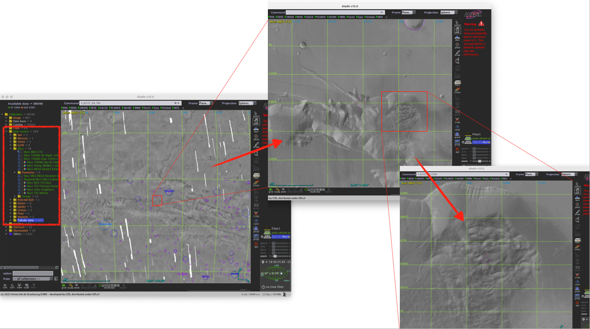
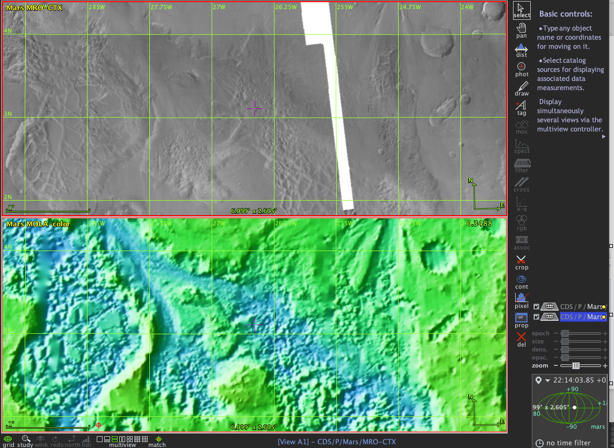
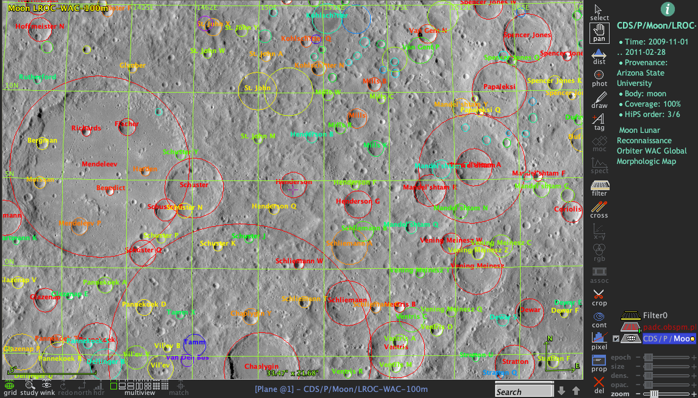
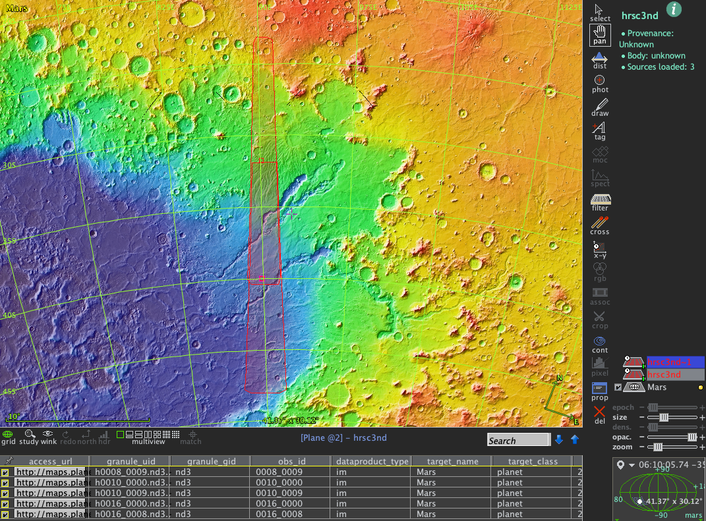
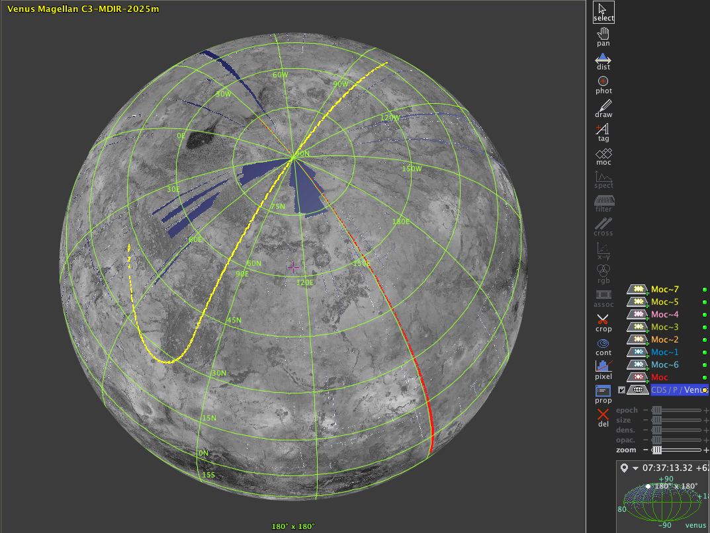
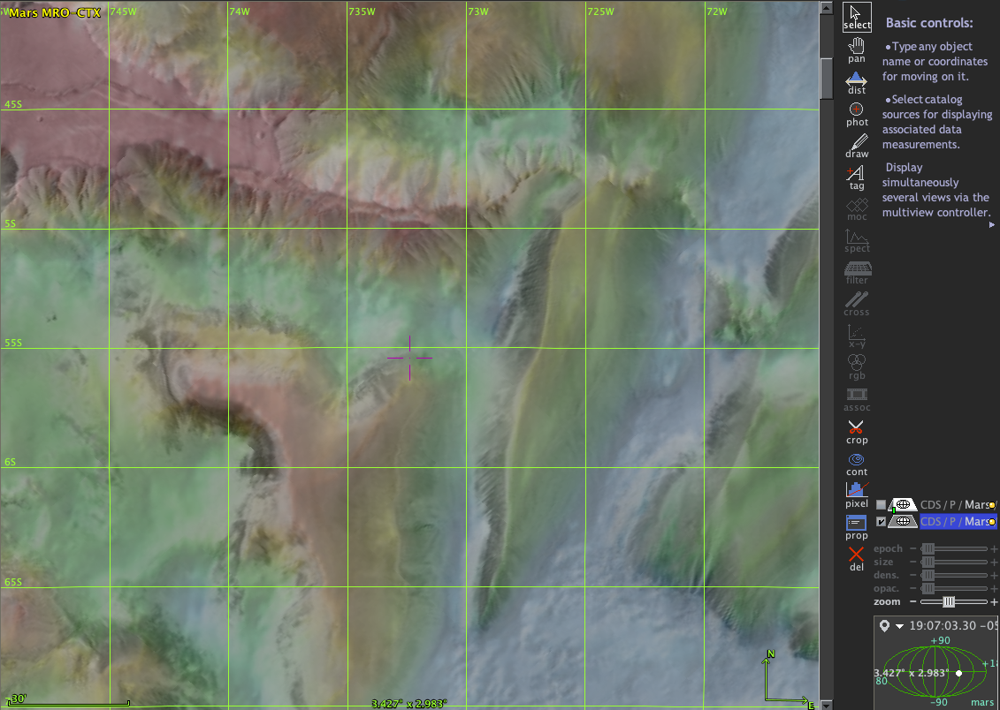
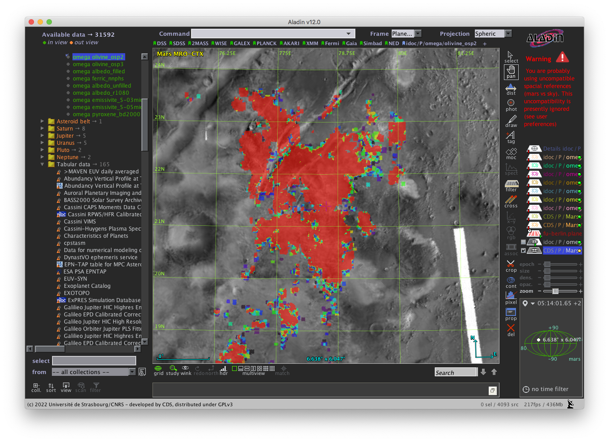
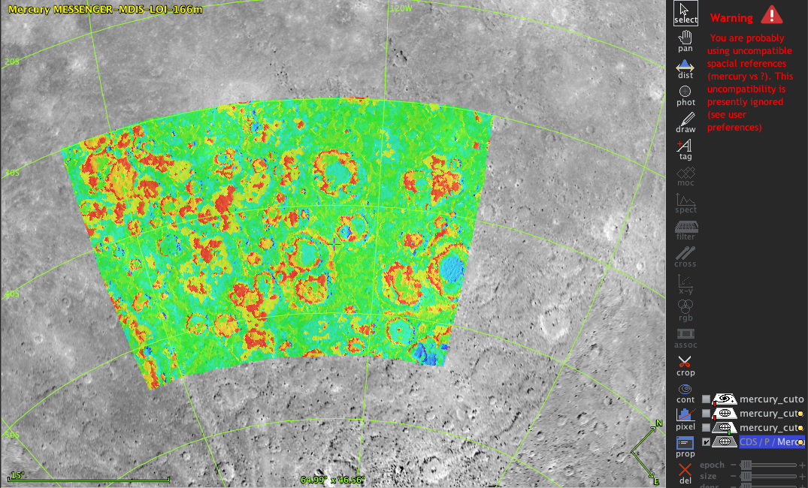
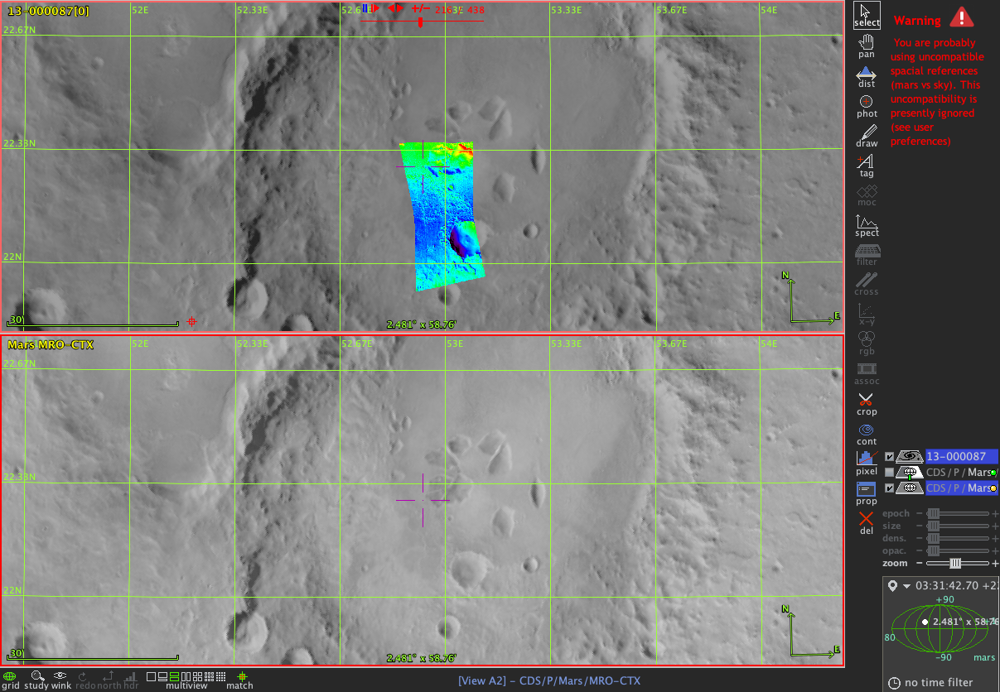
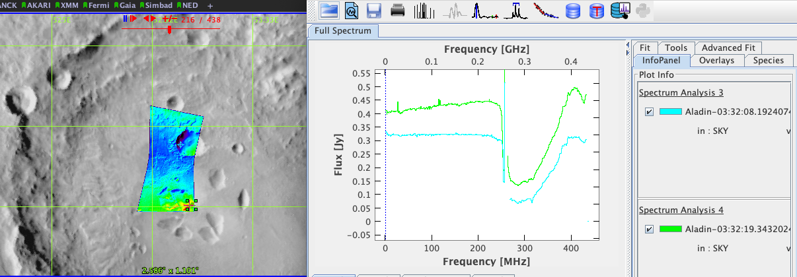

## Planetary maps and images in Aladin

## Tutorial

Basic display and visualisation of planetary images 

### Change log

| Version | Authors                         | Notes     |
| ------- |:-------------------------------:| ---------:|
| 0.1     | S. Erard, S. Derrière, M. Minin | 1/6/2015  |
| 1.0     | S. Erard                        | 22/6/2025 |

### Keywords

Images
Maps
Cubes
Tools

## Summary

This tutorial describes basic image manipulation of planetary images in Aladin.

It assumes an adequate setup in Aladin (see [setting_up_tools](https://github.com/epn-vespa/tutorials/blob/master/misc/setting_up_tools/setting_up_tools.md))

## Introduction

The VESPA data infrastructure heavily relies on the Virtual Observatory (VO) framework, and enlarges it to support Solar System data. In particular, classic VO tools are used to provide easy display functionalities to the users. However, those are mainly aimed at plotting objects in a celestial reference frame. Although this is adapted to celestial images of planetary interest (e.g., telescopic images of asteroids or planets), this is not optimal for planetary maps or orbital measurements. 
Aladin has therefore been expanded to support images of planetary surfaces in the VESPA environment.

## Using planetary HiPS in Aladin

### 1- Basic manipulation

Once the planetary mode is validated in Aladin, Solar System HiPS are included in the left-hand Data discovery tree (red rectangle in Fig.1). Most sub-directories contain HiPS of the planets and their satellites. 

[HiPS](https://aladin.cds.unistra.fr/hips/) (Hierarchical Progressive Surveys) are multiresolution maps which are optimised for display of on-line material: only the scene and resolution plotted on screen is downloaded, making it fast and smooth. HiPS rely on a tessellation system of the sphere (healpix).

The Aladin Data tree includes tens of planetary HiPS, many of which are derived from the standard USGS maps with their native resolution. 

• In the fields above the display window, set coordinate frame to "Planet deg" and projection to "Spheric"  for most applications

• Double click on a planetary HiPS to display it. "Mars MRO CTX" has the highest resolution at the time of writing

• Click "Grid" below the display window to show the coordinate grid

• Click and drag the pointer to rotate the planet (select the "Pan" tool if this doesn't work). Double-click on a location to centre it.

• Zoom in or out with the mouse central button

• Rotate the polar axis by dragging the mouse on the compass (bottom right of display window). This is reset by clicking the North icon below the window.

• "Lock View" from the local menu freezes the attitude but still allows zooming in/out

• The menu item Image>Symmetry swaps the scene in both directions



*Fig.1: basic HiPS manipulation in Aladin (Mars MRO CTX)*

### 2- Special uses

In addition to maps, some planetary HiPS are built from lander **panoramas**. Play with the "Mars Stimson panorama" by zooming in/out at different locations.

The field of view is always plotted at the bottom of the window. A **scale and compass** are also visible when the body is resolved (not in full-disk view).

HiPS support changes of **projection** mode (from the "Projection" field above the display window). The most relevant projections are:

• Spherical (actually: orthographic), can be rotated in 3D with the pointer

• Cartesian (actually: cylindrical) or Mercator provide a complete view of the surface, both preferably centred on the Equator for readability

• Aitoff and Mollweide are similar with lesser deformation at high latitudes

See [setting_up_tools](https://github.com/epn-vespa/tutorials/blob/master/misc/setting_up_tools/setting_up_tools.md) for more details.

The healpix grid is usable on ellipsoids to plot images or data; beware however that density maps are not preserved but are function of latitude. Plotting data on irregular shape models is supported by TOPCAT rather than Aladin (see [shape models in TOPCAT](https://github.com/epn-vespa/tutorials/blob/master/surfaces/shape_models/shape_models.md)).

### 3- Multiview display

The mutiview mode is available from a series of icons below the display window. This is used with either independent or associated plots. With two (or more) windows open:

• Select both windows (Comm-click on Mac OS) and move the pointer to synchronise the coordinates and scales (you may also need to click the "Match" icon)

• Unselect the Match icon to dissociate them



*Fig.2: Synchronised HiPS in two windows (CTX and MOLA altimetry on Mars)*

## Overlay of vector information

### 1- Craters

Aladin can load tabular data from TAP services directly.

• Load the Moon LRO WAC morphologic HiPS

• In the Data tree, select Solar System > Tabular data > Lunar craters

• In the opening TAP dialogue, type

```
SELECT TOP 9999 * FROM lunar_craters.epn_core where diameter > 10
```

• In Catalogue > Create a filter > Advanced mode, type

```
{
draw ellipse(0.5*118.54*${diameter}, 0.5*118.54*${diameter}, 0) rainbow(${depth}, 0, 3) rainbow($ {depth},0,3)
draw ${feature_name} rainbow(${depth}, 0., 3)
}
```

This will overplot large crater contours with name. Colour varies with crater size. Of course, this assumes that all craters are circular.

(118.54 is the scale in "/km = 360 *3600 / (2π R<sub>Moon</sub>) )

The same result is obtained by selecting the craters in the VESPA portal (or TOPCAT) and sending the complete metadata table via SAMP.



*Fig.3: Largest lunar craters on LRO mosaic, with circular contours*

### 2- Contours and MOC footprints

When selecting data from the VESPA portal, both s_region and MOC coverages can be sent via SAMP individually or globally from the result table (the same is possible for s_region in the TAPhandle client, or from TOPCAT). Footprints plot directly in Aladin when they are sent by themselves (e.g. using the Footprint button in the VESPA portal, or from the TOPCAT activation menu).

The complete metadata table can also be samped from the VESPA portal or other clients. It will appear in the data stack, and as a table below the display window (click on the data stack if not). Only the central coordinates are plotted by default. To plot the s_region contours themselves, open the property panel (from the local menu or Edit > Properties) and select "Show associated FoV". 



*Fig.4: s_region footprints for selected HRSC nadir sessions on Mars*

Although both formats provide accurate footprints, MOC are particularly adapted to provide complex unit boundaries, as they also support disconnected regions. They are also more robust in some situations (inclusion of a pole, footprint large wrt the planetary disk…).

To display MOC footprints from a samped table, look for the column Coverage in the table and click the button in this cell.



*Fig.5: Selection of VIRTIS / Venus-Express session footprints on Magellan Mosaic*

## Superimposing spatial data

### 1- HiPS

The HiPS already downloaded in Aladin are listed in the data stack (rightmost column). A basic mechanism in Aladin prevents from overplotting HiPS from different planetary bodies (see warning message on top of the data stack area, and check box selector turning red). Also notice that data overlapping the current view are coloured and body in green in the Collections Data tree.

Global HiPS can be superposed by selecting one as reference (check the box) and setting the transparency slider of the other one(s). 

• Try this with Mars TES albedo and Mars THEMIS Day IR mosaic HiPS, or with the THEMIS day and night HiPS. More than two HiPS can be superposed this way.

Some HiPS are stored with colour encoding. Grey-level HiPS can be plotted in Aladin with a colour scale. In any case, a coloured HiPS can be superposed to grey-level ones by setting the transparency slider to a low value. A typical use is to superpose low-resolution physical information on a high-resolution mosaic. 

• Try to superimpose MOLA coloured altimetry (or OMEGA olivine map) to MARS CTX or Mars THEMIS Day mosaic.



*Fig.6: MOLA altimetry (coloured) on CTX mosaic of Mars (high resolution, in grey)*



*Fig.7: OMEGA olivine map (coloured) on CTX mosaic of Mars (high resolution, in grey) in the Jezero crater area*

### 2- Images

Images with no associated coordinate can be georeferenced using the astrometrical calibration functionality in Aladin (under Menu Image). Fits images with WCS included in the header do not require this (see [Planetary images WCS manipulations](../astropy-planetary-coordinate-frames/planetary-images-wcs.ipynb)). However, they will only plot in native format (x/y coordinates) with the lon/lat coordinate grid overplotted, like in ds9.

To allow reprojection of georeferenced images on an arbitrary coordinate grid, it is required to first convert them to HiPS format. In the Aladin data stack, select the image then go to Tool > Generate Hips based on… > current image.

The HiPS computation can take several seconds. When done: select the HiPS version of the image in the data stack, open the properties panel and set "Transparency" to 0. The HiPS image will plot on the reference HiPS basemap, and will follow any manipulation and reprojection in the display window.



*Fig.8: An image of Mercury (planetary fits version) on the MESSENGER HiPS*

### 3- Spectral cubes

Georeferenced spectral cubes can be displayed like images — you may need to use a two-view display to make it fit correctly.
A slider shows up on top of the cube to allow the selection of spectral planes.



*Fig.9: a CRISM spectral cube (fits version) overplotted on the CTX HiPS*

The **Spect icon** in the tool column (right of the display window) will plot a spatial marker and display the spectrum in the secondary Context window (bottom right).

The **CASSIS plugin** (Tools > plugin > CASSIS extractor) will open the CASSIS application and display local spectra.

In both cases, moving the spatial marker in Aladin's main window will update the displayed spectrum



*Fig.10: a CRISM spectral cube (fits version) overplotted on the CTX HiPS*


## Further topics

• Browse planetary HiPS in AladinLite with the [Aladin Lite planets explorer](https://aladin.cds.unistra.fr/AladinLite/planets-explorer/)

• AladinLite has a resolver mode which identifies surface features from the USGS Planetary Gazetteer (requires AladinLite to be installed with this option in the web page).

• As mentioned above, data tree items (under Collections) are coloured green when they overlap the current view and body.

This is done by comparing with a global MOC provided for each collection on a "MOCserver". This can be queried manually here: [MocServer](http://alasky.u-strasbg.fr/MocServer/query) (see use cases on the sky: [MocServer](http://alasky.u-strasbg.fr/MocServer/example))

A more versatile system is available in the Collection-tree filter (click button in front of From at the bottom of the Data tree, select the Spatial tab), allowing the user to provide an on-line MOC and play with intersect functions.


## Links

More information on VESPA: [http://www.europlanet-vespa.eu/](http://www.europlanet-vespa.eu/)

VESPA data portal: https://vespa.obspm.fr

Please contact the VESPA team for support: support.vespa @ obspm.fr
