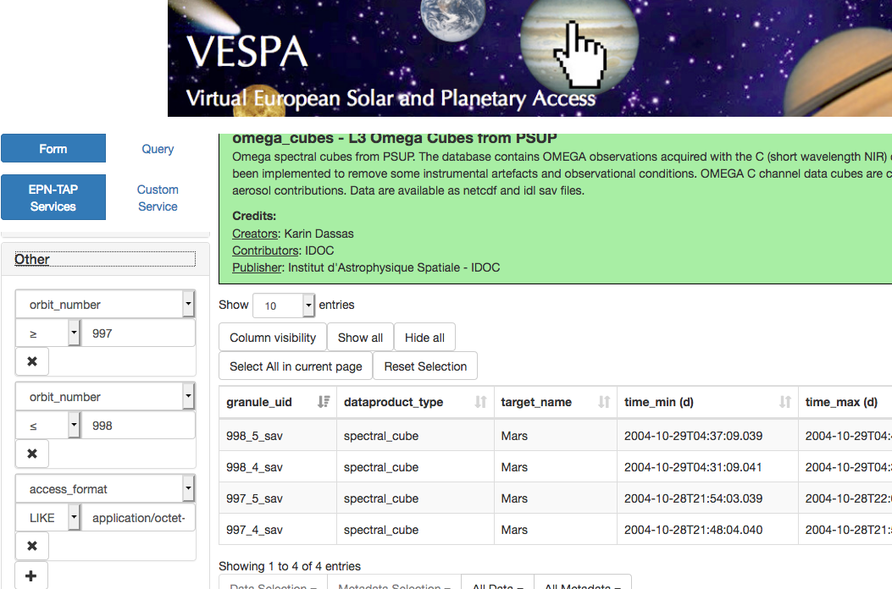
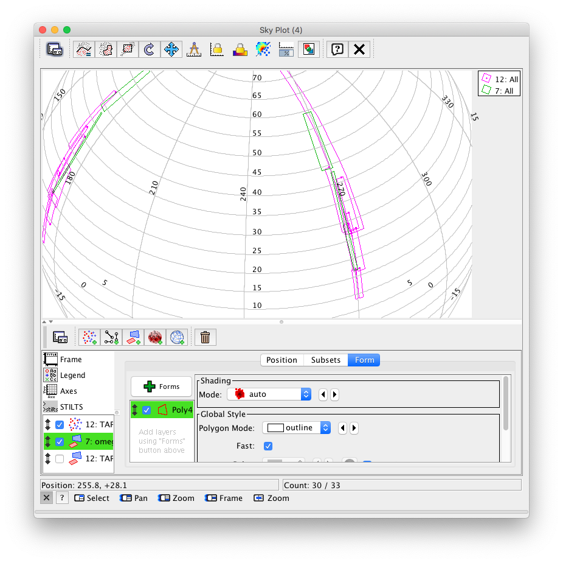
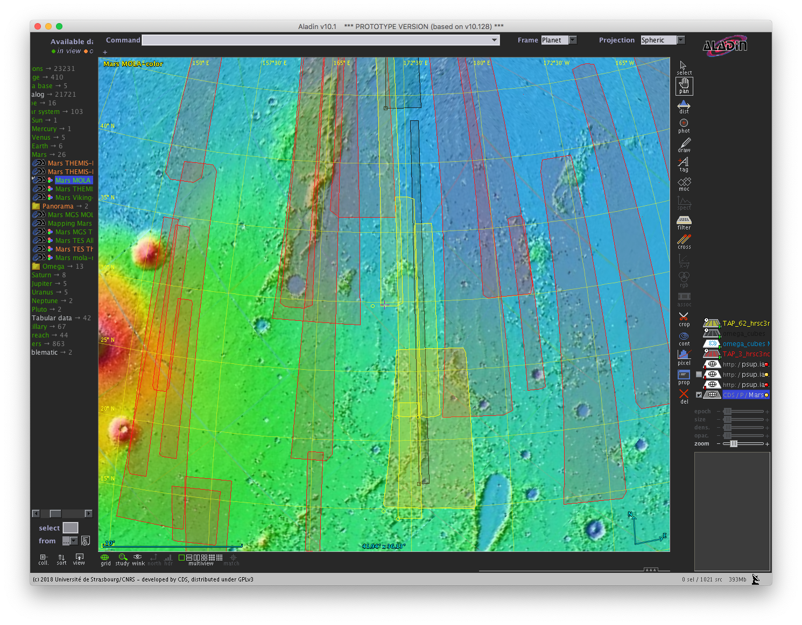

## Matching HRSC & OMEGA files

* [Authors](#authors)
* [Change log](#change-log)
* [Requirements](#requirements-and-dependencies)
* [Use case](#use-case)
* [Keywords](#keywords)
* [Summary](#summary)
* [Introduction](#introduction)
* [Steps](#steps)
* [References](#references)
* [Links](#links)

## Authors:

S. Erard

## Change log

| Version       | Author        | Notes  |
| ------------- |:-------------:| -----: |
| 0.1           | S. Erard      | 4/6/2019  |

* * *

## Requirements and dependencies
None

* * *

## Use case
Searching for overlapping files in spatially extended datasets

## Keywords
* Surfaces 
* Observations
* Images
* Image cubes

## Summary
This short tutorial shows how to identify overlapping files at the surface of Mars from footprints (Mars-Express/HRSC and OMEGA services).

## Introduction

HRSC and OMEGA are respectively the main camera and the imaging spectrometer on board Mars-Express. Both acquired large datasets from early 2004, and now provide a nearly complete coverage of Mars. The hrsc3nd and omega_cubes services available in VESPA are used here to illustrate the common problem of idenfying observations of the same area from two different instruments (note that these two services only contain subsets of the original datasets). 

A very basic 2D search can be performed on the VESPA portal using the bounding box (defined by the c1/c2 parameters with min/max values). However this approximation is usually very inaccurate and falls down completely near the poles. Instead, we'll use the footprints provided in some services.

## Steps

### 1- Select OMEGA data of interest
* Go to the VESPA portal, click on the omega_cubes service
* Enter search parameters in the left (query) panel
* For instance, enter orbit_number ≥ 997, orbit_number ≤ 998 and access_format LIKE '%application/octet-stream%'
in the "Other" tab.
* There are 4 results: image cubes acquired on MEx orbits 997 and 998, with no duplication (related to format)
* We'll now search for HRSC images of these areas

[http://vespa.obspm.fr]

### 2- Send results to TOPCAT and edit the table
* First open TOPCAT on your desktop (or click the TOPCAT icon in the VESPA portal page) 
* Click on All metadata / Send table (below the table)
* TOPCAT will receive a table called omega_cubes, with 4 rows (identical to the one displayed in the portal)
* In the omega_cubes service the s_region parameter is empty and doesn't provide the footprint of the observing sessions. We'll build footprints from the bounding box limits provided in the coordinate parameters (C1/C2 for longitude/latitude, with min/max values).
* Open the table in TOPCAT and add a new synthetic column with: 

name: box5 

expression: "POLYGON UNKNOWNFrame "+join(array(C1min, C2min, C1min, C2max, C1max, C2Max, C1max, C2min), " ")
* Add another column with:

name: box6

expression: "POLYGON("+join(array(C1min, C2min, C1min, C2max, C1max, C2Max, C1max, C2min), ",")+")"
* You also need to edit the column definition. Click the icon Display column metadata. Search for box5, type in the field xtype of this parameter: adql:REGION followed by ENTER (required for TAP).
You can also rename s_region to s_region_0 for later processing in Aladin.

* These bounding boxes can be displayed in TOPCAT using SkyPlot window, with a polygonal form or a quadrilateral layer (see another tutorial). They provide a reasonably accurate estimate of the session footprints, at least outside the polar areas and after the final ~ polar orbit is reached.

* In the HRSC service, the s_region parameter contains contours sampled at high enough resolution to actually represent the image footprints. 

### 3- Search HRSC images overlapping one OMEGA cube
* We'll use a specific 2D search function which is only implemented in the TAP protocol (not in the tools). We therefore need to query the HRSC server with data retrieved from OMEGA.
* In TOPCAT, select the VO>TAP menu item. In the keywords field: enter HRSC, and click the PRSFUB TAP server + Use service
* In the new window, type in the large field at the bottom: 

SELECT *

   FROM hrsc3nd.epn_core where 1=INTERSECTS(s_region, POLYGON(266.762,44.0625,266.762,59.4062,270.934,59.4062,270.934,44.0625) )

where the POLYGON… string is copied/pasted from the omega_cubes table, box6 column for element 997_4_sav
* Click on Run Query. This will load a table containing 2 rows: the 2 HRSC images overlapping the footprint of this OMEGA session.
* See below how to display the results
* Note: the same query can be run directly from the VESPA portal using the Query mode while displaying the HRSC service

[ type in the ADQL field: 1=INTERSECTS(s_region, POLYGON(266.762,44.0625,266.762,59.4062,270.934,59.4062,270.934,44.0625)) ]

### 4- Search HRSC images overlapping a set of OMEGA cubes
* If your selection contains several OMEGA cubes, repeating this process will rapidly become tedious. Instead, this can be achieved with a single query, provided that your search table is first uploaded on the distant server.
* First open the TAP query panel as before. Then type

SELECT *

   FROM hrsc3nd.epn_core as tb

   JOIN TAP_UPLOAD.omega_cubes AS tc

   ON 1=INTERSECTS(tb.s_region, tc.box5)

* You'll now retrieve a table with 17 rows describing the images overlapping the 4 cubes (this table actually concatenates descriptions from the two services, therefore providing one to one correspondance).
* Footprints are easily overplotted on OMEGA's ones using a polygonal form (see other tutorials)

### 5- Displaying the results in Aladin
* Start Aladin (you need the prototype version ≥ 10.128)
* Load the MOLA shaded relief map from the data tree (left panel, under Solar System/Mars); switch Frame to Planet in the upper line. 
* (optional) Select the HRSC service from the data tree (under Solar System/Tabular data). Type

SELECT TOP 9999 * FROM hrsc3nd.epn_core 

in the query field, and click Submit.

Select the new HRSC layer in the right panel, and properties in the local menu (right click)

Click Show associated FoV to display the footprints of HRSC images - displayed in red in the figure
* In TOPCAT, first edit the column names of the omega_cubes table (if not done in step 2) and change s_region to anything else (say, s_region_0) to put it out of the way. 
* Select the table and the menu item: Interop>Send table to Aladin; do the same for the HRSC… TAP_UPLOAD table 
* In Aladin, select the new omega_cubes layer in the right panel (layer stack), and properties in the local menu (right click)
* Click Show associated FoV to display the footprints (bounding boxes) of OMEGA cubes - displayed in black in the figure
* Do the same for the HRSC matches layer - displayed in yellow in the figure

### 6- To go further
* You can add more parameters to refine the match between datasets. An obvious addition in the general case would be to look for similar viewing geometries (but the hrsc3nd service includes only nadir images). Parameters such as acquision time, local time, solar longitude (Ls) which are available in many services, may be required to match also. Searches restrained to these 1D parameters can be performed more easily from the VESPA portal.
* Note that upload in the TAP query (step 4) is required because 1) the two services are located on different servers; 2) one service does not provide footprints in s_region, which is required to search for overlaps; this has to be sorted out in TOPCAT.
* You can test a comparison between services that provide actual footprints by using HRSC and CRISM. Going through TOPCAT is still required because we have to upload one table on a different server. Plotting footprints in Aladin is straightforward in this case.

## References

## Links

See details here to set a correct display on planetary surfaces in TOPCAT and Aladin, and to plot footprints in TOPCAT:

[https://voparis-wiki.obspm.fr/pages/viewpage.action?pageId=14942383]
