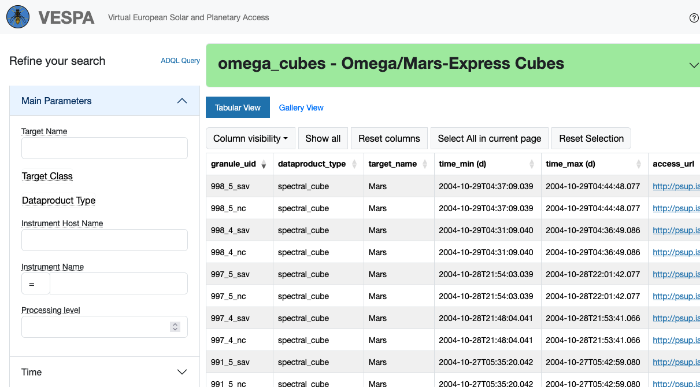
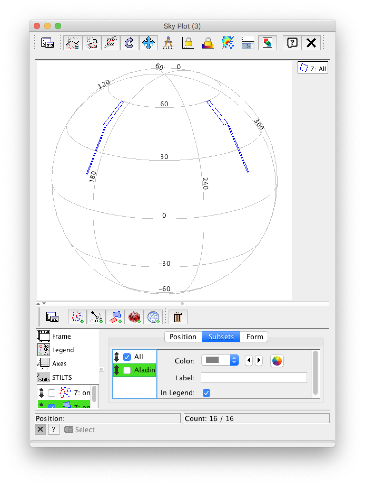
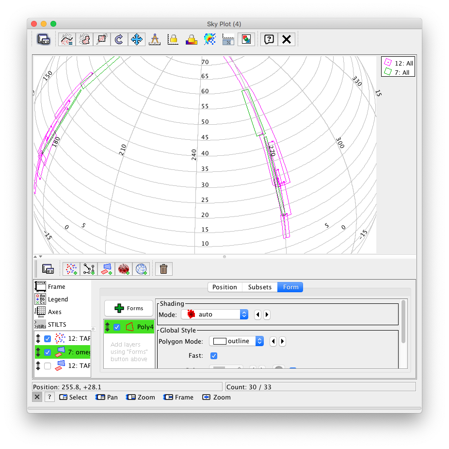
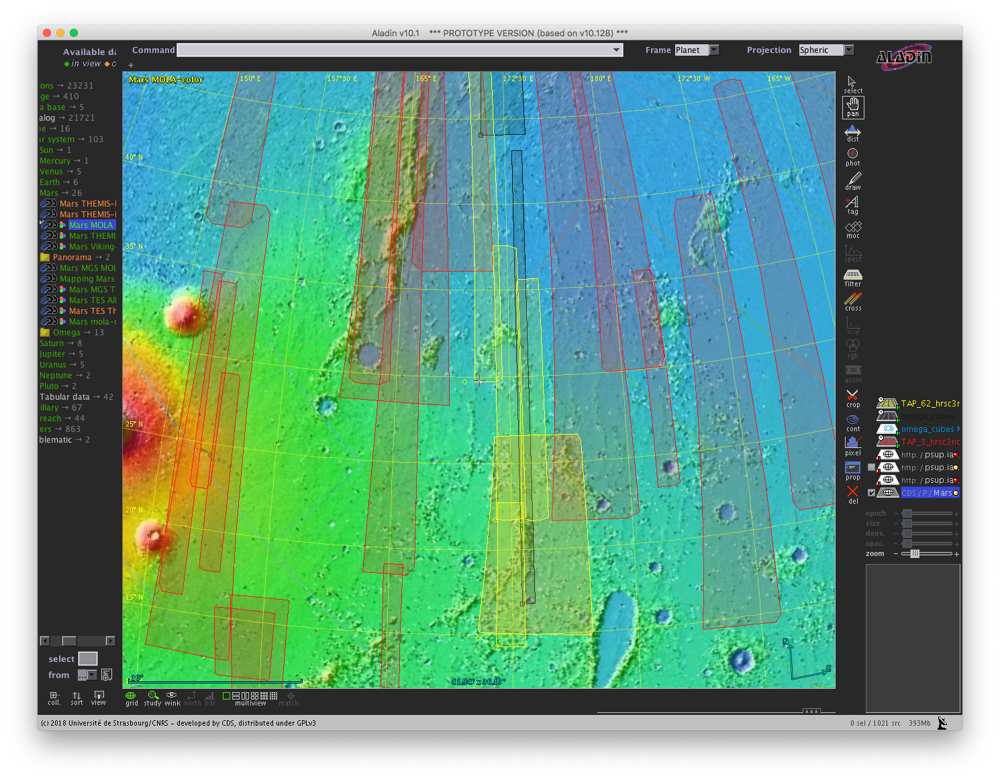
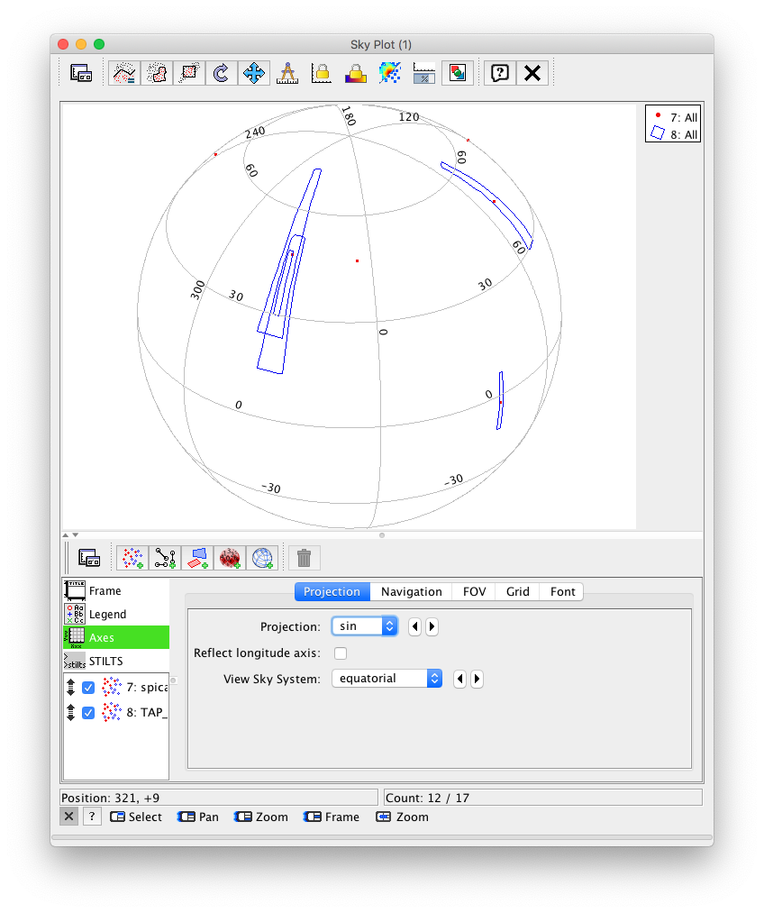
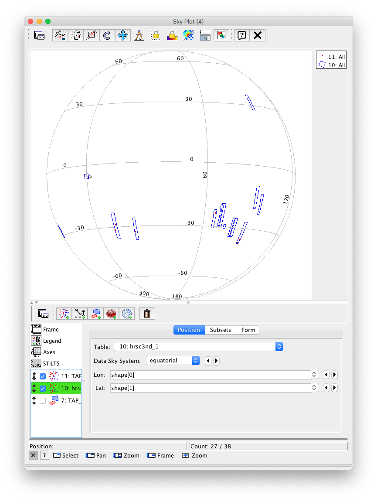

## Cross-matching spatially overlapping observations from EPN-TAP services

[Use case](#use-case)  
[Authors](#author)  
[Summary](#summary)  
[Introduction](#introduction)  
[Tutorial](#tutorial)  
[Links](#links)  


## Use case
Searching for overlapping files in spatially extended datasets


### Change log

| Version       | Author        | Notes  |
| ------------- |:-------------:| -----: |
| 0.1           | S. Erard      | 4/6/2019  |
| 0.2           | S. Erard      | 13/6/2019 |
| 1.0           | S. Erard      | 1/10/2026 |


### Requirements and dependencies
Display setup for planetary surfaces and maps in TOPCAT & Aladin


### Keywords
Surfaces  
Observations  
Images  
Image cubes  

## Summary
This tutorial shows how to identify spatially overlapping files at the surface of planets from footprints provided as contours. It uses Mars-Express data from HRSC, OMEGA and SPICAM (EPN-TAP services).


## Introduction

HRSC and OMEGA are respectively the main camera and the imaging spectrometer on board Mars-Express. Both have acquired large datasets from early 2004, and now provide a nearly complete coverage of Mars; SPICAM performed stellar occultation measurements from which vertical atmospheric profiles were fit. The hrsc3nd and omega_cubes services available in VESPA are used here to illustrate the common problem of identifying observations of the same area in two different datasets, typically from different instruments (notice that the hrsc3nd and omega_cubes services only contain subsets of the original datasets). This use case is then extended to point features, based on the spicam service (which contains derived data). 

A very basic 2D search can be performed on the VESPA portal using a bounding box (defined by the c1/c2 parameters with min/max values). However this approximation is usually very inaccurate and falls down completely near the poles. Instead, we'll use the footprints provided in some services.


## Tutorial


### 1- Select OMEGA data of interest
* Go to the [VESPA portal](http://vespa.obspm.fr), click on the omega_cubes service
* Enter search parameters in the left (query) panel
* For instance, enter in the "Other" tab:
``` 
orbit_number ≥ 997
orbit_number ≤ 998
access_format LIKE '%application/octet-stream%'
```

* There are 4 results: image cubes acquired on MEx orbits 997 and 998 (with no duplication due to various formats)
* We'll now search for HRSC images of these areas
* Footprints are often provided through the standard VO parameter `s_region`, which describes the spatial coverage of an observation as a contour. It is generally more accurate than simple longitude/latitude bounding boxes and enables spatial operations such as INTERSECTS and CONTAINS.





### 2- Send results to TOPCAT and edit the table
* First open TOPCAT on your machine
* Click on All metadata / Send table in the VESPA portal (below the table)
* TOPCAT will receive a table called omega_cubes, with 4 rows (identical to the one displayed in the portal)

The HRSC service includes an s_region parameter which provides contours sampled at high enough resolution to actually represent the image footprints. 

In the omega_cubes service however, the s_region parameter is empty and doesn't provide the footprint of the observing sessions. We'll build footprints from the bounding box provided in the coordinate parameters (C1/C2 for longitude/latitude, each with min/max values).

* Open the omega_cubes table in TOPCAT and add a new synthetic column with: 

```
name: box5 
expression:
"POLYGON UNKNOWNFrame "+join(array(C1min, C2min, C1min, C2max, C1max, C2Max, C1max, C2min), " ")
```
* Add another column with:
```
name: box6
expression: 
"POLYGON("+join(array(C1min, C2min, C1min, C2max, C1max, C2Max, C1max, C2min), ",")+")"
```
* You also need to edit the column definition. Click the icon Display column metadata. Search for box5, type in the field xtype of this parameter: adql:REGION (and validate by pressing ENTER!) - this step is required for TAP.
You can also rename s_region to s_region_0 for later processing in Aladin.

These bounding boxes can be displayed in TOPCAT using SkyPlot window, with a polygonal form or a quadrilateral layer (see another tutorial). They provide a reasonably accurate estimate of the session footprints, at least outside the polar areas and after the final, roughly polar, orbit is reached.




### 3- Search HRSC images overlapping one OMEGA cube
* We'll use ADQL spatial functions provided by TAP services to perform the overlap search. We therefore need to query the HRSC server with data retrieved from OMEGA.
* In TOPCAT, select the VO>TAP menu item. In the keywords field: enter HRSC, and click the PRSFUB TAP server + Use service
* In the new window, type in the large field at the bottom: 

``` 
SELECT *
   FROM hrsc3nd.epn_core where 1=INTERSECTS(s_region, POLYGON(266.762,44.0625,266.762,59.4062,270.934,59.4062,270.934,44.0625) )
``` 

where the POLYGON… string is copied/pasted from the omega_cubes table, box6 column for element 997_4_sav
* Click on Run Query. This will load a table containing 2 rows: the 2 HRSC images overlapping the footprint of this OMEGA session.
* See below how to display the results
> Note: the same query can be run directly from the VESPA portal using the Query mode while displaying the HRSC service. Type in the ADQL field:
>
``` 
1=INTERSECTS(s_region, POLYGON(266.762,44.0625,266.762,59.4062,270.934,59.4062,270.934,44.0625)) 
``` 

### 4- Search HRSC images overlapping a set of OMEGA cubes
* If your selection contains several OMEGA cubes, repeating this process will rapidly become tedious. Instead, this can be achieved with a single query, provided that your search table is first uploaded on the distant server.
* First open the TAP query panel as before. Then type:
``` 
SELECT *
   FROM hrsc3nd.epn_core as tb
   JOIN TAP_UPLOAD.omega_cubes AS tc
   ON 1=INTERSECTS(tb.s_region, tc.box5)
``` 

* You'll now retrieve a table with 17 rows describing the images overlapping the 4 cubes (this table actually concatenates descriptions from the two services, therefore providing one to one correspondance).
* Footprints are easily overplotted on OMEGA's ones using a polygonal form (see other tutorials)




### 5- Displaying the results in Aladin
* Start Aladin
* Load the MOLA shaded relief map from the data tree (left panel, under Solar System/Mars); switch Frame to Planet in the upper line. 
* Select the HRSC service from the data tree (under Solar System/Tabular data). Type

``` 
SELECT TOP 9999 * FROM hrsc3nd.epn_core 
``` 
in the query field, and click Submit.  

* In TOPCAT, first edit the column names of the omega_cubes table (if not done in step 2) and change s_region to anything else (say, s_region_0) so it doesn't get in the way. 
* Select the table and the menu item: Interop>Send table to Aladin;
* Do the same for the HRSC… TAP_UPLOAD table 

To display all three datasets in Aladin: 

* Select the corresponding data layer in the right panel (layer stack), right click to open the local menu, and select Properties
* Click Show associated FoV to display the footprints

In the figure, footprints of HRSC images are displayed in red; bounding boxes of OMEGA cubes in black; HRSC matches in yellow.




### 6- Matching images and point features
* The same technique can be used to identify images containing selected point features (here using the foot of SPICAM vertical profiles from Mars-Express):
* Select a set of SPICAM profiles in the VESPA portal and load it into TOPCAT
* In TOPCAT, open the TAP query for the hrsc3nd service as before and type in the query field: 

``` 
SELECT TOP 1000 *
   FROM hrsc3nd.epn_core AS tb
   JOIN TAP_UPLOAD.spicam AS tc
   ON 1=CONTAINS(POINT(tc.c1min, tc.c2min), tb.s_region)
``` 




* Conversely, to identify point features located in image footprints:
* Select a set of HRSC images in VESPA and load it into TOPCAT


* In TOPCAT, select the VO>TAP menu item. In the keywords field enter "spicam", select the LATMOS TAP server & click "Use service"
* In the new window, type in the query field: 

``` 
SELECT TOP 1000 *
   FROM spicam.epn_core AS tb
   JOIN TAP_UPLOAD.hrsc3nd AS tc
   ON 1=CONTAINS(POINT(tb.c1min, tb.c2min), tc.s_region)
``` 



> Note: again, you can proceed more simply in the VESPA portal in Query mode to retrieve all features in a single image, or all images covering a single feature.


### 7- To go further

Spatial overlap is usually only the first stage of a scientific cross-match. Depending on the application, temporal, seasonal, illumination, or viewing-geometry constraints may also be required. EPN-TAP provides these parameters in a common framework, allowing spatial matches to be progressively refined.

* An obvious addition in the general case would be to look for similar viewing geometries (notice that the hrsc3nd service includes only nadir-looking images). Parameters such as acquisition time, local time, solar longitude (Ls) which are available in many services, may also be required to match. Searches restrained to these 1D parameters can be performed more easily from the VESPA portal before the spatial comparison.
* Note that upload in the TAP query (step 4) is required because 1) the two services are located on different servers; 2) one service does not provide footprints as s_region, which is required to search for overlaps; this has to be sorted out in TOPCAT.
* You can test a comparison between services that provide actual footprints by using HRSC and CRISM. Going through TOPCAT is still required because we have to upload one table on a different server. 
* When dealing with services located on the same server, the present workflow is still the simplest solution: although selecting a part of the first dataset can be done in the same TAP query as the spatial match, it involves a tricky syntax.
* This technique can also be used to look for overlaps in a single 2D dataset. 

An alternative solution for spatial cross-matches is provided by the VESPA geoportal. It relies on MOC footprints rather than s_region contours and provides an interactive environment for spatial selections and comparisons. It is however limited to registered EPN-TAP services.


## Links

See other tutorials about spatial data and planetary surfaces in VESPA, TOPCAT, and Aladin:  

[https://github.com/epn-vespa/tutorials/blob/master/surfaces/Aladin\_Hips\_MOC/Images\_Aladin.md](https://github.com/epn-vespa/tutorials/blob/master/surfaces/Aladin_Hips_MOC/Images_Aladin.md)

[https://github.com/epn-vespa/tutorials/blob/master/misc/setting\_up\_tools/setting\_up\_tools.md](https://github.com/epn-vespa/tutorials/blob/master/misc/setting_up_tools/setting_up_tools.md)

[https://github.com/epn-vespa/tutorials/blob/master/surfaces/geoportal\_demo/Geoportal\_demo.md](https://github.com/epn-vespa/tutorials/blob/master/surfaces/geoportal_demo/Geoportal_demo.md)

