## Finding spectra of TNOs

[Tutorial](#use-case)  
[Authors](#author)  
[Summary](#summary)  
[Introduction](#introduction)  
[Tutorial](#tutorial)  
[Links](#links)  


## Tutorial
Cross correlation of data services

## Author:

S. Erard

### Change log

| Version       | Author        | Notes  |
| ------------- |:-------------:| -----: |
| 1.0           | S. Erard      | 12/10/2024  |
| 1.1           | S. Erard      | 19/6/2025  |
| 1.2           | T. Hope       | 2/4/2026   |


### Keywords
Spectroscopy
Service

## Summary
This tutorial describes how to retrieve spectra of TNOs, when these targets are not identified in spectral services. It also shows how to use the dedicated spectro\_tno service for direct access to TNO/Centaur reflectance spectra with rich metadata (taxonomy, dynamics, photometric colours).

## Introduction

EPN-TAP services includes generic list of asteroids with dynamical properties, and spectral databases of small bodies. In the latter, the dynamical type is not usually provided. To retrieve spectra of TNOs, is it therefore necessary to identify TNOs from a first service, then to query a spectral service with a list of targets. This is not directly feasible in the VESPA portal, but there are several ways to achieve this.


## Tutorial

 
### 1- Identify targets of interest

Several EPN-TAP data services provide dynamical properties of small bodies: MPC, NEOCC, MP3C, DynAstVO, etc.

Specialists can identify objects that belong to a dynamical class using a combination of orbital parameters provided by these services. In some cases however, such classes may be readily indicated. Here, we can identify distant objects from the MPC service by issuing a simple query: 

``
SELECT * FROM mpc.epn_core WHERE "orbit_class" LIKE '%Distant object%' 
``

As of writing, this returns a list of ~ 6000 objects with names and properties (including both TNOs and Centaurs, though)


```
Alternative: Use the analytic TNO definition provided e.g. by Astorb / Lowell Obs: 
SELECT * FROM mpc.epn_core WHERE "semi_major_axis" >= 30.0709 
This yields 5337 objects, TNOs only
```

Such queries can be issued from any TAP client, e.g. the VESPA portal or TOPCAT, see Fig. 1.

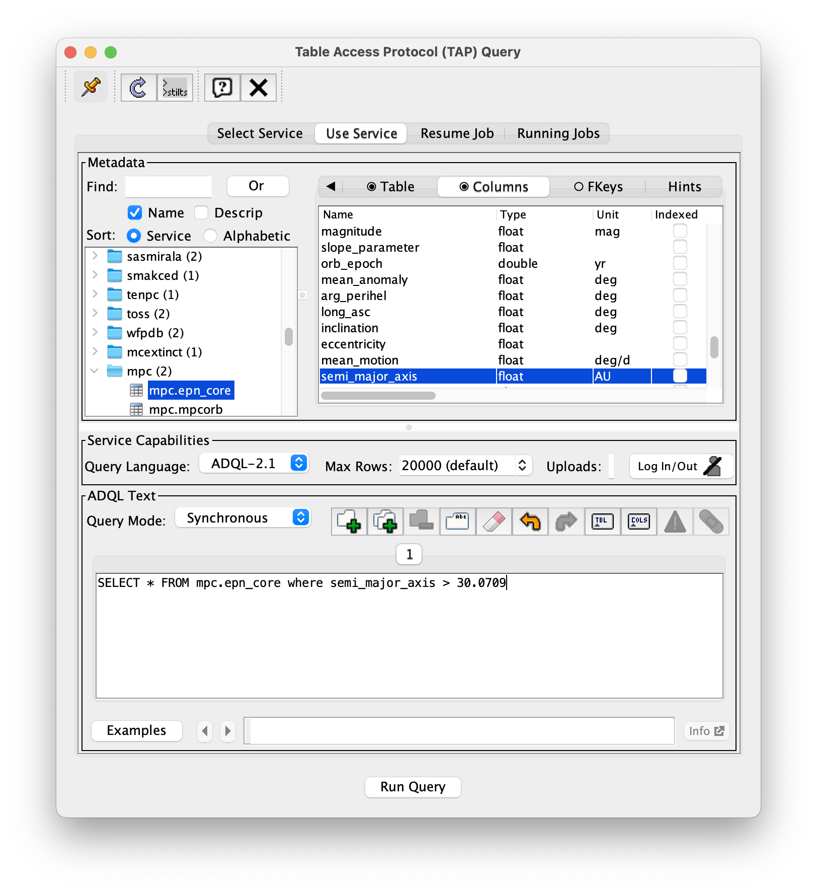

### 2- Getting the spectra

The spectro\_asteroids service is a large collection of small body spectra, but the targets are not described in terms of dynamical class. The list retrieved in step 1 can be used to query this service from the target\_name parameter, thanks to the homogeneity of EPNCore description. 

The easiest way to perform this is to use TOPCAT:

* From TOPCAT, send the above query to the MPC service (or do it in the VESPA portal, then SAMP the result table to TOPCAT)
* In TOPCAT, grab the whole table from spectro\_asteroids - check that you're not limited in number of answers ("Max Rows" field):

``
SELECT * FROM spectro_asteroids.epn_core WHERE ("target_class" LIKE '%asteroid%')
``

* In TOPCAT, from the Join menu: run a Pair match between the two tables. Use: algorithm = Exact Value; Matched Value = target_name in both cases; Match Selection = All matches (to retrieve all available spectra). See Fig. 2.
* This returns a list of 49 spectra of TNO at the time of writing

Links to the spectra are available under access\_url in this table.


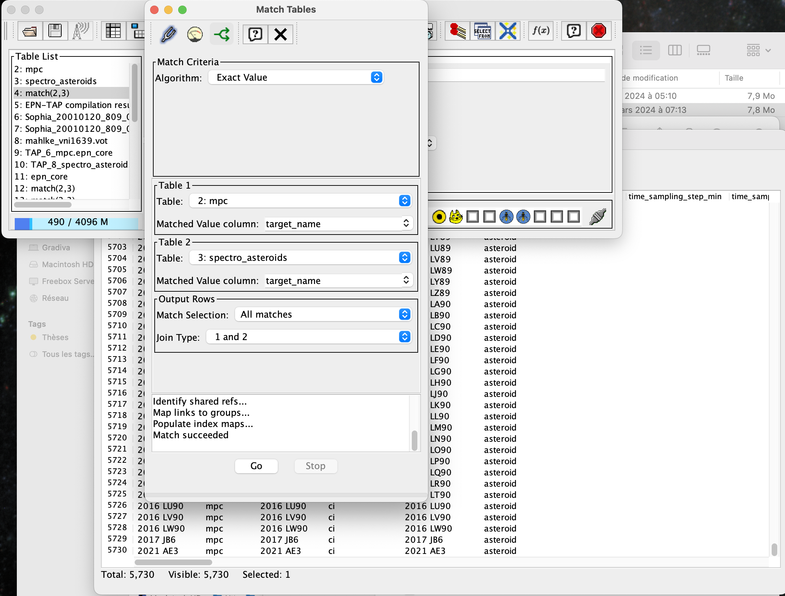

To display the spectra in TOPCAT:

* With the match result table selected, go to Activation actions in menu Views 
* Click Plot Table in the left menu
* The plot window will open and display something
* Set up the display as you wish, e.g.: reflectance(wavelength), with Form = Add line 
* Clicking a row will plot the current spectrum
* The Load table action works similarly


### 3- Alternative solutions
 
Alternative solutions exist which may be more efficient in some cases:

* You can upload the target list to the server hosting the spectro\_asteroids service and run a cross match on the server. This is especially convenient if the service you're mining is too large to be downloaded easily. This functionality is available from TOPCAT and other TAP clients, or in python using the astropy library. "Upload Join" is a property of the TAP protocol, but some TAP servers may disable it - in particular you are limited in upload size, so it is better to reduce the size of the target list to a minimum:

```
; target list from service MPC (will load as t9 in this TOPCAT session):
SELECT target_name FROM mpc.epn_core WHERE "orbit_class" LIKE '%Distant object%' 
;
; join on service spectro_asteroids:
SELECT TOP 100 *
  FROM spectro_asteroids.epn_core AS db
  JOIN TAP_UPLOAD.t9 AS tc
    ON (db.target_name = tc.target_name)
```


* Alternatively, in python you can loop on the target list and send individual queries to the spectrum service. This also makes it possible to retrieve spectra from several services.


### 4- Using the dedicated spectro\_tno service

The spectro\_tno service (Merlin et al. 2017, A&A 604, A86) provides combined vis-nIR reflectance spectra (0.35--2.45 micron) of 42 TNOs and Centaurs, plus 4 taxonomic mean spectra. Unlike generic spectral services, it includes dynamical classification, spectral taxonomy, and photometric colour indices directly as queryable columns. No cross-match with MPC is needed to filter by dynamical class.

#### Querying the service

From TOPCAT (VO > TAP), connect to the PADC TAP service and run:

``
SELECT * FROM spectro_tno.epn_core
``

This returns 46 rows: 42 individual spectra and 4 taxonomic mean spectra computed by Merlin et al. 2017 (one per BB, BR, IR, RR class of the Barucci et al. 2005 taxonomy).

#### Filtering by dynamical class or taxonomy

The custom columns allow direct filtering without any cross-match:

``
SELECT target_name, dynamical_type, taxonomy_code, instrument_name
  FROM spectro_tno.epn_core
  WHERE dynamical_type = 'Plutino'
``

Available values for dynamical\_type: Cubewano, Plutino, SDO, Detached object, Centaur.
Available values for taxonomy\_code: BB, BR, IR, RR.

#### Displaying a spectrum

* Load the result table in TOPCAT
* Open the Activation Actions window (Views > Activation Actions)
* In the Actions list, check "Plot Table"; in the Configuration panel, set Table Location to access\_url and Plot Type to Plane
* Click a row in the table, or use the lightning bolt button to invoke on the current row
* TOPCAT opens a Plane Plot window with X = wavelength and Y = reflectance (auto-detected from VOTable UCDs)
* In the Form tab, check Line alongside Mark to connect the data points; the Aux axis displays reflectance\_error as a colour gradient


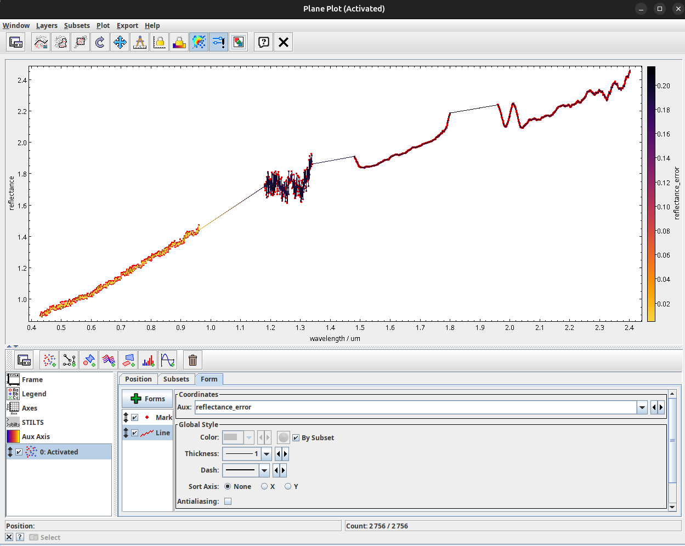


### 5- Enriching spectro\_tno with orbital parameters from MPC

The spectro\_tno service provides dynamical classification but not orbital elements. These can be retrieved from MPC via a cross-match on target\_name in TOPCAT.

#### Step-by-step

* Load spectro\_tno in TOPCAT:

``
SELECT target_name, alt_target_name, dynamical_type, taxonomy_code
  FROM spectro_tno.epn_core
  WHERE granule_gid = 'combined_spectrum'
``

* Load orbital elements from MPC:

``
SELECT target_name, semi_major_axis, eccentricity, inclination
  FROM mpc.epn_core
  WHERE orbit_class LIKE '%Distant object%'
``

* Open the Match Tables window (Joins > Pair Match)
* Algorithm: Exact Value
* Table 1: spectro\_tno table, Matched Value column: target\_name
* Table 2: MPC table, Matched Value column: target\_name
* Output Rows — Match Selection: Best match, symmetric; Join Type: 1 and 2
* Click Go

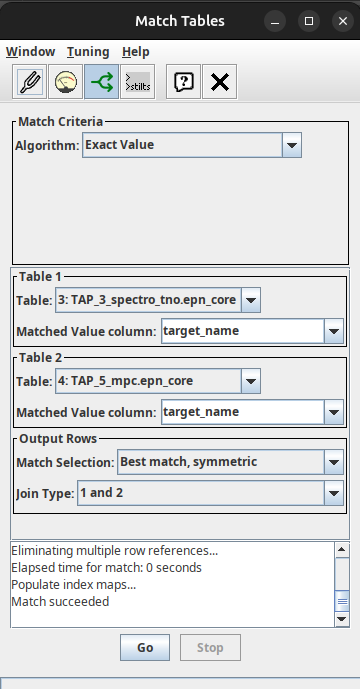

This produces a combined table with both spectro\_tno metadata (taxonomy, dynamics) and MPC orbital elements (semi\_major\_axis, eccentricity, inclination) for each matched object.

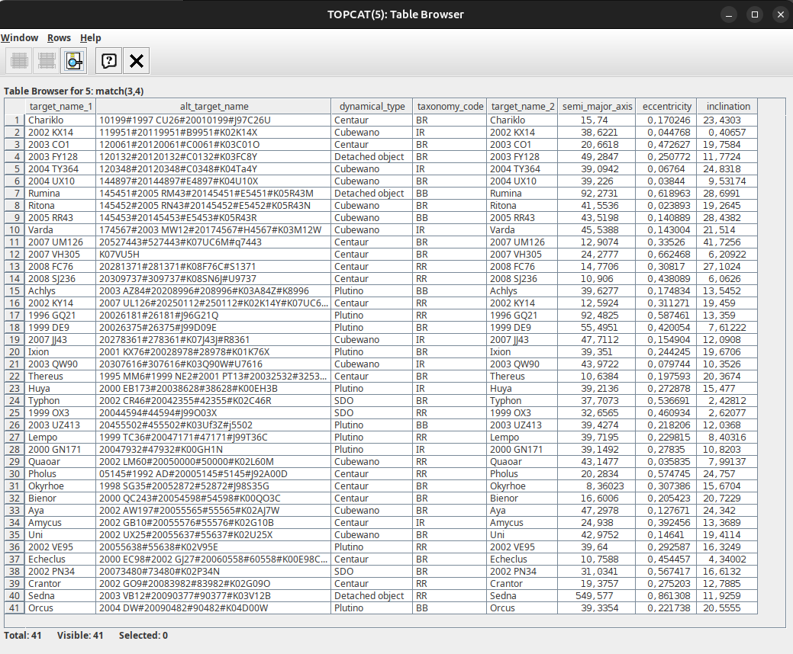

Note: target\_name in spectro\_tno uses current IAU names from the SsODNet/Quaero database. For recently named objects (e.g. Lempo, Varda, Aya), the match with MPC may require using alt\_target\_name instead.

#### Scatter plot: orbital elements coloured by taxonomy

With the matched table:

* Open the Plane Plot window (Graphics > Plane Plot)
* In the Position tab, set X = semi\_major\_axis, Y = eccentricity
* To colour by taxonomy: in the main TOPCAT window, open Views > Row Subsets and create one subset per class (e.g. expression `taxonomy_code.equals("BB")`, and likewise for BR, IR, RR)

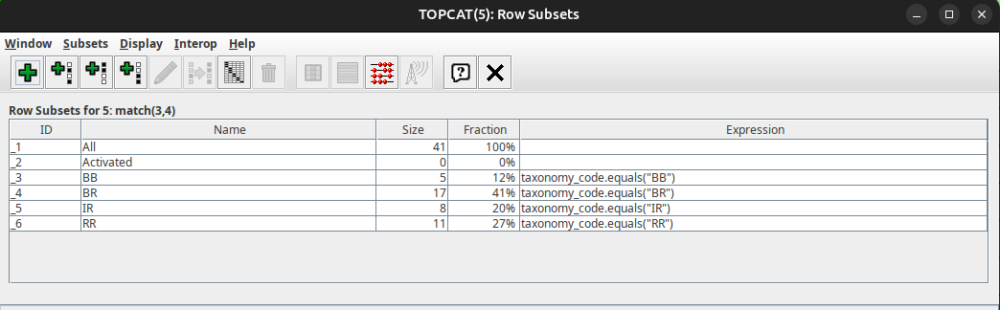

* Back in the Plane Plot, go to the Subsets tab: the 4 subsets appear with distinct colours. Check all four to display the points coloured by taxonomic class

<div style="width:650px; height:650px; overflow:hidden;">
  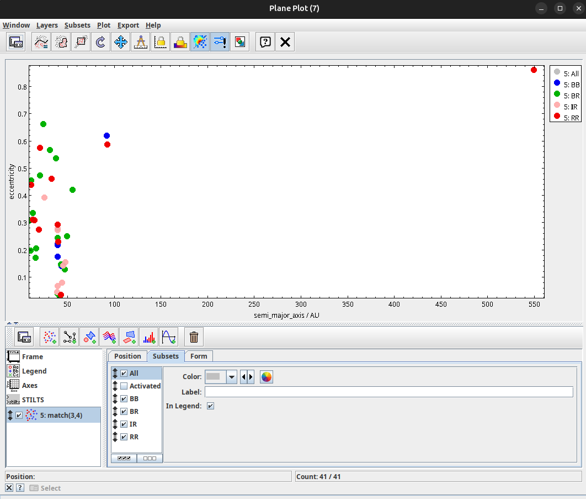
</div>

This kind of analysis was previously only possible by manually combining several catalogues. The EPN-TAP framework and TOPCAT make it a straightforward operation.


### 6- Comparing taxonomic mean spectra

The 4 taxonomic mean spectra (BB, BR, IR, RR) summarise the spectral diversity of TNOs/Centaurs. They can be compared directly:

``
SELECT * FROM spectro_tno.epn_core WHERE granule_gid = 'taxonomic_mean'
``

* Load this table in TOPCAT (4 rows)
* In Activation Actions, check "Load Table" with Table Location = access\_url
* Use the double lightning bolt with film strip icon ("Perform all active actions on every row in the current subset in turn") to load all 4 VOTables at once

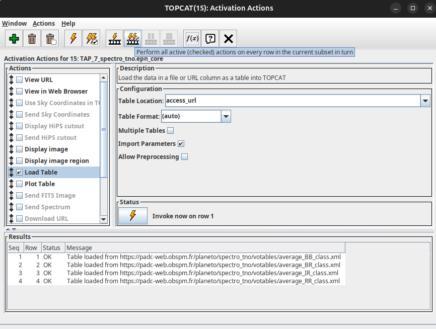

* Open a Plane Plot (Graphics > Plane Plot). The first table is already displayed
* For each remaining table, click "Add a new positional plot control to the stack" and select the next table. Set X = wavelength, Y = reflectance

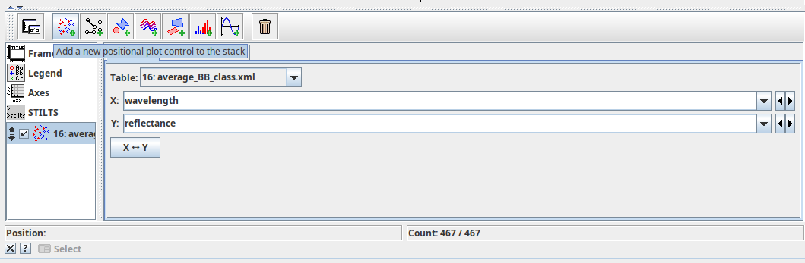

* Check Line in the Form tab for each layer
* Each layer gets a distinct colour, allowing direct comparison of the 4 mean spectra

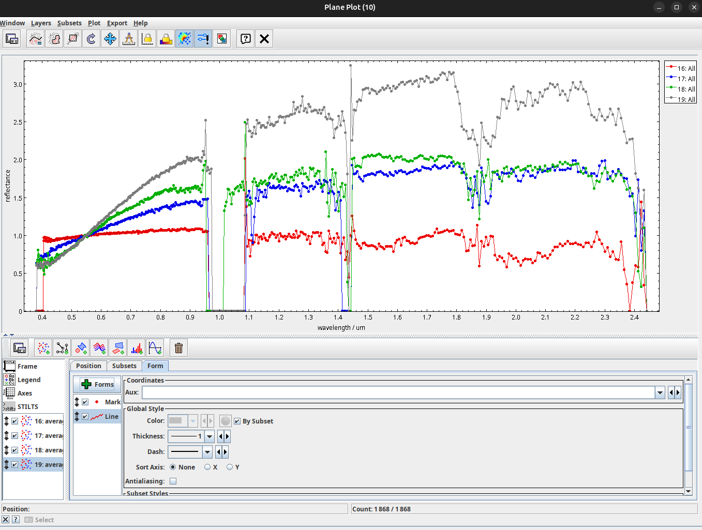

The spectral slope increases from BB (neutral/blue) to RR (very red), reflecting increasing amounts of complex organics (tholins) on the surface.


### 7- Photometric colour analysis

The spectro\_tno service includes V-R, V-I, V-J, V-H and V-K colour indices from Table 2 of Merlin et al. 2017. These can be used to study the colour diversity of TNOs:

``
SELECT target_name, taxonomy_code, dynamical_type,
       color_index_v_r, color_index_v_i, color_index_v_j
  FROM spectro_tno.epn_core
  WHERE color_index_v_r IS NOT NULL
``

* Load in TOPCAT and open the Plane Plot window (Graphics > Plane Plot)
* In the Position tab, set X = color\_index\_v\_r, Y = color\_index\_v\_j
* To colour by taxonomy: open Views > Row Subsets and create one subset per class (`taxonomy_code.equals("BB")`, and likewise for BR, IR, RR), then check them in the Subsets tab of the plot

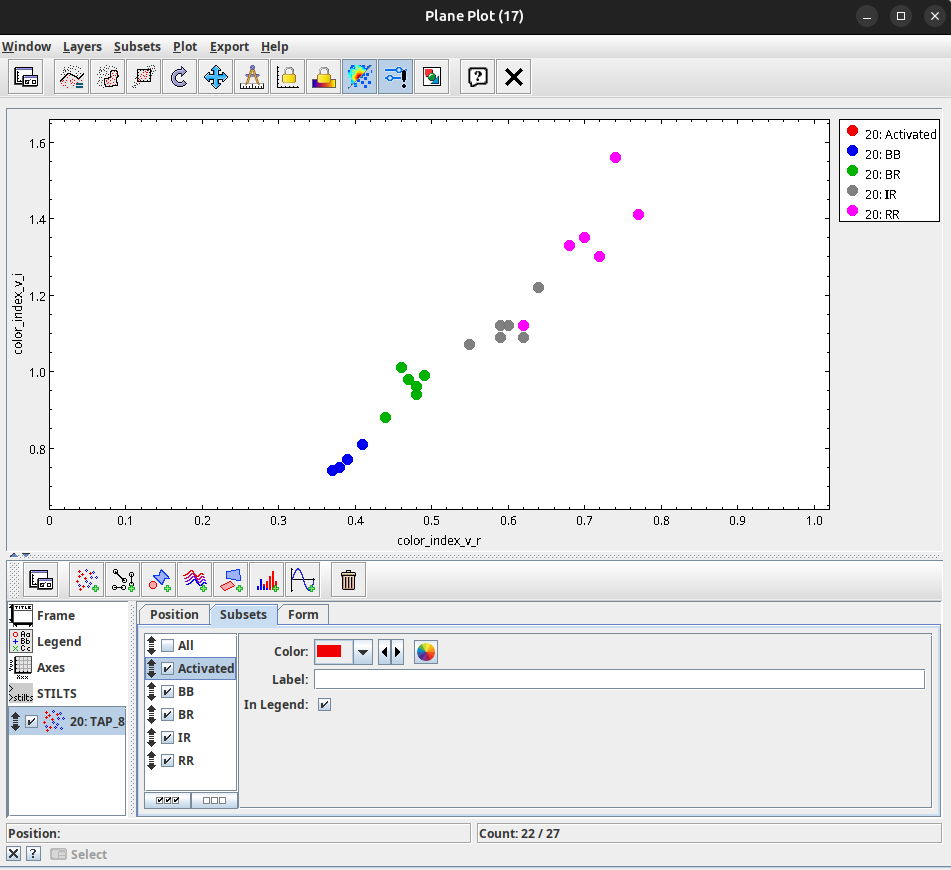


## Links

* [VESPA portal](http://vespa.obspm.fr)
* [TOPCAT](https://www.star.bris.ac.uk/~mbt/topcat/)
* [Merlin et al. 2017](https://doi.org/10.1051/0004-6361/201730933)
* [Barucci et al. 2005 taxonomy](https://doi.org/10.1051/0004-6361:20053346)
* [SsODNet/Quaero API](https://ssp.imcce.fr/webservices/ssodnet/api/quaero)


