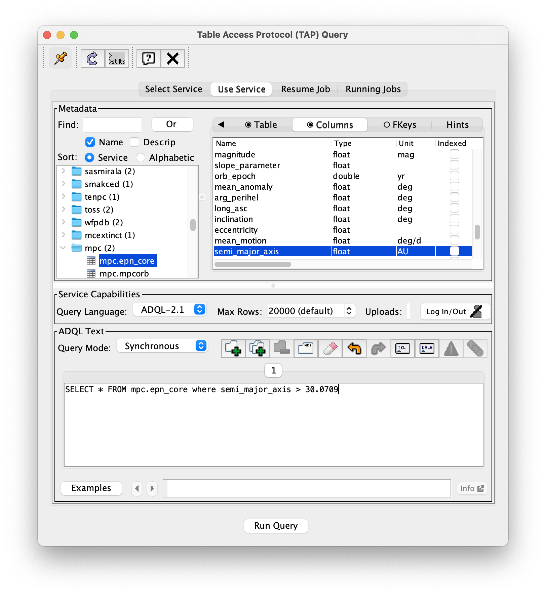
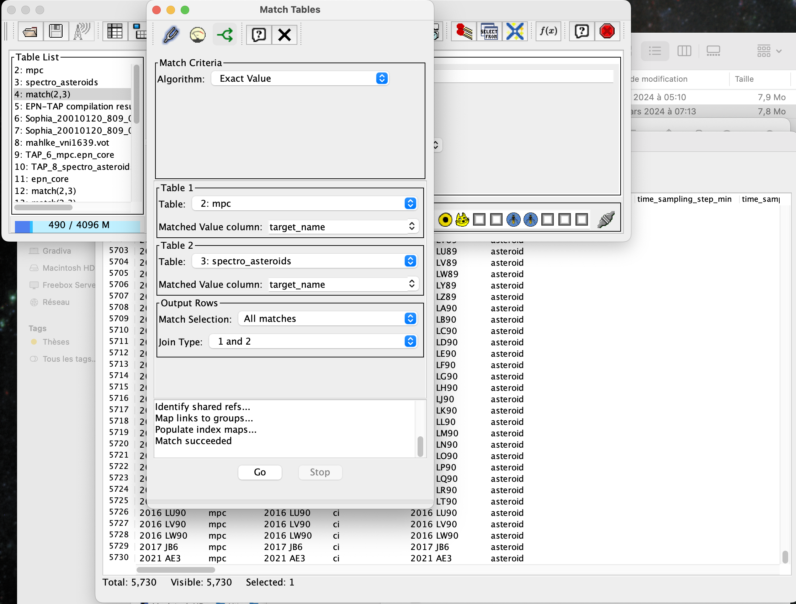
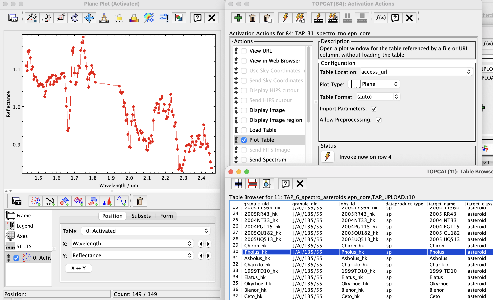
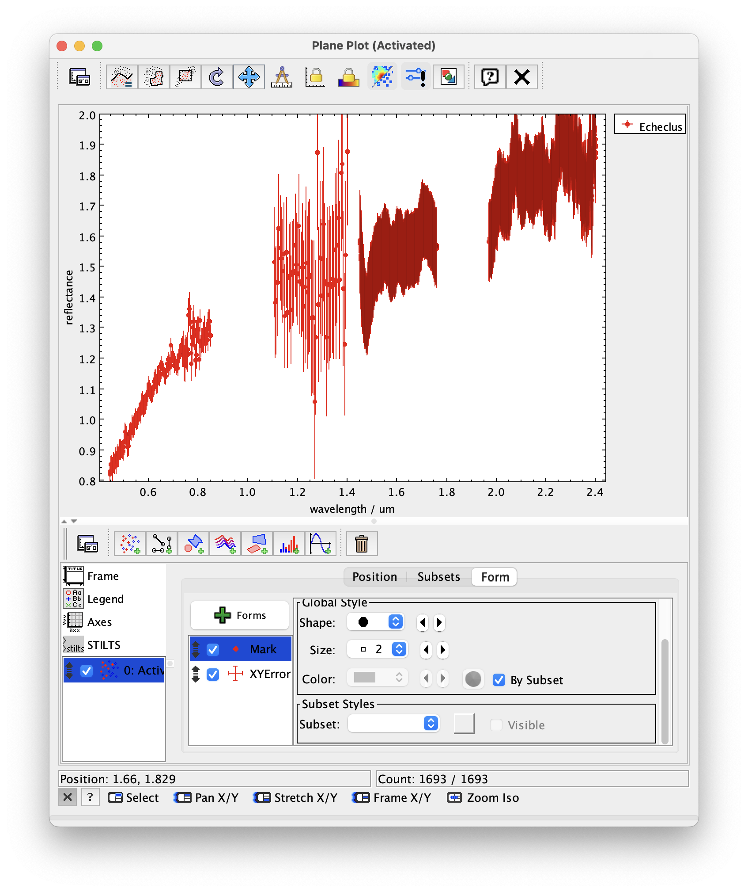
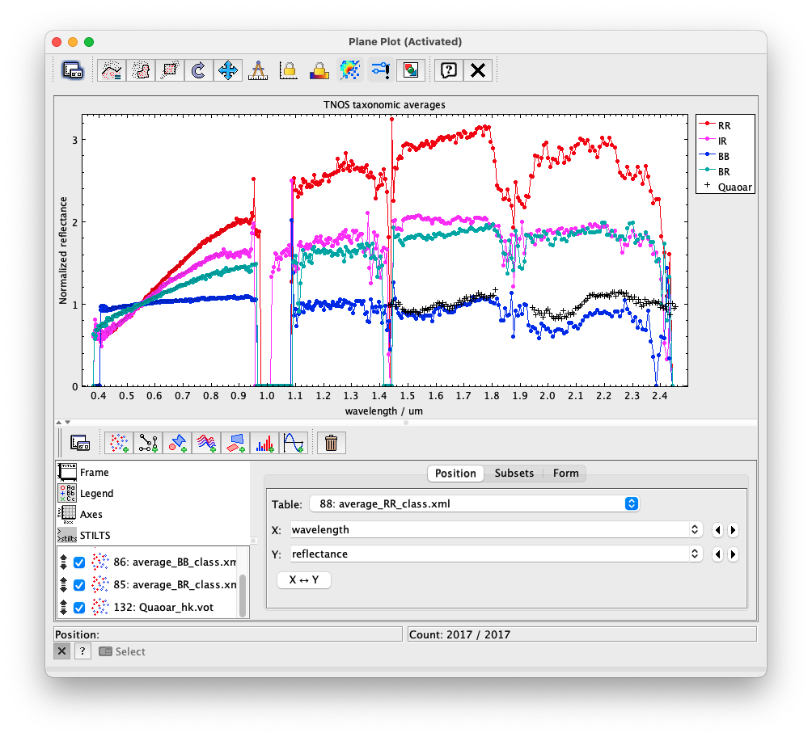
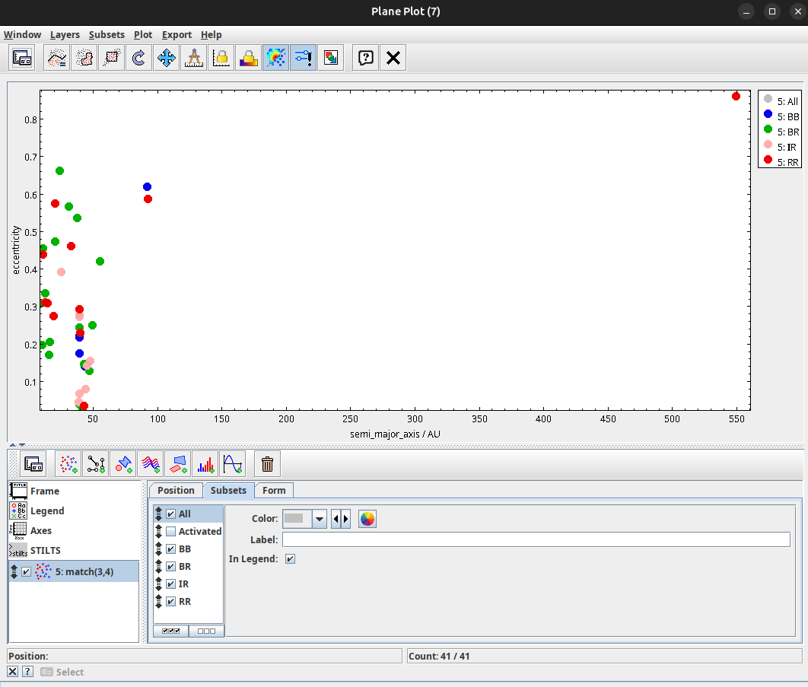

## Finding spectra of TNOs through service cross-matching


[Use case](#Use_case)  
[Summary](#summary)  
[Introduction](#introduction)  

[Identify targets of interest](#1--Identify-targets-of-interest)  
[Getting the spectra](#2--Getting-the-spectra)  
[Displaying the spectra](#3--Displaying-the-spectra-in-TOPCAT)  
[Alternative solutions](#4--Alternative solutions)  
[Using the dedicated spectro_tno service](#5--Using-the-dedicated-spectro_tno-service)  

[Conclusion](#Conclusion)  


## Use case
Cross-matching and combining complementary data services


### Change log

| Version       | Author        | Notes  |
| ------------- |:-------------:| -----: |
| 1.0           | S. Erard      | 12/10/2024  |
| 1.1           | S. Erard      | 19/6/2025  |
| 1.2           | S. Erard, T. Chope       | 2/4/2026   |
| 1.3           | S. Erard, T. Chope       | 6/10/2026   |


### Requirements and dependencies

Download the lastest versions of the VO tools to manage spectral data: 

TOPCAT: [TOPCAT](https://www.star.bristol.ac.uk/mbt/topcat/)

SPLAT-VO: [GAVO SPLAT](https://www.g-vo.org/pmwiki/About/SPLAT)

• Basic knowledge of the VESPA portal: [https://vespa.obspm.fr](https://vespa.obspm.fr)


### Keywords
Spectroscopy
EPN-TAP
Cross-match

## Summary
This tutorial describes how to retrieve spectra of TNOs, when these targets are not identified in spectral services. It also shows how to use the dedicated spectro\_tno service for direct access to TNO/Centaur reflectance spectra together with taxonomic and dynamical information.

## Introduction

EPN-TAP services include generic lists of asteroids with dynamical properties, and spectral databases of small bodies. In the latter, the dynamical type is not usually provided. To retrieve spectra of Trans-Neptunian Objects, it is therefore often necessary to identify TNOs from a first service, then to query a spectral service with a list of targets. This is not directly feasible in the VESPA portal, but there are several ways to achieve this.


 
### 1- Identify targets of interest

Several EPN-TAP data services provide dynamical properties of small bodies: MPC, NEOCC, MP3C, DynAstVO, etc.

Specialists can identify objects that belong to a dynamical class using a combination of orbital parameters provided by these services. In some cases however, such classes may be readily indicated. Here, we can identify distant objects from the MPC service by issuing a simple query: 

``
SELECT * FROM mpc.epn_core WHERE "orbit_class" LIKE '%Distant object%' 
``

As of writing, this returns a list of 6292 objects with names and properties, including both TNOs and Centaurs


> Alternative: Use the analytic TNO definition provided e.g. by Astorb / Lowell Observatory: 
```SELECT * FROM mpc.epn_core WHERE "semi_major_axis" >= 30.0709 
This yields 5544 objects, TNOs only
```

Such queries can be issued from any TAP client, e.g. the VESPA portal or TOPCAT, see Fig. 1.



*Fig. 1: Query to MPC in TOPCAT*


### 2- Getting the spectra

The spectro\_asteroids service is a large collection of small body spectra from several papers, but the targets are not described in terms of dynamical class. The list retrieved in step 1 can be used to query this service from the target\_name parameter, thanks to the homogeneity of EPNCore description. 

The easiest way to perform this is to use TOPCAT:

* From TOPCAT, send the above query to the MPC service (or do it in the VESPA portal, then SAMP the result table to TOPCAT)
* In TOPCAT, grab the whole table from spectro\_asteroids - check that you're not limited in number of answers ("Max Rows" field):

``
SELECT * FROM spectro_asteroids.epn_core WHERE ("target_class" LIKE '%asteroid%')
``

In TOPCAT, from the Join menu, run a Pair match between the two tables. Use: 

* algorithm = Exact Value
* Matched Value = target_name in both cases
* Match Selection = All matches (to retrieve all available spectra of the same object)
* (Beware that all table rows must be visible for the match, i.e. no subset must be active)

This returns a list of 45 spectra of TNOs at the time of writing, see Fig. 2. Inspection of the table shows that most of these spectra were acquired on the Keck telescope (`instrument_host_name`) and published by Barkume et al 2008 (`bib_reference`). 

Links to the spectra are available under `access\_url` in the table.




*Fig. 2: Matching the tables in TOPCAT*

### 3- Displaying the spectra in TOPCAT

To browse the spectra quickly:

(in this case you may want to define a subset excluding Pluto which is given with another scale)

* With the match result table selected, go to the menu  Views > Activation actions 
* Select and check Plot Table in the left menu, click Invoke
* The plot window will open and display something
* Set up the display as you wish, e.g.: reflectance(wavelength), with Form = Add line 
* Use the vertical arrows in the table to browse spectra sequentially




*Fig. 3: Stepping through spectra in TOPCAT*


You can download all spectra at once, so they are ready to use in composite plots:

* Select and check the Load Table action
* Use the lightning & film icon (= Selected Action on All Rows) to apply it to the current subset


### 4- Alternative solutions
 
Alternative methods may be more efficient in some cases.

#### 4.1 Upload on server
 You can upload the target list to the server hosting the spectro\_asteroids service and run a cross match on the server. This is especially convenient if the service you're mining is too large to be downloaded easily. This TAP functionality is available from TOPCAT and other clients, or from python using the astropy library. "Upload Join" is a property of the TAP protocol, but some TAP servers may disable it - in particular you are limited in upload size, so it is better to reduce the size of the target list to a minimum:

* target list from service MPC (will load as t10 in this TOPCAT session):

```
SELECT target_name FROM mpc.epn_core WHERE "orbit_class" LIKE '%Distant object%' 
```

* Join on service spectro_asteroids:

```
SELECT TOP 100 *
  FROM spectro_asteroids.epn_core AS db
  JOIN TAP_UPLOAD.t10 AS tc
    ON (db.target_name = tc.target_name)
```


#### 4.2 Python script

In python you can loop on the target list and send individual queries to the spectrum service. This also makes it possible to retrieve spectra from several services. See this tutorial for python access: [Accessing EPN-TAP services from different tools](https://github.com/epn-vespa/tutorials/blob/master/misc/data-access/Data_access.md).


#### 4.3 Searching alternate names

The above workflow works because all EPN-TAP services use a common metadata model: parameters have the same meaning across services and can be used as matching keys. In particular, the `target_name` parameter is essential for identifying moving objects in the Solar System (as opposed to astronomical objects with fixed coordinates).

However, `target_name` assumes standard IAU values which may be difficult to implement - it is prone to typos (spaces, etc), and doesn't necessarily use ascii encoding. Besides, small bodies have several designations and the main one may evolve over time (discovery IDs, principal designation, number, name). EPNCore handles this by providing a parameter `alt_target_name` that may aggregate different designations. A query on target_name can be made more robust by using a special function to match a single string with this aggregate: 


* target list with all designations, from service MPC (will load as t15 here):

```
SELECT alt_target_name FROM mpc.epn_core WHERE "orbit_class" LIKE '%Distant object%' 
```

* Join on service spectro_asteroids:

```
SELECT TOP 100 *
  FROM spectro_asteroids.epn_core AS db
  JOIN TAP_UPLOAD.t15 AS tc
    ON (1=ivo_hashlist_has(tc.alt_target_name, db.target_name))
```

This syntax is supported by most EPN-TAP servers. You have to check if alt_target_name is present in the reference service and if it always provides all possible designations. There is usually one more robust way to write the query - typically you want to check the target_name from observational services with the alt_target_name from large catalogues, which are updated more often and are expected to be more complete.


### 5- Using the dedicated spectro\_tno service

The spectro\_tno service provides combined vis-nIR reflectance spectra (0.35-2.45 micron) of 42 TNOs and Centaurs acquired at the VLT. The original paper (Merlin et al. 2017) was intended to provide a reference frame for future observations. The table therefore contains additional information: extra rows for average spectra of the 4 standard taxonomic classes; extra columns providing dynamical class, spectral taxonomic type, and photometric colour indices, which may be queried directly. No cross-match with MPC is needed to filter by dynamical class:

``
SELECT target_name, dynamical_type, taxonomy_code, instrument_name
  FROM spectro_tno.epn_core
  WHERE dynamical_type = 'Plutino'
``

#### 5.1- Displaying and comparing the spectra


Spectra are displayed in TOPCAT like in section 3. In addition you can use the XYError form to overplot the uncertainty in reflectance, which is provided for all spectra (Fig. 4). Notice the varying S/N ratio in regions of the spectral range measured by different instruments.



*Fig. 4: VLT spectrum of Echeclus with error bars*


The average spectra can be loaded this way:

``
SELECT * FROM spectro_tno.epn_core WHERE granule_gid='taxonomic_mean'
``

The 4 average spectra are displayed with TOPCAT in Fig. 5 (it may be faster to send this table to SPLAT-VO for a quick plot).

The spectral slope increases from BB (neutral/blue) to RR (very red) types, which is interpreted as the effect of increasing amounts of complex organics (tholins) on the surface. Also notice the large telluric absorption remnants (these spectral regions are masked in Fig. 4).

These average spectra serve as a reference to determine the taxonomic class from other observations (Fig. 5). Different normalisations and spectral ranges must be accounted for - Quaoar is actually an RR type, not a BB as suggested here.




*Fig. 5: The Keck observation of Quaoar in spectro_asteroids compared with the 4 taxonomical averages from VLT spectra in spectro_tno*


#### 5.2- Cross-matching with other services

The level of documentation of the spectro\_tno makes it useful to combine with other data services. In particular:

* Orbital elements can be retrieved from the MPC service, e.g., to study the distribution of taxonomic types in the Solar System
* The colour indices from this table can be compared with observations from other small body services, either spectra (e.g., spectro_asteroids, Gaia_asteroids) or flux measurements (e.g. SBNAF, TNOsAreCool).
* The average spectra are intended to allow computing colour indices in other photometric systems, so that such observations can be used to identify taxonomic classes.


As previously, any cross-match relies on the target\_name parameter when studying large populations of Solar System objects.
 




*Fig. 6: Taxonomic types from spectro_tno in a dynamical plot from the MPC service*


## Conclusion

This tutorial illustrates a common use case in VESPA: combining complementary EPN-TAP services to build a scientific sample that is not directly available from a single source.

Starting from the MPC catalogue, we identified Trans-Neptunian Objects and retrieved corresponding spectra from a generic spectral service. Several approaches were presented to perform the cross-match, including local table matching in TOPCAT, TAP uploads, and the use of alternate target designations.

The dedicated spectro_tno service illustrates a complementary approach, where dynamical and taxonomic information are already provided together with the spectra. Such specialized services can in turn be combined with catalogues, spectral databases, photometric measurements, or model results.

This workflow highlights one of the main strengths of the EPN-TAP framework: metadata are described in a common way across independent services, making cross-matching straightforward. The same approach can be applied well beyond TNO spectroscopy, wherever complementary Solar System datasets need to be cross-matched or compared.


