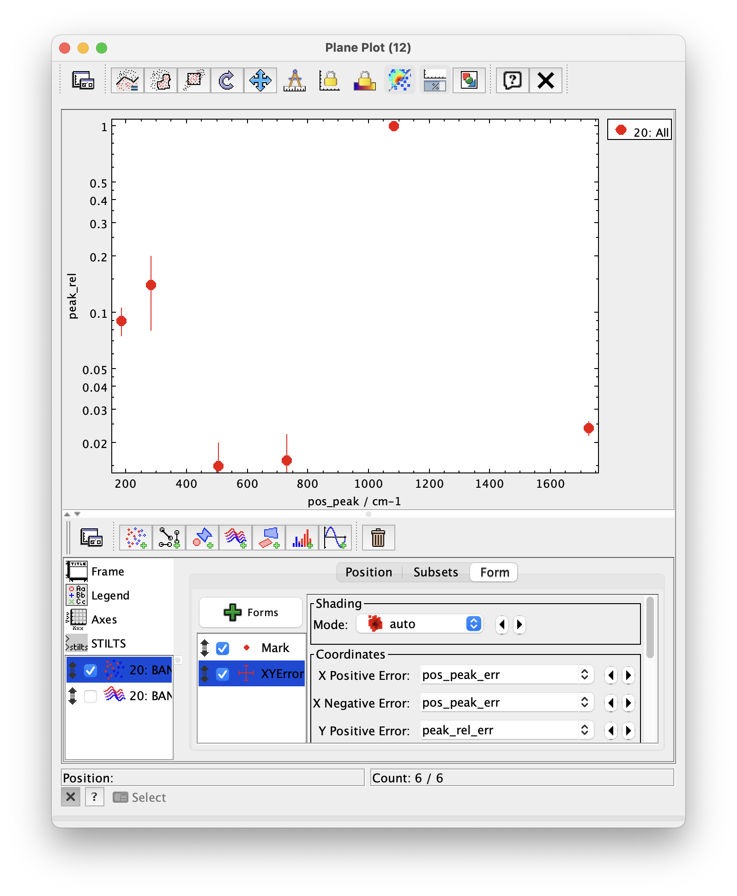

## Plotting bandlists

## Tutorial

Function plots in TOPCAT

## Author:

S. Erard

### Change log

| Version | Author   | Notes      |
| ------- |:--------:| ----------:|
| 1.0     | S. Erard | 30/12/2024 |

### Keywords

Spectroscopy
Bandlist

## Summary

This tutorial describes how to work with spectral bandlists in the VESPA environment. 

## Introduction

Spectral properties of materials are shared in the VO by various data services, using several formats - these include complete spectra but also bandlists. The SSHADE service in particular provides both type of data measured or collected for materials of planetary interest in solid phase. 

Use of the SSHADE spectra service is described here: http://www.europlanet-vespa.eu/tutos/CASSIS_VESPA_tutorial.pdf 

### 1-  Retrieving bandlists

The SSHADE bandlist service provide a description of the individual spectral bands identified in such spectra - it is available from its own interface, or via the EPN-TAP from the VESPA portal or other interfaces (schema name = sshade_bandlist).

From the VESPA portal you can query the sample_classification parameter for species name (use upper case initial) :

``SELECT * FROM
 sshade_bandlist.epn_core WHERE "sample_classification" LIKE '%Siderite%'``

The data associated to each row is a table of bands with their characteristics. The external_link parameter opens a dedicated page on the SSHADE bandlist site, where detailed information is available. 

In the VESPA portal, select the rows for some results and click the Data selection > Send tables button. This will send the data tables to TOPCAT.

### 2- Displaying bandlists in TOPCAT

#### Simple plot

Using TOPCAT Plane plot window, you can easily plot peak intensity (peak_rel) versus peak position (pos_peak) - see Fig. 1. In addition: 

- In Axes > Coords, check the Ylog box 

- Add errors with the XYerror form

*Fig. 1: Basic plot of band parameters in TOPCAT*

The corresponding stilts command is:

``topcat -stilts plot2plane \
   xpix=644 ypix=480 \
   xlabel='pos_peak / cm-1' ylabel=peak_rel \
   xmin=-649 xmax=2199 ymin=-0.085 ymax=1.139 \
   legend=false \
   auxvisible=false \
   in=BANDLIST_RAMAN_beta_K2CaCO3-2.data.vot x=pos_peak \
    y=peak_rel shading=auto leglabel='19: All' \
   layer_1=Mark \
      size_1=5 \
   layer_2=XYError \
      xerrhi_2=pos_peak_err xerrlo_2=pos_peak_err \
       yerrhi_2=peak_rel_err yerrlo_2=peak_rel_err``

#### Bands plot

What we really want is to reproduce the thumbnail image from the service, i.e. to plot individual bands with Gaussian profiles (Fig. 2)

- Display the table cells in TOPCAT, click the header and select New synthetic column.

- In the dialogue, type Name = xgrid; Expression = sequence(100,-5,0.1). This will create a column containing a normalized vector of indices

- Add a new XYArray Layer to the stack

- In the Position tab select the bandlist table

- type Xvalues = add(pos_peak,multiply(width,xgrid)) 

[providing a wavenumber vector around each band center]

- type Yvalues = multiply(peak_rel,arrayFunc("exp(-x*x)",xgrid))

[corresponding scaled Gaussian]

  => For each row of the bandlist, the two vectors are plotted against each other

- In Axes > Coords, check the Ylog box and set the scale to reproduce the thumbnail

  

*Fig. 2: plotting the individual bands in TOPCAT*

#### Bands plot in wavelength

To plot the data as a function of wavelength in µm (Fig. 3):

- In the positional layer: set x = 10000./pos_peak

- In the XYLine layer: set x = divide(10000.,add(pos_peak,multiply(width,xgrid)))

You can superpose observational spectra on this plot, in order to check a possible match with the laboratory data.

*Fig. 3: Same plot as a function of wavelength in µm (band profiles are Gaussian in energy)*

### 5- To go further

• Remember that all TOPCAT plots can be produced from the command line via the stilts script language, which can be incorporated in a processing pipeline. Such plots can be manipulated with a mouse in the same way as in TOPCAT.

• Use TOPCAT XYarray Layer control to work with sub-arrays and functions associated to row parameters — see: [XYArray Layer Control](https://www.star.bristol.ac.uk/mbt/topcat/sun253/GangLayerControl_xyarray.html)
