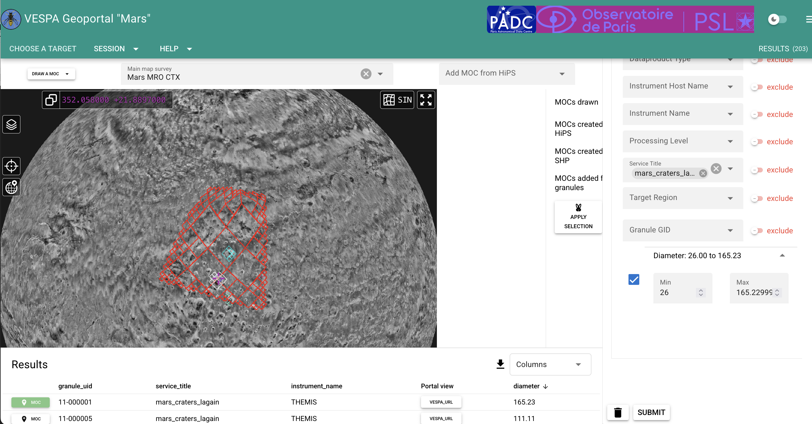
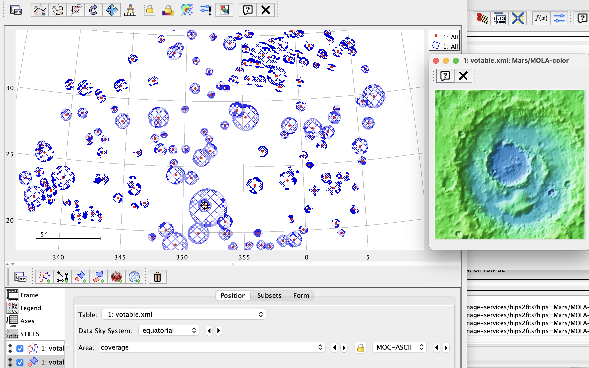
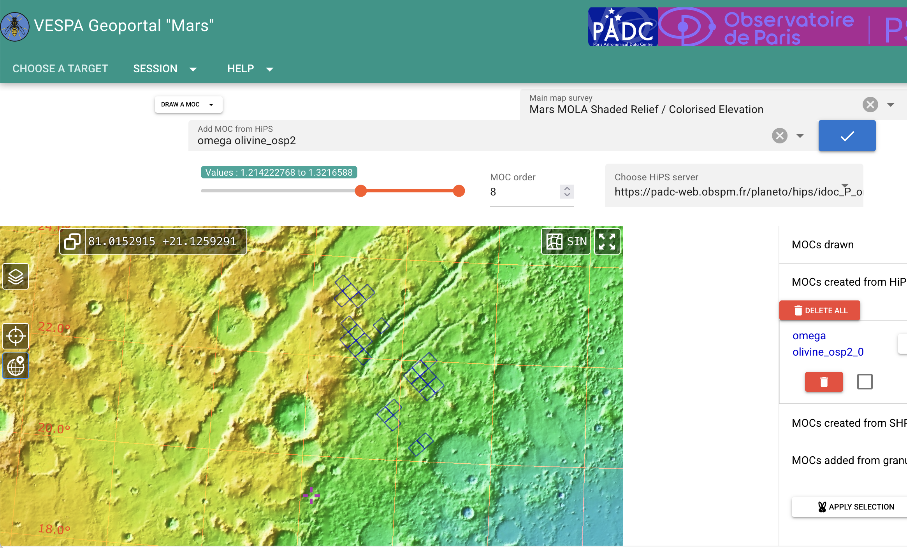
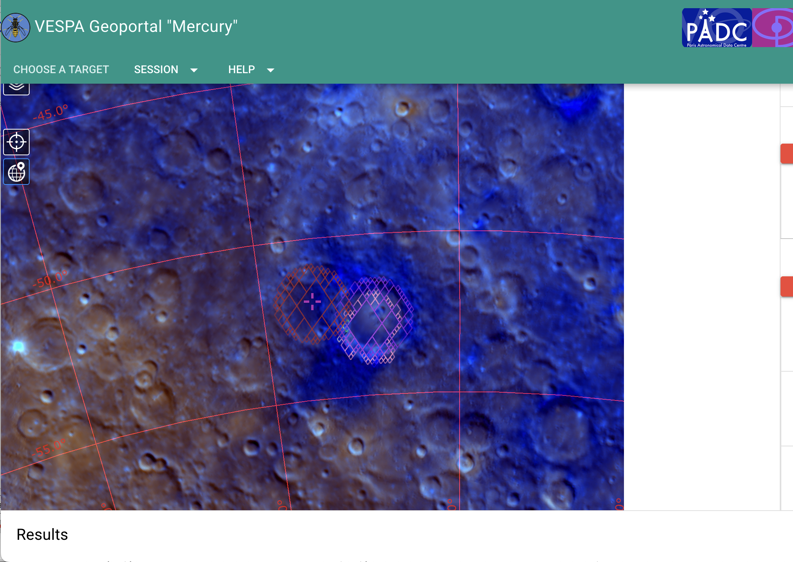
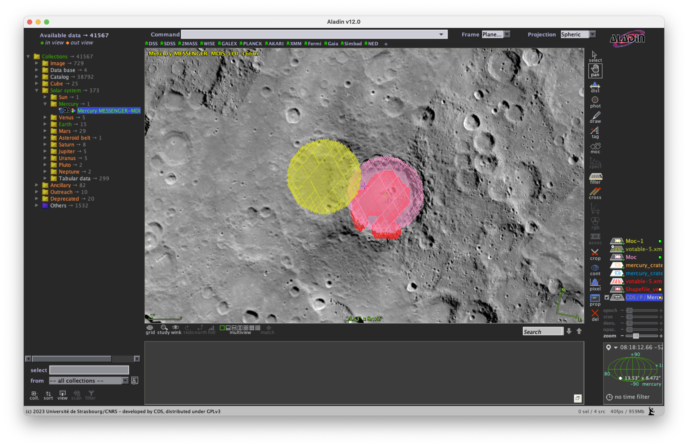

*S. Erard, Astro-CC Scientific training event, Strasbourg 1/10/2026*

&nbsp;
&nbsp;
 
# Spatial searches —VESPA geoportal demo

The VESPA geoportal is a web-based discovery and visualization environment for planetary data. It is intended to find observations, measurements, or catalogues entries georeferenced on a planetary surface.

Its functionalities are therefore similar to GIS (Geographic Information System) commonly used in planetary science, such as JMars. Unlike traditional GIS, it relies entirely only VO standards and protocols, and is interfaced with EPN-TAP data services. Because the Geoportal relies on a local metadata database harvested from EPN-TAP services, spatial searches usually remain interactive even when many services are involved.

## Preliminaries - Setting up VO tools

VO tools default to standard celestial conventions, which differ from those used in planetary science. The main differences concern the orientation of planetary coordinate frames, and measurements in solar reflected light. Spatial frames in particular must be set up consistently to plot data correctly on planetary surfaces.

See here to setup TOPCAT and Aladin: [https://github.com/epn-vespa/tutorials/blob/master/misc/setting\_up\_tools/setting\_up\_tools.md](https://github.com/epn-vespa/tutorials/blob/master/misc/setting_up_tools/setting_up_tools.md)

We will use HiPS (multiresolution maps) and MOC (healpix-based footprints). See here how they work: [https://github.com/epn-vespa/tutorials/tree/master/surfaces/Aladin\_Hips\_MOC](https://github.com/epn-vespa/tutorials/tree/master/surfaces/Aladin_Hips_MOC)

## Selecting craters in a region of interest

We're working with craters on Mars.

- Go to the Geoportal page: https://padc-findme.obspm.fr

- Select Mars as a target. That will open a new page with the MOLA shaded relief map in 3D spherical projection. You can first push the table area below AladinLite to make the display more visible.

Zoom in and out, rotate the sphere, try the various HiPS available

Notice the number of data elements found in EPN-TAP services (top right)

Use the grid and the resolver in AladinLite (relying on the USGS gazetteer of nomenclature)

### Hand-drawn MOC

Draw a region of interest from the menu Draw a MOC. The region of valleys NE of Valles Marineris is fine, size ~ 20 ° x 20° 

- You may have to click the Apply selection button

- Notice how the number of data elements reduces - it now only returns data elements within the drawn MOC.

In the filter panel on the right, select service\_title = mars\_craters\_lagain 

Click Submit below the filters

- Notice how the number of data elements reduces again (only returns craters within the MOC)

Open the table area below the display if you've minimized it. In the result table, add display of diameter then sort by diameter

- We want to retain ~ 200 craters (end of 4th pages of 50 results; > 25 km in the example)

- Set diameter cutoff to 25 km + click Submit

   This leaves 200 results in the example

Click on the MOC buttan at the left of the table to display selected crater MOC

Click Download VOTable (the big black arrow in the table header) to save it on your disk

### Display in TOPCAT

Load this VOTable in TOPCAT

This is where you need to setup TOPCAT to planetary conventions:

- In Axes: uncheck Reflect longitudes axis (all longitudes would be reversed otherwise)

- In Axes / grid: uncheck Sexagesimal

Open the TOPCAT table: this is the complete EPN-TAP table for the selected craters

Click Plane plot to display 

- In the Form panel, use Mode = Aux and Aux = diameter to plot the size in colour

- Add an Area plot control, select the table => The craters MOC will show up immediately

- Click on a crater in the display => the row is selected in the table (and vice versa)

- Click the Stat Icon (big Sigma) to get the mean and std-dev crater size.

### HiPS cutouts

You can also display a small area around the feature of interest, which helps visual inspection of individual features.  In the main window, select the crater table, then select Views > Activate Actions from the menu

- Select and check Display HiPS cutouts

- Set RA = C1min, Dec = C2min, Field of View = 3 deg

- Select HiPS Survey = your preferred Mars HiPS (in Other > mars)

- Click on craters in the plot (or select a table row) => a small map of the area will display in a pop-up window

(alternatively, you can send the table via SAMP to Aladin Desktop, and load a HiPS of the planet. Double-clicking on the table will  plot crater centres. When clicking a feature in any window/table, all other displays will remain synchronized).

## Creating a MOC from a quantitative map

Back to the Geoportal, still on Mars. 

MOCs can be defined from a HiPS - this makes sense for HiPS exposing quantitative values, e.g. altimetry, but also retrieved abundance of a given mineral.

- Click the menu Add MOC from HiPS

- Select Omega olivine\_osp2

- Setup the cursor to 60% (~ 1.2) - this will define a MOC from the largest values only

- Setup MOC order = 8

- Click the blue arrow to extract the MOC

These regions are very small and are plotted on a dark background, you need to zoom in enough to see them. A possible method is to open the menu MOC created from HiPS and center one of them, then zoom in.

If you're lost: in this case go to the Jezero area (NE of Syrtis Major ~ 78° E / 21°N, see image below).

You can save the current session from the Session menu. You will be able to reload it later from the target selection page.

## Advanced use case — Importing external GIS products 

We're now working with morphological units on Mercury.

- Select Mercury as a target

- Switch to the MDIS colour mosaic

We are interested in pyroclastic deposits on Mercury, and work from the analysis of MESSENGER images by Leon-Dasi et al 2023 (10.3390/rs15184560). Contours are shared on Zenodo as supplementary material to this paper, in shapefile format. We will focus on a particular deposit. 

Use the file Shapefile\_vent\_327\_deposit.shp, a deposit straddling a small crater

- Drop it on the AladinLite display of the geoportal page. Select order = 12 & mode = union in the popup window

[this use case makes full sense when using individual spectra from MESSENGER - today we'll use craters instead]

In the filter section on the right, select the Mercury\_craters service and click Submit

- In the MOC panel, display information on the MOC created from the shapefile, check the box (and uncheck hand-drawn MOCs if any). Click Overlaps then the Apply Selection button

- This will select only craters which footprint overlaps the selected MOC, i.e. the unit of interest (only 2 of them)

- Again, you can plot their MOC from the left side button of the table

From the AladinLite Stack menu / Overlays you can save all displayed MOC on disk. The converted shapefile will be saved as an ascii MOC in json format.

Load this file into Aladin Desktop (you can also drop it, or load it in TOPCAT then SAMP it to Aladin). It is correctly interpreted, while Aladin wouldn't accept a .shp file. You can similarly save the crater MOCs from AladinLite.

By double-clicking on the result table in Aladin, it would open in the drawer below the display. Search the Coverage column and click the button to plot the crater MOC.

(the crater centres will plot immediately, but you need to use a filter to draw the contour on this particular planet. You can load it from Catalogue > Create a filter then Advanced mode - use [this file](img/Mars_Craters.ajs)). 

A natural application is to rapidly identify spectra within morphological surface units, compute their mean and standard deviation, and browse them to check the homogeneity of spectral properties (or not). This is currently feasible in python; such a functionality in VO tools would make it even more convenient.

## Conclusion

The VESPA Geoportal enables spatial searches across the complete EPN-TAP environment using MOCs, planetary maps, and metadata harvested from distributed services. Regions of interest can be defined interactively, derived from quantitative HiPS, or imported from external GIS products. Results can then be exported to VO tools such as TOPCAT and Aladin for further analysis.

&nbsp;

**Note**

To ensure interactive performance, the Geoportal relies on a local metadata database periodically harvested from EPN-TAP services worldwide. As a consequence, newly published metadata may not be visible immediately. Most spatial searches remain available even when individual services are temporarily offline, but operations requiring access to the original data products still depend on the corresponding EPN-TAP services (storing the result VOTable & visualizing granules in the VESPA portal).

