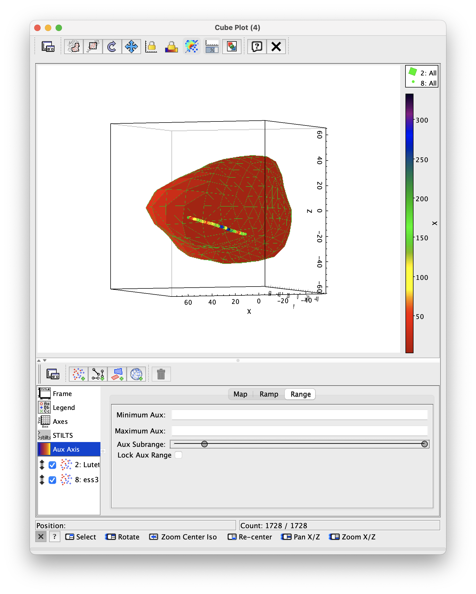

## Plotting shape models in TOPCAT

**Tuto in progress for TOPCAT version 4.11beta - for the time being this is only a baseline to be cleaned up and finalized. See the associated documentation, also in dev:**
https://voparis-wiki.atlassian.net/wiki/spaces/VES/pages/289439745/Shape+models+in+TOPCAT+-+documentation

## Tutorial

3D plots in TOPCAT

## Author:

S. Erard

### Change log

| Version | Author   | Notes      |
| ------- |:--------:| ----------:|
| 1.0     | S. Erard | 12/12/2024 |

### Keywords

Shape models 
Spectroscopy
Small bodies

## Summary

This tutorial describes how to plot shape models of small bodies in TOPCAT, and how to overplot observations. 

## Introduction

Small bodies and satellites have irregular figures which can't be plotted adequately in Aladin. Such bodies are described by 3D shape models, which are provided in a number of formats accepting many variations. TOPCAT has been able to plot such shape models at least from version 4, given some preliminary work on the data table. From v4.11, this function has been simplified and provides easy quicklook visualisation.

The tutorial consists in:

1) Reading a shape model to be used as global reference shape. 

2) Plotting the shape model in 3D in TOPCAT

3) Overplotting images / data pre-projected on the same shape model, for quicklook or more accurate plots. Possibly include an extra information such as albedo or fixed illumination for reference.

Background on the procedure and formats are provided on this page:

``
https://voparis-wiki.atlassian.net/wiki/spaces/VES/pages/289439745/Shape+models+in+TOPCAT+-+documentation
``

### 1-  Basic display of shape models

#### Load a shape model of Phobos

In TOPCAT, click the Open table icon, select Format = ver and enter URL =

 ``
https://sbnarchive.psi.edu/pds4/non_mission/gaskell.phobos.shape-model/data/phobos_ver64q.tab
``

This is a modestly resolved shape model with ~ 50,000 plates – however, loading it first from a browser may be faster.

Ingesting this type of file produces 2 tables in TOPCAT: 

- the first one (phobos_ver64q.tab) is a list of vertices defined by their Cartesian coordinates; 
- the second table (phobos_ver64q.tab-2) is a list of triangular plates defined by the vertices they connect. For each plate, a row contains 3 columns providing the x/y/z coordinates of the first vertex, and a 4th column providing a vector of the other vertex coordinates.

> Note that table 2 restrained to its first 3 columns is not equivalent to table 1: it contains more rows but usually less unique vertices.

#### Plot Phobos as a point cloud

Select the first table and open the Cube plot window from the tool bar. The point cloud is displayed using the default Mark form (Fig. 1).

- It is important to set up the axis length uniformly: go to Axes > Coords and check the "Isometric" box

- To remove the frame: go to Axes > Grid > Draw wire frame. You can also hide the caption in Legend > Style (especially when displaying subsets)

- To zoom in: go to Axes > View, play with Zoom factor (rather than with the mouse, which would plot part of the shape out of the frame)

Rotate and manipulate the figure in 3D. To improve the rendering you can try, in the Form tab:

- to set Shading mode = translucent, then adjust Transparency level — the varying vertex density provides a sense of relief 
- to set Global style > Size to 0
- you can also experiment with higher resolution shape models of Phobos located in the same directory.

> You will notice in the Position tab that the default display for this type of shape model uses Coordinates = Components and X/Y/Z set to the corresponding columns of the vertex table.

*Fig. 1: phobos_ver64q.tab and phobos_ver256q.tab shape models from PDS SBN (with increasing resolution)*

### 2-  Quicklook display of data on a shape model

#### Plot a shape model of comet 67P

As previously, load the shape model file in TOPCAT with Format = ver and URL =

 ``
http://comsim.esac.esa.int/rossim/SHAPE_MODEL_DRAFTS/OTHER_LEGACY/SHAP7_v1.6/cg-spc-shap7-v1.6-cheops.ver
``

This is a much more resolved shape model with ~ 1.6 M plates

Plot the vertex table as previously in the Cube plot window, don't forget to check the isometric box and to set the Shading mode to  translucent.

#### Overlay observational data from Rosetta

• In TOPCAT, read the local file <a href="img/VH3Db.txt">"VH3Db.txt"</a> in ascii format —&nbsp;it is derived from VIRTIS / Rosetta observations from the 1D H-channel. The file includes a measured reflectance and the Cartesian coordinates of the footprint center for successive locations.

In the previous Cube plot window, add a new positional layer control. 

- In the Position tab for this layer, select the table VH3Db.txt
- In the Form tab, Set Shading mode to Aux, Aux to col4, and adjust Shape size to manage continuity
- The color scale can be modified under the Aux Axis icon in the control stack.

• Now read the local file  <a href="img/VM3D.txt">"VM3D.txt"</a> in ascii format —&nbsp;this is a similar file derived from the imaging channel of VIRTIS / Rosetta. 

Add this data to the plot as previously and adjust the symbol size (Fig. 2). 

• You can similarly experiment with the local file ["phobosRoIvert.txt"](img/phobosRoIvert.txt) and the Phobos shape model (Fig. 3).

> By default, the same color scale is used to plot both data files on 67P, which makes sense if you're plotting the same quantity. You can access an independent color table (actually, several ones) by selecting Shading mode = Paux and Aux2shader = another color table. This color ramp will not be displayed in the caption, therefore the main color table should be used with the main parameter (Fig. 2b).

*Fig. 2: Two views of comet 67P nucleus with overlaid VIRTIS footprints (values plotted on footprint center)*

> Notice that in this section a shape model is embedded in the data files as a set of 3D coordinates. It doesn't have to be the exact same shape as the reference one plotted in the first layer, and can even point to locations above or below the surface (i.e., coma or sub-surface for a comet).

#### Selecting a Region of Interest manually

In the Cube plot window, you can use the freehand tool (from the tool bar) to grab the coordinates of a region manually defined — this is 2-step process in 3D:

- Select the freehand tool, draw a region with the pointer; when done, check the freedhand tool again, give a name to this subset and click "Add subset". The new subset includes both the front and rear sides of the shape model, which is probably not what you want.

- Rotate the plot by ~ 90° — the subset will appear as disconnected regions. In the Subset tab, uncheck All to plot only the current subset, then select the part of interest and define a new subset with the region of interest.

- You can check All in the subset tab again to display both the selected RoI and the global shape.

This procedure works to select either vertices or plates.

### 3- Solid plate models

Open a new Cube plot window, select the *plate* table (e.g., "phobos_ver64q.tab-2") of either shape model loaded. In the Forms tab of this layer, add a Polygon form and set Coordinates > Other points to "others".

Deactivate the default Mark Form and in the Polygon form play with Shading mode and Polygon mode. 

- The shape model is displayed as a mesh for most settings (Fig. 3 & 4a)
- set Polygon mode = Fill and Shading mode = Aux, with Aux = one the table columns (try the Z coordinate at this point). This plots the Aux parameter on the solid shape, and the rear side is hidden from view (Fig. 4b)
- Add a second Polygon form and set Shading mode = translucent and Polygon mode = outline. This will overlay the mesh to improve legibility (as in Fig. 5).

Compare the low resolution Phobos model to the 67P high resolution model in this solid display mode. Is higher resolution always optimal for this application?

*Fig.3: Phobos as a plate mesh, with a region of interest overlaid on vertices*

*Fig. 4: Eros plate model from DAMIT, mesh and solid view - the plotted quantity is the distance from center*

• As previously you can overlay additional data on the coordinates of their footprint center (Fig. 5, on Lutetia). This is the easiest way to represent data on a plate model, and this is adapted for quicklook view. 

In this case, it is better to use a secondary color scale by setting the plate Shading mode to Paux, as described above.

*Fig. 5: Lutetia plate model from DAMIT, solid view with observations overlaid on footprint centers*

#### Overlay data on a solid plate model

A more accurate plot would use the exact 2D spatial coverage of the data derived from the instrument field of view. There are two possible situations: 

- plotting a complete coverage of the target as a texture — this typically provides the albedo or illumination conditions for every plate. There is a 1-to-1 match between the data file and the plate model.

- plotting data restrained to a Region of Interest. The solution to this problem requires to identify the plates covered by each pixel footprint — this is feasible with SPICE, and may be part of the computation pipeline. The data file is therefore a list of plate IDs + measured quantities. This situation is relevant to resolved observations but also to thermal modeling, where flux or temperature is computed on individual plates.

In both cases, we have to match the data file with the plate model based on plate ID — the exact same model must be used.

##### Overlay a texture

To illustrates how you would overlay a complete texture on a plate model, we're looking at lower resolution shape models (produced by inversion of light curves).

- Load the shape model of Vesta with format = ver and URL=
  
   ``
  https://astro.troja.mff.cuni.cz/projects/damit/stored_files/open/64139/shape.txt
  ``

- Plot the plate table as previously.

We want to overlay the albedo texture available at

 ``
https://astro.troja.mff.cuni.cz/projects/damit/stored_files/open/64137/albedo
``

This file provides one albedo value per plate on this shape model - unfortunately the file is not correctly formatted for TOPCAT and needs editing. Instead, use the prepared local version <a href="img/vestaalbedo.txt">"vestaalbedo.txt"</a>. You can see that no coordinates are included in the data file: the plates are identified by their row number in the two files, which need to be cross-matched:

- Open the Pair match tool from the tool bar. Set Algorithm = Exact value, tables = vestaalbedo.txt and shape.txt-2, both with Matched Value column = $0 (which stands for row number), and keep Match selection = best match symmetric, Join type = 1 and 2. This will join the matching rows in a new table called match(x1,x2).
- Display this matched table in the Cube plot window as previously, this time using Aux = col1 which is the albedo value (Fig. 6)

*Fig. 6: Vesta plate model from DAMIT, with albedo texture overlaid on plates*

> Note: On Unix-like systems you can prepare the file this way:
> 
> curl -s https://astro.troja.mff.cuni.cz/projects/damit/stored_files/open/64137/albedo | sed -e's/ /\n/g'> vestaalbedo.txt

##### Overlay a Region of Interest

If the data coverage is not complete, the data file has to provide the plate number explicitely on each row, together with data values. The match with the complete shape model would rely on this plate number (Fig. 7).

You can provide both a complete albedo texture for context (using shading mode = Paux) and the actual data on a dedicated color scale using shading mode = Aux.

This type of plot is relevant for detailed analyses or publications.

*Fig. 7: a) Phobos with Z coordinate on plates (grey scale) and a dummy parameter overlaid on plates in a Region of Interest (color) b) Lower resolution example on Vesta*

### 4- Using other shape formats

#### SPICE digital shape kernels (dsk)

Space mission data are commonly projected on shape models provided by SPICE dsk kernels. These are binary files with extension .bds, which do not enter TOPCAT directly. However, the DSKEXP command converts them to several formats, including the .ver format used above. Once the paths are set on your system, type for instance:

``
dskexp -dsk phobos_g_288m_spc_0000n00000_v001.bds -text phobos.ver -format ver``

which you can ingest in TOPCAT as ver (see also additional reading).

#### lonlat models

Older shape models were based on regular sampling in longitude and latitude, rather than on tesselation of the target. 

You can load an older "lon-lat" shape model of Eros here, in ascii format: ``
https://sbnarchive.psi.edu/pds3/near/NEAR_A_5_COLLECTED_MODELS_V1_0/data/msi/erosrgst.tab
``

Each row describes a location with latitude, longitude (beware of the inversion), radius and extra computed parameters such as gravity, topographic slope, etc.

- Display the table in the Cube plot window, this time setting Coordinates = Polar, Lon = col2, Lat = col1 (in this order), Radius = col3.
- In the Form tab, set Shading mode to Aux and Aux to col5 (topographic slope), then increase the Shape size.
- When displaying low resolution shape models such as this one, adding a Line3D form may improve the rendering.

*Fig. 8: Older Eros lon-lat model from PDS SBN, with slope plotted on coordinate grid*

> Note: the lonlat format was subject to severe artefacts and discontinuities. It can only provide quicklook display, as it doesn't define extended plates. 

 

### 5- To go further

• Remember that all TOPCAT plots can be produced from the command line via the stilts script language, which can be incorporated in a processing pipeline. Such 3D plots can be manipulated in the same way as in TOPCAT windows.

• Details on the procedure and shape model formats are provided on this page:``
https://voparis-wiki.atlassian.net/wiki/spaces/VES/pages/289439745/Shape+models+in+TOPCAT+-+documentation
``
