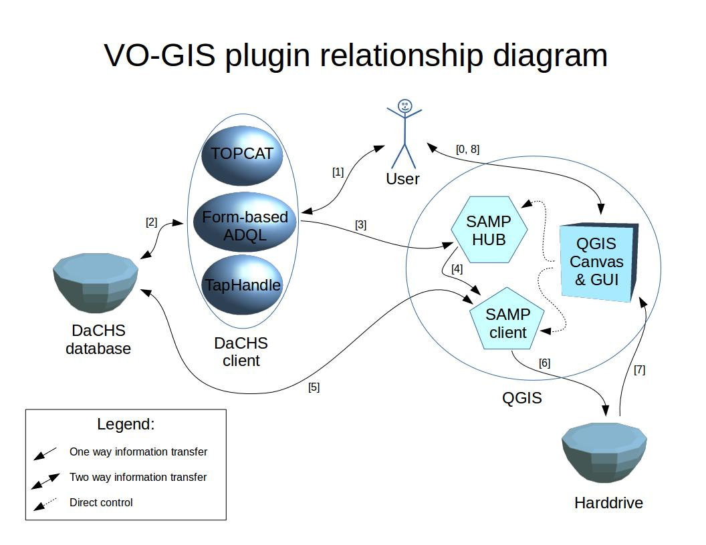
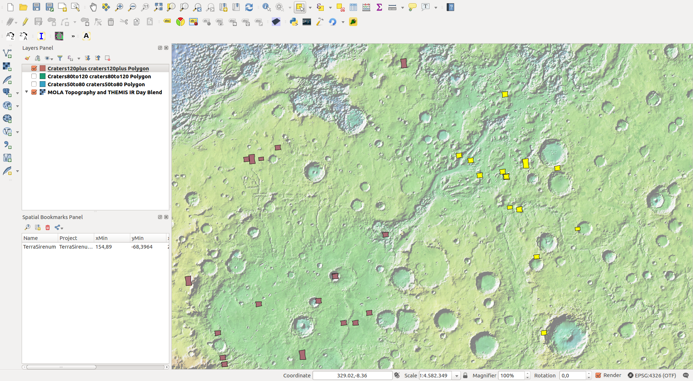

# Using QGIS plugin to obtain vector data from VO and place into QGIS.

In this example we will use data available from epn1.epn-vespa.jacobs-university.de

The tutorial is covered by the following YouTube video:


[](https://www.youtube.com/watch?v=Jlso7MkdwYs)

This tutorial will demonstrate how to:

0. Install plugins we have developed.

1. Browse WMS layers exposed on our server and load them as basemap in QGIS.

2. Run complex geospatial queries using ADQL on DaCHS and load it to QGIS using our plugin.

3. Load previews of CRISM coverages onto the map.

4. Access spectra of individual pixels on CRISM coverages of interest and broadcast this data to VO spectroscopy applications such as CASSIS.

## Step 0: Plugins installation

### 0.0 Prerequesites: you must have astropy installed.

### 0.1 Download github release from this link: 
https://github.com/epn-vespa/VO_QGIS_plugin/archive/v0.2.zip

### 0.2 Extract contents of the extracted directory in your QGIS python/plugins directory

The QGIS plugin directory should then look like:
```
~/.qgis2/python/plugins
├── GAVOImage
├── polyToAladin
└── VESPA
```

### 0.3 Start QGIS and enable the plugins VESPA and GAVOImage


## Step 1: Adding WMS basemap

### 1.0 Start a new project in QGIS

### 1.1 Open TapHandle by either
 * Opening epn1.epn-vespa.jacobs-university.de, clicking on TAP, than TapHandle
or
 * Going directly to 
http://saada.unistra.fr/taphandle/?url=http://epn1.epn-vespa.jacobs-university.de/tap

### 1.2 Open usgs_wms table>epn_core, add a WHERE clause granule_gid=Mars


### 1.3 Click submit, use a link in preview_url to preview the maps


### 1.4 Open access_url and copy link location


In our case it's

http://planetarymaps.usgs.gov/cgi-bin/mapserv?map=/maps/mars/mars_simp_cyl.map&service=WMS&request=GetCapabilities

### 1.5 In QGIS click "Add WMS/WMTS Layer", click new and paste "access_url" copied in previous step.


### 1.6 Click "Connect", then "Add"


### 1.7 Click "Close"


You should now have a basemap displayed on your Canvas.

## Step 2: Getting vector data
The data aquisition process consists of 4 fundamental steps:
0. Data mining / querying
1. Starting SAMP Hub
2. Starting SAMP Clinet
3. Transfering data via SAMP

The workflow follows as such:




### 2.0 Query DaCHS with ADQL.

Suppose we are interested in CRISM coverages from senson L that cover craters of diameter between 50 and 80 km. We can do this with an ADQL query. Simply paste this request into browser:

    http://epn1.epn-vespa.jacobs-university.de/__system__/adql/query/form?__nevow_form__=genForm&
    query=select cra.granule_uid, cri.*, cra.diameter, cra.feature_name, cra.crater_morphology_3 FROM (select * from mars_craters.epn_core as cra2 where cra2.diameter > 50 and  cra2.diameter < 80) as cra INNER JOIN (select * from crism.epn_core as cri2 where cri2.sensor_id='L') as cri  ON (1=INTERSECTS(
    cri.s_region, 
    cra.s_region
    ))&_TIMEOUT=200&_FORMAT=HTML&submit=Go


Detailed instructions on what ADQL is and how to use it are beyond the scope of this tutorial and can be found on the bottom of that webpage, or on: 
http://epn1.epn-vespa.jacobs-university.de/__system__/adql/query/info

### 2.1 Start SAMP HUB by clicking "start SAMP HUB" button on the VESPA plugin toolbar.


### 2.2 Start SAMP Client and click "Connect/Disconnect"


### 2.3.0 Switch to web browser with the query result and click "Send via SAMP"


### 2.3.1 When prompted to give consent, click "Yes"


### 2.3.2  Click again on "Send via SAMP" and wait for table to download. Once it is added to the Layers Panel, click on "Connect/Disconnect", press OK (this will close the client), then close SAMP HUB as well.

Your table will now appear in the Layers Panel


### 2.4  Move the layer to the top of the list, change symbology to make it more visible.


### 2.5 Zoom in on an area of interest


## Step 3: Showing preview images on the map using GAVOImage plugin.

### 3.0 Select one polygon from the dataset obtained in Step 2


### 3.1 Click on GAVOImage plugin button


### 3.2 Press OK


You should now be able to see the preview image over the polygon.


By using "Identify tool" on the corresponding polygon you can learn more about the crater:


## Step 4: Examine spectra at a point

We can use the data in the table to examine spectra of a particular location on Mars.
Furthermore, this data can then be sent via SAMP to VO spectroscopy tools, such as CASSIS.

### 4.0 Use "Identify" tool on a polygon corresponding to the coverage of interest.


### 4.1 Click on "subgranule_url"


### 4.2 Click on the image in the web browser, spectra will appear


### 4.3 Start CASSIS Interactive Spectrum Analyzer


### 4.4 In the web brower a "Broadcast via SAMP!" button will appear. Click on it.


### 4.5 When prompted if you authorize the connection, click yes. Spectra should now open in CASSIS.


### 4.6 Change bottom axis to "Wavelength" in "um".


## Step 5: Sending polygons to Aladin.

### 5.0 Open Mars Heliopix survey in Aladin
Open Aladin web start: aladin.u-strasbg.fr/java/aladin.jnlp 

On the main menu click "File" => "Open URL"  


Add HiPS :  
http://epn1.epn-vespa.jacobs-university.de:8080/marsmola/Mars-ELATLON-ICRS.hpx  
Click submit.  


### 5.1 In QGIS select several polygons from a table recieved via SAMP and click on the polyToAladin plugin button



Polygons will now appear in Aladin


