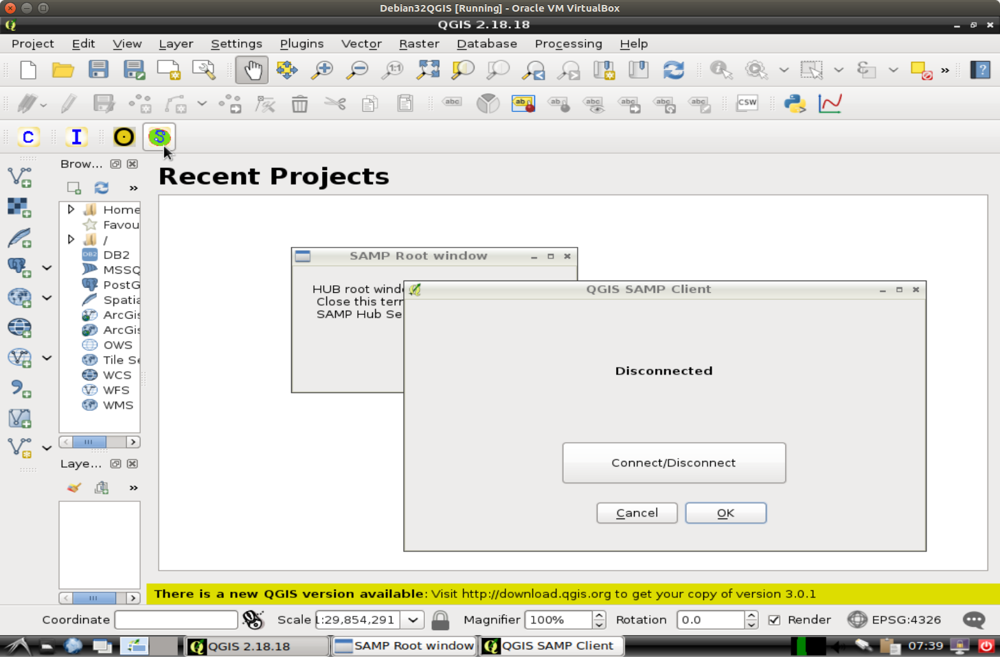
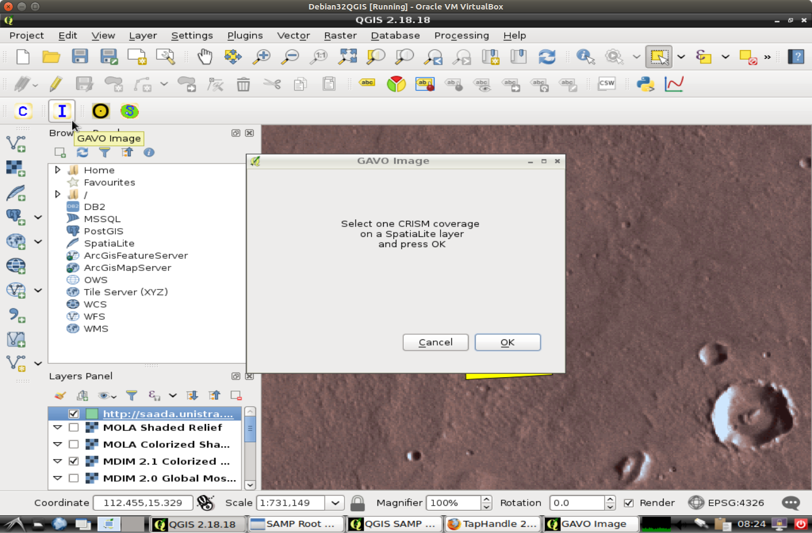

# Start SAMP Hub 
 

# Start SAMP Client 

# Connect SAMP Client to SAMP Hub

# Open TAPHandle on EPN1

# Edit query to select Mars WMS

# Connect TapHandle to SAMP

# Send WMS to SAMP

# WMS will be imported to QGIS

# In TapHandle select CRISM coverages from sensor ‘L’

# Send result to SAMP

# Zoom in QGIS

# Pick Select’ tool

# Select a coverage footprint

# Use GAVO Image tool to load coverage preview

# Preview will load on the map

# Use GAVO Coverage tool to download the entire coverage

# Set Project CRS from layer

# Open Temporal/Spectral Profile Tool

# Use identify tool on the coverage footprint to find the wavelengths

# Switch to settings of the Profile tool and paste the wavelengths

# Use Profile tool to plot spectrum

# Use identify button then open feature form

# Get value of ‘external_link’

# Open external link in firefox

# Zoom with mousewheel and select spectra by clicking on a pixel

# Start CASSIS by webstart

# Disconnect QGIS SAMP Client

# Switch to the ‘external_link’ and click “Broadcast via SAMP!”

# The spectra will load to CASSIS

